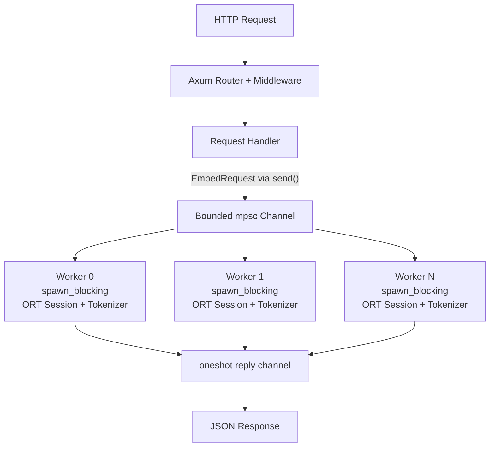

[](https://github.com/Fulton-Engineering-Services/bge-m3-embedding-server/actions/workflows/ci.yml) [](https://github.com/Fulton-Engineering-Services/bge-m3-embedding-server/actions/workflows/release.yml) [](https://codecov.io/gh/Fulton-Engineering-Services/bge-m3-embedding-server) [](CONTRIBUTING.md) [](Cargo.toml) [](LICENSE) [](https://github.com/Fulton-Engineering-Services/bge-m3-embedding-server/pkgs/container/bge-m3-embedding-server) [](https://fulton-engineering-services.github.io/bge-m3-embedding-server/bge_m3_embedding_server/)

**API Documentation:** [fulton-engineering-services.github.io/bge-m3-embedding-server](https://fulton-engineering-services.github.io/bge-m3-embedding-server/bge_m3_embedding_server/)

# bge-m3-embedding-server

An Axum HTTP server serving BGE-M3 dense and sparse embeddings via direct
[ONNX Runtime](https://onnxruntime.ai/) integration. It exposes an OpenAI-compatible
`/v1/embeddings` endpoint for dense vectors and a `/v1/sparse-embeddings` endpoint for
SPLADE-style sparse token weights.

Key capabilities:
- **Long-context embeddings** — supports up to 8192 tokens (BGE-M3's full positional range), configurable via `BGE_M3_MAX_SEQ_LENGTH`.
- **Memory-aware auto-tuning** — detects container/cgroup memory at startup, runs a workspace probe, and derives a safe workspace budget automatically. No manual `ONNX_BATCH_SIZE` knob needed.
- **Length-aware bin-packing** — tokens within each `session.run()` call are padded only to the longest sequence in that chunk, not the global maximum. Short-text batches pack densely; long-text batches split appropriately.
- **Single-pass dual embeddings** — `/v1/embeddings:both` produces dense and sparse vectors in one ONNX `session.run()` on all three model variants. BGE-M3's transformer runs once per chunk and both representations are derived from its output — unlike hybrid retrieval setups that run a separate dense encoder and a sparse model in sequence.

## Quick Start

### Build

```bash
cargo build --release
```

### Run

```bash
# Model files are downloaded to /tmp/bge-m3-cache on first run
BGE_M3_CACHE_DIR=/tmp/bge-m3-cache cargo run --release
```

Wait for the log line `"Models ready — accepting requests"` before sending requests. On first
run this takes a minute or two while the ONNX model files download. On Linux, the server
returns ready as soon as the leader worker loads, then an additional **startup workspace probe**
(~120 s on a cache miss, milliseconds on a cache hit) runs in the background to measure the
auto-budget cost-model coefficients — see [docs/startup-probe.md](docs/startup-probe.md) for
the full theory primer.

### Verify

```bash
# Readiness check
curl http://localhost:8081/health

# Dense embedding
curl -s http://localhost:8081/v1/embeddings \
  -H "Content-Type: application/json" \
  -d '{"input": "query: what is Rust?", "model": "bge-m3"}' | jq .

# Sparse embedding
curl -s http://localhost:8081/v1/sparse-embeddings \
  -H "Content-Type: application/json" \
  -d '{"input": ["what is Rust?"]}' | jq .

# Dense + sparse in one forward pass (preferred for ingestion pipelines)
curl -s http://localhost:8081/v1/embeddings:both \
  -H "Content-Type: application/json" \
  -d '{"input": "passage: what is Rust?", "model": "bge-m3"}' | jq .
```

## API Reference

Full OpenAPI 3.1 specification: [`openapi.yaml`](./openapi.yaml)

| Endpoint | Method | Description |
|----------|--------|-------------|
| `/v1/embeddings` | `POST` | Dense embeddings — OpenAI-compatible |
| `/v1/sparse-embeddings` | `POST` | Sparse embeddings — BGE-M3 SPLADE-style |
| `/v1/embeddings:both` | `POST` | Dense + sparse in a single forward pass |
| `/v1/models` | `GET` | Fleet discovery — returns the `bge-m3` model entry |
| `/health` | `GET` | Readiness probe with worker pool status and tuning data |

### `GET /health`

Returns the worker pool status as JSON. Five possible states:

| HTTP | `status` | Meaning |
|------|----------|---------|
| `200` | `ok` | All workers healthy, models loaded |
| `200` | `warn` | Some workers exited; remaining workers are operational |
| `200` | `idle` | Models unloaded after idle timeout; will auto-reload on next request |
| `503` | `loading` | Models still initializing at startup |
| `503` | `fail` | All worker threads have exited (fatal) |

```bash
curl http://localhost:8081/health
```

**Response (`ok`)** — when ready, also includes `max_seq_length` and the derived `tuning` object:

```json
{
  "status": "ok",
  "workers": { "live": 2, "total": 2 },
  "max_seq_length": 8192,
  "tuning": {
    "a_bytes_per_token": 18432.0,
    "b_bytes_per_token_sq": 6.2,
    "max_workspace_bytes": 2500000000,
    "probe_status": "complete",
    "memory_source": "cgroup_v2",
    "available_bytes": 28991029248,
    "model_rss_bytes_per_worker": 1100000000
  }
}
```

The `tuning` object lets operators verify what the server derived at startup without scraping logs.
`probe_status` is one of `disabled`, `running`, `complete`, `failed`, or `cache_hit`. See
[docs/startup-probe.md](docs/startup-probe.md) for what each state means and how to act on it.

**Response (`loading`)**

```json
{"status":"loading"}
```

---

### `POST /v1/embeddings`

Dense embeddings. OpenAI-compatible request and response format.

**Request**

```bash
curl -s http://localhost:8081/v1/embeddings \
  -H "Content-Type: application/json" \
  -d '{
    "input": "query: what is Rust?",
    "model": "bge-m3"
  }'
```

`input` accepts a single string or an array of strings. BGE-M3 query inputs should be prefixed
with `"query: "` and passage inputs with `"passage: "` for best retrieval quality.

**Response**

```json
{
  "object": "list",
  "model": "bge-m3",
  "data": [
    {
      "object": "embedding",
      "index": 0,
      "embedding": [0.0123, -0.0456, 0.0789]
    }
  ],
  "usage": {
    "prompt_tokens": 5,
    "total_tokens": 5
  }
}
```

**Error Response**

```json
{
  "error": {
    "message": "batch size 512 exceeds maximum 256",
    "type": "invalid_request_error",
    "code": 400
  }
}
```

---

### `POST /v1/sparse-embeddings`

Sparse embeddings using BGE-M3's SPLADE-style sparse model.

**Request**

```bash
curl -s http://localhost:8081/v1/sparse-embeddings \
  -H "Content-Type: application/json" \
  -d '{
    "input": ["what is Rust?"]
  }'
```

`input` accepts a single string or an array of strings.

**Response**

```json
{
  "data": [
    {
      "index": 0,
      "sparse_values": {
        "indices": [42, 100, 3527],
        "values": [0.5, 0.8, 0.3]
      }
    }
  ]
}
```

Each entry in `data` corresponds to one input string. `indices` are vocabulary token IDs and
`values` are the associated relevance weights.

---

### `POST /v1/embeddings:both`

Produces both dense and sparse embeddings for each input in a single ONNX forward pass.

**Why this matters — BGE-M3's unified backbone**

BGE-M3 achieves single-pass dual embeddings on all three model variants, though
the ONNX graph topology differs:

- **FP32 (`BAAI/bge-m3`, `BGE_M3_MODEL=fp32`):** The ONNX graph has two explicit
  named output heads — `sentence_embedding` [batch, 1024] for the pooled dense
  vector, and `token_embeddings` [batch, seq, 1024] for token-level hidden states.
  One `session.run()` emits both tensors; the server extracts dense and sparse
  base directly from their respective named outputs.
- **FP16 / INT8 (`Xenova/bge-m3`, default and quantized):** The ONNX graph
  exposes a single `last_hidden_state` [batch, seq, 1024] output. One
  `session.run()` emits it; the server derives the dense vector from the CLS token
  at position 0, and the sparse base from all token positions of the same tensor.
  Still one forward pass — the transformer runs exactly once per chunk.

In all three cases the transformer executes once per chunk. The cost of producing
both representations is nearly identical to producing just one.

Contrast this with common alternatives: running a dense-only model alongside BM25,
pairing an OpenAI embedding call with a separate sparse encoder, or sequentially
calling `/v1/embeddings` and `/v1/sparse-embeddings` — all of which require two
model invocations. For ingestion pipelines that index both representations, this
endpoint halves transformer compute.

The colon (`:`) in the path follows [AIP-136](https://google.aip.dev/136) custom-verb convention.

**Request**

```bash
curl -s http://localhost:8081/v1/embeddings:both \
  -H "Content-Type: application/json" \
  -d '{
    "input": ["passage: Rust is a systems programming language.", "passage: Axum is a web framework."],
    "model": "bge-m3"
  }'
```

`input` accepts a single string or an array of strings. Prefix passage inputs with `"passage: "`
and query inputs with `"query: "` for best retrieval quality.

**Response**

```json
{
  "object": "list",
  "model": "bge-m3",
  "data": [
    {
      "index": 0,
      "embedding": [0.0123, -0.0456, 0.0789],
      "sparse_values": {
        "indices": [42, 100, 3527],
        "values": [0.5, 0.8, 0.3]
      }
    }
  ],
  "usage": {
    "prompt_tokens": 7,
    "total_tokens": 7
  }
}
```

Each entry in `data` carries the 1024-dimensional `embedding` (L2-normalized) and the
`sparse_values` map (`indices` are vocabulary token IDs, `values` are the corresponding
SPLADE weights) for the same input string.

---

## Configuration

All configuration is via environment variables. The server reads them once at startup; changes
require a restart.

### Core

| Variable | Default | Description |
|----------|---------|-------------|
| `BGE_M3_CACHE_DIR` | `/cache` | Directory where ONNX model files are cached |
| `BGE_M3_BIND` | `0.0.0.0:8081` | TCP bind address |
| `BGE_M3_WORKERS` | `2` | Worker thread count (each loads its own model; min 1). Automatically clamped to `1` when `BGE_M3_EP` is `cuda` or `tensorrt` — see [GPU Execution Providers](#gpu-execution-providers-cuda--tensorrt). |
| `BGE_M3_INTRA_THREADS` | `1` | Intra-op threads each ORT session may use per `session.run()` call (min 1). Default `1` keeps per-worker RSS predictable for the workspace probe; raise to `floor(num_cpus / workers)` on under-utilized hosts to fan out matmul/attention kernels across cores. Re-run the probe after changing. |
| `BGE_M3_MAX_BATCH` | `256` | Maximum texts per request (min 1) |
| `BGE_M3_MAX_SEQ_LENGTH` | `8192` | Maximum tokenized sequence length, range `[1, 8192]`. Lower values reduce memory; `8192` is BGE-M3's published maximum. |
| `BGE_M3_IDLE_TIMEOUT_SECS` | `300` | Seconds of inactivity before models are unloaded from memory; `0` disables idle unloading |
| `BGE_M3_MODEL` | `fp16` | Model variant — see [Model Variants](#model-variants) |
| `BGE_M3_EP` | `cpu` | Execution provider: `cpu` (MLAS, default), `cuda` (NVIDIA CUDA), or `tensorrt` (NVIDIA TensorRT). On macOS, CoreML is always used regardless of this setting. `cuda`/`tensorrt` require the corresponding Cargo feature and a GPU-enabled ORT build — use the `-cuda` Docker image tag. |
| `BGE_M3_GPU_VRAM_BUDGET_BYTES` | unset | VRAM workspace ceiling (bytes) when `BGE_M3_EP` is `cuda` or `tensorrt`. Defaults to 10 GiB when unset (suitable for GPUs with ≥ 16 GiB VRAM, e.g. A10G / L4). Lower this for GPUs with less VRAM (e.g. `8589934592` for 8 GiB). The host-RAM probe is bypassed when any GPU EP is active. |
| `BGE_M3_TRT_WARMUP_SHAPES` | 2D 16-shape grid (see TensorRT notes) | Comma-separated `BxL` shapes to pre-compile as TensorRT engine files during worker startup (`BGE_M3_EP=tensorrt` only). Default: `{1, 4, 16, 32} × {128, 512, 2048, 8192}` in batch-major order — the smallest batches finish first so common router shapes are warm quickly. Invalid tokens are skipped with a warning; empty or all-invalid values fall back to the default set. Each shape takes 30–170 s on the first deploy; subsequent starts reuse cached engines. Shrink the grid (e.g. `1x128`) for local development. |
| `BGE_M3_WARMUP_ONLY` | `0` | When `1`, compile and fsync all TRT engine files then exit 0. No HTTP port is bound. Use as an ECS init container to pre-populate the shared engine cache before the main container starts — the main container then reaches healthy in seconds instead of 90–180 minutes on a cold cache. A `WARN` is logged if set with a non-`tensorrt` EP (exits 0 cleanly regardless). See [ECS Init Container Pattern](#ecs-init-container-pattern-tensorrt). |
| `BGE_M3_LOG_FORMAT` | (text) | Set to `json` for structured JSON log output; omit for auto-detect (JSON in non-TTY, human-readable in TTY) |

### Auto-Budget Tuning (Linux)

On Linux, the server automatically detects available memory and derives a safe workspace budget
via a startup probe. No manual batch-size tuning is needed. The probe fits a quadratic cost model
`workspace ≈ a · (batch · seq) + b · (batch · seq²)` from a small set of measured `(batch, seq)`
shapes — see [docs/startup-probe.md](docs/startup-probe.md) for the math primer (transformer
workspace decomposition, normalized OLS, conditioning, persistent caching, lock-free handoff).

| Variable | Default | Description |
|----------|---------|-------------|
| `BGE_M3_DISABLE_AUTO_BUDGET` | unset | Set to `1` to skip the probe; uses conservative defaults |
| `BGE_M3_DISABLE_PROBE_CACHE` | unset | Set to `1` to force a fresh probe even when a fingerprint-matching cache file exists at `{cache_dir}/probe-coefficients.json` |
| `BGE_M3_AVAILABLE_MEMORY_BYTES` | detected | Override memory detection (cgroup v2 → v1 → `/proc/meminfo`) |
| `BGE_M3_MEMORY_SAFETY_FACTOR` | `0.7` | Fraction `[0.1, 1.0]` of detected workspace to use; provides headroom for ORT arena fragmentation |
| `BGE_M3_TOKEN_BUDGET` | unset | Pin `max_workspace_bytes` directly (replaces the legacy `BGE_M3_ONNX_BATCH_SIZE` approach) |
| `BGE_M3_COST_MODEL_A` | probe-derived | Override linear coefficient `a` (bytes/token-position) |
| `BGE_M3_COST_MODEL_B` | probe-derived | Override quadratic coefficient `b` (bytes/token-position²) |

### Deprecated

| Variable | Notes |
|----------|-------|
| `BGE_M3_ONNX_BATCH_SIZE` | **Deprecated.** Replaced by the quadratic cost model + auto-budget probe. Setting this variable logs a `WARN` and translates the value to `BGE_M3_TOKEN_BUDGET` for backward compatibility. Will be removed in a future release. |

## Model Variants

Set `BGE_M3_MODEL` to select a variant.

| Setting | Model | Per-session size | Notes |
|---------|-------|-----------------|-------|
| `fp16` (default) | `Xenova/bge-m3` | ~1.08 GB | Fleet default. Best memory/quality balance for Linux/MLAS. On macOS CoreML, 6–10× slower than fp32 due to Cast node fragmentation — use fp32 there instead. |
| `fp32` | `BAAI/bge-m3` | ~2.16 GB | Full-precision. Recommended for Apple Silicon CoreML deployments. Required if Xenova exports lack 8192-position embeddings. |
| `int8` | `Xenova/bge-m3` | ~568 MB | Weights-only INT8 quantization. ~74% memory reduction vs fp32. Dense cosine sim vs fp32: mean 0.976, p5 0.969, min 0.963. Use with MLAS (CPU EP) only — DequantizeLinear nodes fragment CoreML execution identically to fp16. |

See [docs/model-variants.md](docs/model-variants.md) for the full precision evaluation and
per-scenario metrics.

## GPU Execution Providers (CUDA / TensorRT)

Two opt-in Cargo features enable NVIDIA GPU inference:

| Feature | Cargo flag | EP activated by |
|---------|-----------|----------------|
| `cuda` | `--features cuda` | `BGE_M3_EP=cuda` |
| `tensorrt` | `--features tensorrt` | `BGE_M3_EP=tensorrt` |

The `tensorrt` feature implies `cuda` (TRT requires the CUDA EP underneath it). Both features are
no-ops on macOS (CoreML is always used there) and in CPU-only builds.

**Key constraints when using GPU EPs:**

- `BGE_M3_WORKERS` is automatically clamped to `1`. The GPU is a serial inference resource;
  loading multiple ORT sessions on the same GPU wastes VRAM with no throughput benefit.
  Multi-stream GPU concurrency is a future enhancement.
- The host-RAM startup probe is bypassed; `BGE_M3_GPU_VRAM_BUDGET_BYTES` (default 10 GiB) is
  used as the workspace ceiling instead.
- Requires the NVIDIA Container Toolkit on the host (ECS GPU AMI or equivalent).
- Use the `-cuda` Docker image tag — the CPU image does not include CUDA/TRT libraries.

**TensorRT engine caching:** when `BGE_M3_EP=tensorrt`, compiled TRT engines are cached to
`{BGE_M3_CACHE_DIR}/trt-engines/` and the TRT timing cache (per-tactic kernel timings) is cached
to `{BGE_M3_CACHE_DIR}/trt-timing`. Each warmup shape that compiles successfully is fsynced to
disk before the next compile begins, so an ECS OOM-kill (`exitCode 137`) cannot strand a
half-written engine plan in the kernel page cache. At startup the server logs `trt cache: found N
cached engines at {path}` (warm) or `trt cache: empty (will compile)` (cold) so operators can
verify in CloudWatch whether the persistent volume is actually being reused. Mount the same
`cache_dir` volume across restarts to preserve compiled engines. TRT plan files embed the GPU
compute capability and CUDA / TRT versions, so cache reuse is per-EC2-host: ASGs that mix
instance families (T4 → A10G) will see expected cache misses on family transitions.

### ECS Init Container Pattern (TensorRT)

**Problem:** Compiling the default 16-shape warmup grid on an NVIDIA L4 takes **90–180 minutes**
total on a cold cache. During that window the worker is busy compiling engines and `/health`
returns `503 loading`, which keeps the ECS service in a perpetual "unhealthy" state unless
`healthCheckGracePeriodSeconds` covers the full window.

**Solution:** Run the server once as an ECS [init container](https://docs.aws.amazon.com/AmazonECS/latest/developerguide/task_definition_parameters.html#container_definition_dependsOn)
with `BGE_M3_WARMUP_ONLY=1`. It compiles all engines, fsyncs them to the shared cache volume,
logs `"warmup-only mode: all TRT engines compiled and cached, exiting"` with `engine_count` and
`cache_path`, and exits 0. The main container then starts with a warm cache and reaches healthy
in **seconds** rather than minutes.

**Local smoke-test (single shape, fast):**

```bash
docker run --rm --gpus all \
  -v /path/to/model-cache:/cache \
  -e BGE_M3_EP=tensorrt \
  -e BGE_M3_WARMUP_ONLY=1 \
  -e BGE_M3_TRT_WARMUP_SHAPES=1x128 \
  ghcr.io/fulton-engineering-services/bge-m3-embedding-server:latest-cuda
# exits 0 after compiling the single 1×128 engine
```

**ECS task definition snippet (generic):**

```json
{
  "containerDefinitions": [
    {
      "name": "trt-warmup",
      "image": "ghcr.io/fulton-engineering-services/bge-m3-embedding-server:latest-cuda",
      "essential": false,
      "environment": [
        { "name": "BGE_M3_EP",          "value": "tensorrt" },
        { "name": "BGE_M3_WARMUP_ONLY", "value": "1" }
      ],
      "mountPoints": [
        { "sourceVolume": "engine-cache", "containerPath": "/cache" }
      ],
      "resourceRequirements": [
        { "type": "GPU", "value": "1" }
      ]
    },
    {
      "name": "bge-m3",
      "image": "ghcr.io/fulton-engineering-services/bge-m3-embedding-server:latest-cuda",
      "essential": true,
      "environment": [
        { "name": "BGE_M3_EP", "value": "tensorrt" }
      ],
      "mountPoints": [
        { "sourceVolume": "engine-cache", "containerPath": "/cache" }
      ],
      "resourceRequirements": [
        { "type": "GPU", "value": "1" }
      ],
      "dependsOn": [
        { "containerName": "trt-warmup", "condition": "SUCCESS" }
      ]
    }
  ]
}
```

**Key deployment notes:**

- **Both containers need GPU access** (`"type": "GPU", "value": "1"` in `resourceRequirements`).
  The warmup container requires the GPU to compile TRT engines; the main container requires it for
  inference.
- **Both containers must mount the same cache volume.** The warmup container writes compiled
  engines to `{cache}/trt-engines/`; the main container reads them on startup.
- **`healthCheckGracePeriodSeconds` must cover the full warmup window.** ECS measures the grace
  period from task start (not from when the main container starts). For a 16-shape grid on an L4,
  set `healthCheckGracePeriodSeconds` to at least `10800` (3 hours) to be safe. Once the engine
  cache is warm and reused on subsequent deploys, the grace period is not consumed. Tune down for
  smaller warmup grids.
- **TRT engine plans are compute-capability-specific.** Plans compiled on an L4 (`sm_89`) cannot
  be used on an A10G (`sm_86`) or T4 (`sm_75`). Use a homogeneous ASG (all instances of the same
  GPU family). An EFS-mounted cache shared across a mixed-GPU ASG will produce cache misses for
  every new GPU family encountered.

## Docker

### Build

```bash
# CPU image (default — linux/amd64 + linux/arm64)
docker build -t bge-m3-embedding-server .

# CUDA + TensorRT image (linux/amd64 only)
docker build -f Dockerfile.cuda -t bge-m3-embedding-server:cuda .
```

The pre-built CUDA image is available from GHCR under the `-cuda` tag:

```bash
docker pull ghcr.io/fulton-engineering-services/bge-m3-embedding-server:latest-cuda
```

### Run

Mount a host directory as `/cache` so the model files persist across container restarts.

```bash
docker run --rm \
  -p 8081:8081 \
  -v /path/to/model-cache:/cache \
  bge-m3-embedding-server
```

**GPU (CUDA) run** — requires NVIDIA Container Toolkit:

```bash
docker run --rm --gpus all \
  -p 8081:8081 \
  -v /path/to/model-cache:/cache \
  -e BGE_M3_EP=cuda \
  ghcr.io/fulton-engineering-services/bge-m3-embedding-server:latest-cuda
```

**GPU (TensorRT) run:**

```bash
docker run --rm --gpus all \
  -p 8081:8081 \
  -v /path/to/model-cache:/cache \
  -e BGE_M3_EP=tensorrt \
  ghcr.io/fulton-engineering-services/bge-m3-embedding-server:latest-cuda
```

Override workers or limit sequence length:

```bash
docker run --rm \
  -p 8081:8081 \
  -v /path/to/model-cache:/cache \
  -e BGE_M3_WORKERS=4 \
  -e BGE_M3_MAX_SEQ_LENGTH=2048 \
  -e BGE_M3_MEMORY_SAFETY_FACTOR=0.6 \
  bge-m3-embedding-server
```

The container includes a built-in `HEALTHCHECK` that polls `GET /health` every 10 seconds.
The start period is 120 seconds to allow time for model download, ONNX initialization, and
the startup probe.

### Local testing on Apple Silicon

The published image is multi-arch (`linux/amd64` + `linux/arm64`), so on Apple Silicon
hosts Docker pulls the native arm64 variant by default — no `--platform` flag needed.

**Important caveat:** the probe is calibrated for a production amd64 Fargate target,
where it completes in well under a minute. Local Apple Silicon runs are slower for two
reasons:

- **Native arm64 in Docker** uses ORT's MLAS CPU EP only — there is no CoreML inside
  Linux containers. Probe time at the default `BGE_M3_MAX_SEQ_LENGTH=8192` is several
  minutes (vs. ~60 s on amd64 Fargate). Functional, just slow.
- **`--platform linux/amd64` under Rosetta 2** is dramatically slower — the probe can
  take 15–20 minutes. Avoid this path unless you specifically need to validate the
  amd64 build.

For fast dev-loop iteration on macOS, skip the probe entirely:

```bash
docker run --rm \
  -p 8081:8081 \
  -v /path/to/model-cache:/cache \
  -e BGE_M3_DISABLE_AUTO_BUDGET=1 \
  bge-m3-embedding-server
```

This uses conservative cost-model defaults (matches the legacy `BGE_M3_ONNX_BATCH_SIZE=16`
behavior) and leaves the server ready a few seconds after model load. Production deploys
should leave the probe enabled so the auto-derived `tuning` data is reported in `/health`.

For native CoreML-accelerated workloads on macOS, use the LaunchAgent install path
instead — see [Apple Silicon (macOS)](#apple-silicon-macos) below.

## Apple Silicon (macOS)

The `scripts/` directory contains scripts for deploying the server as a persistent macOS LaunchAgent
on Apple Silicon Macs (M1/M2/M3/M4).

### Install

```bash
# Build ONNX Runtime from source with CoreML EP, then build and install the server.
# Requires: Rust, CMake, Python 3, Xcode Command Line Tools.
# First run takes 15–30 minutes to build ORT.
./scripts/install-bge-m3-apple.sh

# Or, install a pre-built binary:
./scripts/install-bge-m3-apple.sh /path/to/bge-m3-apple
```

The script:
1. Builds ONNX Runtime from the [FES fork](https://github.com/Fulton-Engineering-Services/onnxruntime) with the CoreML external-data-path fix.
2. Compiles `bge-m3-embedding-server` with `target-cpu=native` and the CoreML-enabled ORT.
3. Installs the binary to `~/.local/bin/bge-m3-apple`.
4. Registers `ai.bge-m3.server` as a LaunchAgent on port **8089**.

### Service management

```bash
# Status
launchctl list ai.bge-m3.server

# Stop
launchctl bootout gui/$(id -u)/ai.bge-m3.server

# Restart
launchctl kickstart -k gui/$(id -u)/ai.bge-m3.server

# Logs
tail -f ~/Library/Logs/bge-m3-apple/stderr.log
```

The LaunchAgent uses `BGE_M3_MODEL=fp16` and `BGE_M3_IDLE_TIMEOUT_SECS=0` (models stay resident).
CoreML EP dispatches the bulk of transformer ops to the GPU (Metal), delivering 20–61% lower
single-text latency compared to the MLAS NEON baseline. See [docs/coreml-ep.md](docs/coreml-ep.md)
for details.

> **macOS auto-budget scope:** The startup probe detects memory and measures workspace cost on
> Linux only (cgroup + `/proc` APIs). On macOS, host RAM is detected via `sysctl hw.memsize`
> but RSS measurement is unavailable, so conservative defaults apply. Apple Silicon deployments
> use the CoreML-tuned plist settings rather than probe-derived values.

## Architecture



**Key design decisions:**

- **Tokenize-once, bin-pack:** each request tokenizes all input texts in a single pass (no padding), then `binpack::bin_pack()` groups them into `session.run()` calls where each chunk is padded only to its own longest sequence. This eliminates the "one long text pads the whole batch" inefficiency.
- **Quadratic cost model:** workspace per `session.run()` call is estimated as `a × (batch × seq) + b × (batch × seq²)`. At `MAX_SEQ_LENGTH=8192`, the quadratic attention term dominates; the bin-packer automatically assigns fewer texts per chunk for long sequences.
- **Memory-aware startup probe (Linux):** after the leader worker loads its model, the server sweeps 7 `(batch, seq)` shapes (6 fixed + the configured `max_seq` capability check), measures peak RSS deltas via `/proc/self/statm`, and fits cost-model coefficients `a` and `b` via normalized ordinary least squares. The probe runs in a background task — workers serve requests immediately with conservative defaults and pick up the fitted coefficients lock-free via `Arc<ArcSwap<CostModel>>` once the fit completes. Fitted coefficients are cached to `{cache_dir}/probe-coefficients.json` (fingerprinted by `version × model × max_seq × arch`) so warm starts skip the probe entirely. Conservative defaults apply when the probe cannot run. See [docs/startup-probe.md](docs/startup-probe.md) for the full theory primer.
- **Single forward pass for dual embeddings:** BGE-M3's ONNX graph exposes the data needed for both dense and sparse embeddings from one `session.run()`. For fp32, the graph has explicit named output heads (`sentence_embedding` + `token_embeddings`). For fp16/int8, both are derived from the single `last_hidden_state` output — dense from the CLS position, sparse base from all token positions. In both cases the transformer executes once per chunk for the `/v1/embeddings:both` handler.
- Each worker runs on a Tokio `spawn_blocking` thread, loading its own ORT session and tokenizer.
- The shared `Arc<Mutex<Receiver>>` provides natural load balancing without a separate dispatcher.
- An `AtomicBool` readiness flag is set only after all workers have loaded **and** a warm-up probe completes. The `/health` endpoint returns `503 loading` until then.
- After `BGE_M3_IDLE_TIMEOUT_SECS` of inactivity, workers drop their model instances to free memory. Models reload transparently on the next request (~10–30 s from cache).
- `tower-http::TraceLayer` + `SetRequestIdLayer` provide per-request tracing and `X-Request-ID` header propagation.

## Contributing

See [CONTRIBUTING.md](CONTRIBUTING.md) for the full development guide.

### Visualisation tools

The `tools/visuals/` directory contains Python scripts that generate
the mathematical figures in [`docs/startup-probe.md`](docs/startup-probe.md).
See [`tools/visuals/README.md`](tools/visuals/README.md) for
setup and usage.

## Versioning

This project uses manual semantic versioning. The version is defined in `Cargo.toml`:

```toml
version = "0.13.0"
```

To release a new version:

1. Update the version string in `Cargo.toml`
2. Commit with: `chore: bump version to X.Y.Z`
3. Push to `main` — the Release workflow handles tagging, multi-arch Docker builds, and GitHub Release automatically.

## License

Licensed under the Apache License, Version 2.0 ([LICENSE-APACHE](LICENSE-APACHE))
