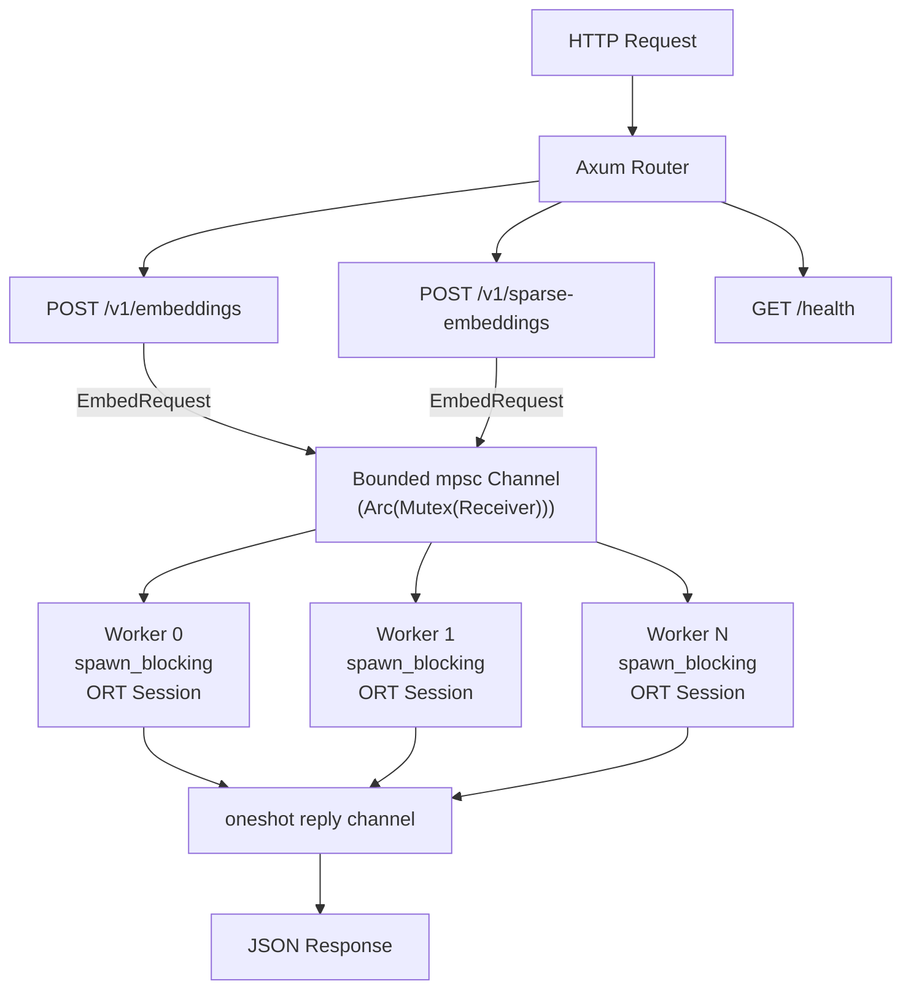

[](https://github.com/Fulton-Engineering-Services/bge-m3-embedding-server/actions/workflows/ci.yml) [](https://github.com/Fulton-Engineering-Services/bge-m3-embedding-server/actions/workflows/release.yml) [](https://codecov.io/gh/Fulton-Engineering-Services/bge-m3-embedding-server) [](LICENSE-MIT) [](https://github.com/Fulton-Engineering-Services/bge-m3-embedding-server/pkgs/container/bge-m3-embedding-server)

# bge-m3-embedding-server

An Axum HTTP server serving BGE-M3 dense and sparse embeddings via direct
[ONNX Runtime](https://onnxruntime.ai/) integration. It exposes an OpenAI-compatible
`/v1/embeddings` endpoint for dense vectors and a `/v1/sparse-embeddings` endpoint for
SPLADE-style sparse token weights.

## Quick Start

### Build

```bash
cargo build --release
```

### Run

```bash
# Model files are downloaded to /tmp/bge-m3-cache on first run
BGE_M3_CACHE_DIR=/tmp/bge-m3-cache cargo run --release
```

Wait for the log line indicating the server is ready before sending requests. On first run this
takes a minute or two while the ONNX model files download.

### Verify

```bash
# Readiness check
curl http://localhost:8081/health

# Dense embedding
curl -s http://localhost:8081/v1/embeddings \
  -H "Content-Type: application/json" \
  -d '{"input": "query: what is Rust?", "model": "bge-m3"}' | jq .

# Sparse embedding
curl -s http://localhost:8081/v1/sparse-embeddings \
  -H "Content-Type: application/json" \
  -d '{"input": ["what is Rust?"]}' | jq .
```

## API Reference

Full OpenAPI 3.1 specification: [`openapi.yaml`](./openapi.yaml)

| Endpoint | Method | Description |
|----------|--------|-------------|
| `/v1/embeddings` | `POST` | Dense embeddings — OpenAI-compatible |
| `/v1/sparse-embeddings` | `POST` | Sparse embeddings — BGE-M3 SPLADE-style |
| `/v1/models` | `GET` | Fleet discovery — returns the `bge-m3` model entry |
| `/health` | `GET` | Readiness probe with worker pool status |

### `GET /health`

Returns the worker pool status as JSON. Five possible states:

| HTTP | `status` | Meaning |
|------|----------|---------|
| `200` | `ok` | All workers healthy, models loaded |
| `200` | `warn` | Some workers exited; remaining workers are operational |
| `200` | `idle` | Models unloaded after idle timeout; will auto-reload on next request |
| `503` | `loading` | Models still initializing at startup |
| `503` | `fail` | All worker threads have exited (fatal) |

```bash
curl http://localhost:8081/health
```

**Response (`ok`)**

```json
{"status":"ok","workers":{"live":2,"total":2}}
```

**Response (`loading`)**

```json
{"status":"loading"}
```

---

### `POST /v1/embeddings`

Dense embeddings. OpenAI-compatible request and response format.

**Request**

```bash
curl -s http://localhost:8081/v1/embeddings \
  -H "Content-Type: application/json" \
  -d '{
    "input": "query: what is Rust?",
    "model": "bge-m3"
  }'
```

`input` accepts a single string or an array of strings. BGE-M3 query inputs should be prefixed
with `"query: "` and passage inputs with `"passage: "` for best retrieval quality.

**Response**

```json
{
  "object": "list",
  "model": "bge-m3",
  "data": [
    {
      "object": "embedding",
      "index": 0,
      "embedding": [0.0123, -0.0456, 0.0789]
    }
  ],
  "usage": {
    "prompt_tokens": 5,
    "total_tokens": 5
  }
}
```

**Error Response**

```json
{
  "error": {
    "message": "batch size 512 exceeds maximum 256",
    "type": "invalid_request_error",
    "code": 400
  }
}
```

---

### `POST /v1/sparse-embeddings`

Sparse embeddings using BGE-M3's SPLADE-style sparse model.

**Request**

```bash
curl -s http://localhost:8081/v1/sparse-embeddings \
  -H "Content-Type: application/json" \
  -d '{
    "input": ["what is Rust?"]
  }'
```

`input` accepts a single string or an array of strings.

**Response**

```json
{
  "data": [
    {
      "index": 0,
      "sparse_values": {
        "indices": [42, 100, 3527],
        "values": [0.5, 0.8, 0.3]
      }
    }
  ]
}
```

Each entry in `data` corresponds to one input string. `indices` are vocabulary token IDs and
`values` are the associated relevance weights.

**Error Response**

```json
{
  "error": {
    "message": "service unavailable: models still loading",
    "type": "service_unavailable",
    "code": 503
  }
}
```

---

## Configuration

All configuration is via environment variables.

| Variable | Default | Description |
|----------|---------|-------------|
| `BGE_M3_CACHE_DIR` | `/cache` | Directory where ONNX model files are cached |
| `BGE_M3_BIND` | `0.0.0.0:8081` | TCP bind address |
| `BGE_M3_WORKERS` | `2` | Worker thread count (each loads its own model; min 1) |
| `BGE_M3_MAX_BATCH` | `256` | Maximum texts per request (min 1) |
| `BGE_M3_IDLE_TIMEOUT_SECS` | `300` | Seconds of inactivity before models are unloaded from memory; `0` disables idle unloading |
| `BGE_M3_ONNX_BATCH_SIZE` | `8` (macOS) / `256` (other) | Texts per `session.run()` call. Defaults to `8` on macOS to avoid CoreML OOM kills |
| `BGE_M3_MODEL` | `fp32` | Model variant: `fp32` loads `BAAI/bge-m3` (~2.16 GB/session); `fp16` loads `Xenova/bge-m3` (~1.08 GB/session). FP16 recommended for Apple Silicon — see [docs/model-variants.md](docs/model-variants.md). |
| `BGE_M3_LOG_FORMAT` | (text) | Set to `json` for structured JSON log output |

## Docker

### Build

```bash
docker build -t bge-m3-embedding-server .
```

### Run

Mount a host directory as `/cache` so the model files persist across container restarts.

```bash
docker run --rm \
  -p 8081:8081 \
  -v /path/to/model-cache:/cache \
  bge-m3-embedding-server
```

Override workers and batch size at runtime:

```bash
docker run --rm \
  -p 8081:8081 \
  -v /path/to/model-cache:/cache \
  -e BGE_M3_WORKERS=4 \
  -e BGE_M3_MAX_BATCH=128 \
  bge-m3-embedding-server
```

The container includes a built-in `HEALTHCHECK` that polls `GET /health` every 10 seconds.
The start period is 120 seconds to allow time for model download and ONNX initialization on
first run.

## Apple Silicon (macOS)

The `scripts/` directory contains scripts for deploying the server as a persistent macOS LaunchAgent
on Apple Silicon Macs (M1/M2/M3/M4).

### Install

```bash
# Build ONNX Runtime from source with CoreML EP, then build and install the server.
# Requires: Rust, CMake, Python 3, Xcode Command Line Tools.
# First run takes 15–30 minutes to build ORT.
./scripts/install-bge-m3-apple.sh

# Or, install a pre-built binary:
./scripts/install-bge-m3-apple.sh /path/to/bge-m3-apple
```

The script:
1. Builds ONNX Runtime from the [FES fork](https://github.com/Fulton-Engineering-Services/onnxruntime) with the CoreML external-data-path fix.
2. Compiles `bge-m3-embedding-server` with `target-cpu=native` and the CoreML-enabled ORT.
3. Installs the binary to `~/.local/bin/bge-m3-apple`.
4. Registers `ai.bge-m3.server` as a LaunchAgent on port **8089**.

### Service management

```bash
# Status
launchctl list ai.bge-m3.server

# Stop
launchctl bootout gui/$(id -u)/ai.bge-m3.server

# Restart
launchctl kickstart -k gui/$(id -u)/ai.bge-m3.server

# Logs
tail -f ~/Library/Logs/bge-m3-apple/stderr.log
```

The LaunchAgent uses `BGE_M3_MODEL=fp16` (Xenova/bge-m3, ~1.08 GB/session) and
`BGE_M3_IDLE_TIMEOUT_SECS=0` (models stay resident). CoreML EP dispatches the vast
majority of transformer ops to the GPU (Metal), delivering 20–61% lower single-text
latency compared to the MLAS NEON baseline. The Neural Engine is not used —
BGE-M3's dynamic sequence length prevents ANE eligibility. See
[docs/coreml-ep.md](docs/coreml-ep.md) for details.

## Architecture



**Key design decisions:**

- Each worker loads a single ORT session inside `spawn_blocking` that produces both dense and
  sparse outputs from one ONNX model, avoiding async runtime blocking during inference.
- The shared `Arc<tokio::sync::Mutex<Receiver>>` lets all workers compete for work from a single
  channel, providing natural load balancing without a separate dispatcher.
- An `AtomicBool` readiness flag is set only after all workers have loaded **and** a warm-up probe
  runs both dense and sparse inference end-to-end. The `/health` endpoint returns `503 loading`
  until this completes.
- After `BGE_M3_IDLE_TIMEOUT_SECS` of inactivity, workers drop their model instances to free
  memory. Models reload transparently on the next request (~10–30 s from cache). Workers themselves
  never exit — only the model instances are unloaded.
- `tower-http::TraceLayer` + `SetRequestIdLayer` provide per-request tracing and `X-Request-ID`
  header propagation.

## License

Licensed under the Apache License, Version 2.0 ([LICENSE-APACHE](LICENSE-APACHE))
