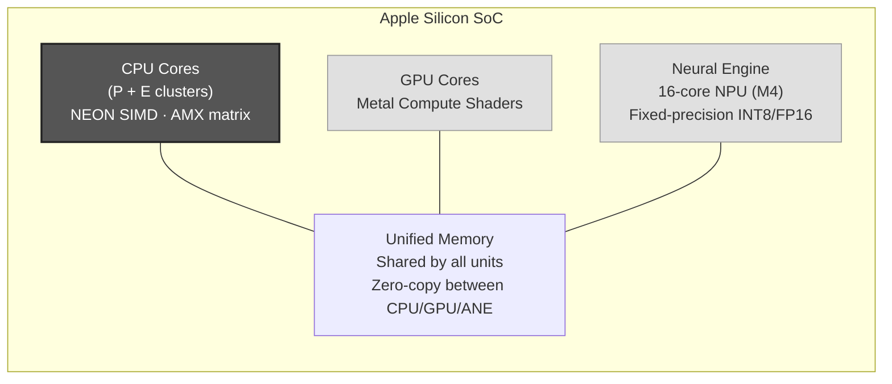
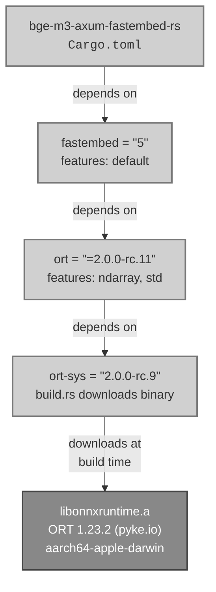
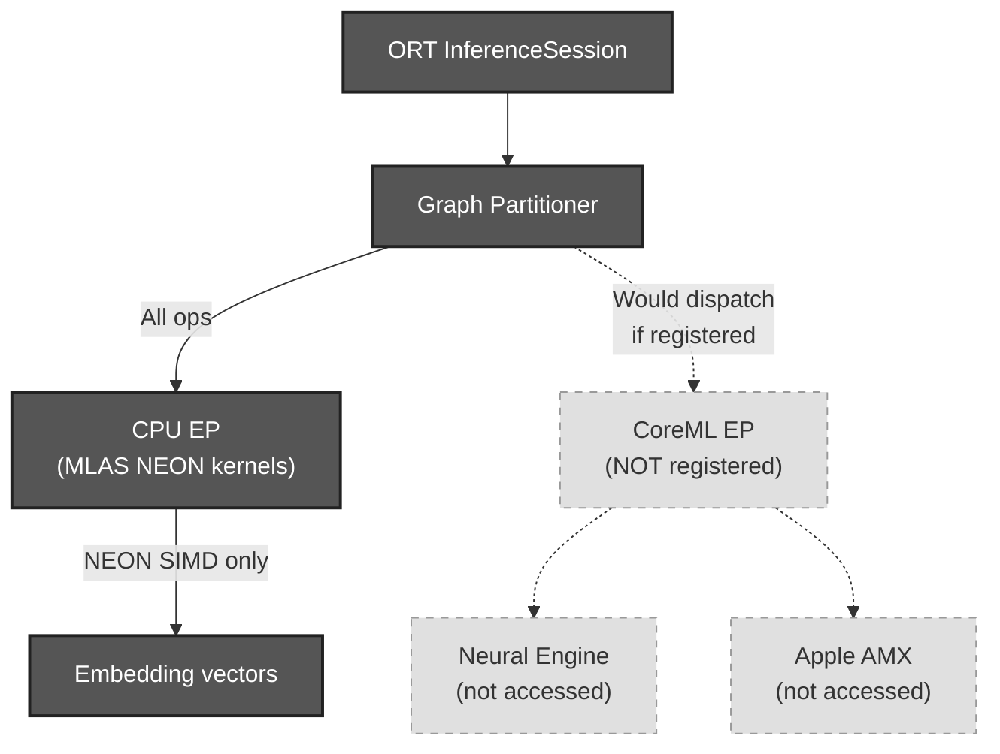
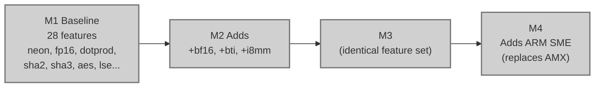
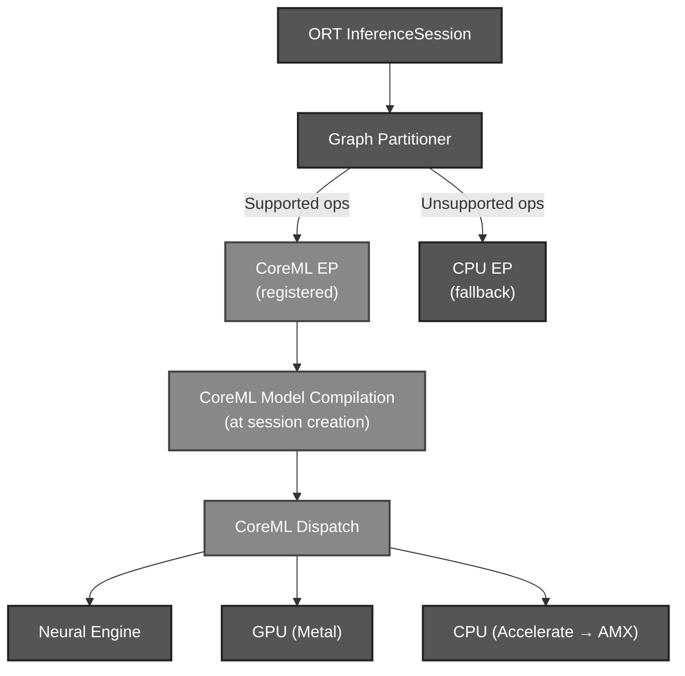

# Apple Silicon Build Target

This document describes how `bge-m3-axum-fastembed-rs` builds, links, and
executes on Apple Silicon (aarch64-apple-darwin). It covers the hardware
compute units available on M-series chips, what the current build chain
actually uses (and what it leaves on the table), the Rust release profile,
and the macOS `launchd` deployment used in production.

## Apple Silicon Compute Units

Apple Silicon SoCs contain four independent compute units relevant to ML
inference. Understanding which units are actually exercised by this project
is key to evaluating optimization opportunities.



### CPU — NEON SIMD

Every ARM64 core (performance and efficiency) has 32 x 128-bit SIMD vector
registers (V0–V31) implementing the NEON (Advanced SIMD) instruction set.
NEON vectorizes operations over 4 x FP32, 8 x FP16, 16 x INT8, etc.

**This is the only compute unit currently used by this project.** ONNX
Runtime's MLAS library contains hand-tuned NEON assembly kernels for GEMM,
convolution, softmax, pooling, and rotary embeddings.

### CPU — AMX (M1–M3) / SME (M4+)

The Apple Matrix coprocessor (AMX) is a proprietary extension tightly
coupled to each CPU cluster. It performs outer-product matrix
multiplication (`Z += X ⊗ Y`) using 512-bit registers at peak throughput
of ~1.6 TFLOPS FP32 on M1 at 3.2 GHz — roughly 3.7x faster than scalar
CPU for matrix-matrix multiply.

Key constraints:

| Aspect | Detail |
|--------|--------|
| Access path | Apple Accelerate framework only (M1–M3); no public intrinsics |
| M4+ | Uses ARM SME (Scalable Matrix Extension), an industry-standard ISA |
| MLAS | **Explicitly disabled** — `platform.cpp` guards AMX init with `#ifndef __APPLE__` |
| Status | **Idle in this project** |

### GPU — Metal Compute Shaders

Apple Silicon uses unified memory, eliminating PCIe copy overhead between
CPU and GPU. CoreML dispatches to the GPU via Metal Performance Shaders
(MPS). M4 chips add dedicated "Neural Accelerators" within the GPU die.

**Not currently used** — requires CoreML EP registration (see below).

### Neural Engine (ANE)

The ANE is a discrete NPU on the SoC targeting fixed-precision inference
(INT8, FP16). The M4 ANE delivers 38 TOPS across 16 cores — roughly 3x
faster than the GPU for compatible models.

Hard constraints:
- Static tensor shapes required — dynamic dimensions force CPU fallback
- Only accessible through CoreML
- **Not currently used** — requires CoreML EP registration

## Dependency Chain

The path from Rust source to ONNX inference traverses four crates before
reaching the prebuilt static library:



### The Prebuilt Binary

`ort-sys` downloads a precompiled static library from `cdn.pyke.io` at
build time. For `aarch64-apple-darwin`, this is ONNX Runtime 1.23.2
compiled with:

- **CPU EP** (default fallback) — always present
- **CoreML EP** — compiled in, 11,886+ CoreML symbols confirmed via `nm`
- **MLAS** — hand-tuned NEON assembly kernels for ARM64
- No CUDA, TensorRT, ROCM, or DirectML (as expected for macOS ARM64)

The dist URL is recorded in `ort-sys`'s `build/download/dist.txt`:

```
none  aarch64-apple-darwin  https://cdn.pyke.io/0/pyke:ort-rs/ms@1.23.2/aarch64-apple-darwin.tar.lzma2
```

### What Links at Build Time

When `cargo build --release --target aarch64-apple-darwin` runs, `ort-sys`'s
`build.rs` emits link directives. For `aarch64-apple-darwin` with the pyke
prebuilt, only Foundation is explicitly linked:

```
cargo:rustc-link-lib=framework=Foundation
```

However, because `libonnxruntime.a` contains CoreML EP object files that
reference CoreML symbols, the linker resolves these against the macOS SDK
frameworks. The resulting binary links:

| Framework | Why |
|-----------|-----|
| `CoreML.framework` | CoreML EP symbols in `libonnxruntime.a` |
| `Foundation.framework` | Explicitly linked by `ort-sys` build.rs |
| `CoreFoundation.framework` | Transitive dependency |
| `Security.framework` | TLS/certificate support |
| `SystemConfiguration.framework` | Network reachability |

This can be verified on the installed binary:

```bash
otool -L ~/.local/bin/bge-m3-apple
```

### CoreML EP — Present but Not Registered

This is the critical subtlety. The binary **contains** CoreML EP code and
**links** `CoreML.framework`, but the EP is **never registered** at runtime.

The chain of why:

1. `fastembed = "5"` depends on `ort` with features `["ndarray", "std"]` — no
   `coreml` feature
2. In the `ort` crate, `src/ep/coreml.rs` gates registration behind
   `#[cfg(any(feature = "load-dynamic", feature = "coreml"))]`
3. Without the feature flag, `register()` returns `Err(RegisterError::MissingFeature)`
4. fastembed never calls `register()` for CoreML anyway — it uses the default
   CPU EP

**Result:** All inference runs through the CPU EP using MLAS NEON kernels.
The CoreML symbols are dead code in the linked binary.



### MLAS on Apple Silicon

MLAS (Microsoft Linear Algebra Subprograms) is ONNX Runtime's built-in
BLAS-like library. It ships as part of `libonnxruntime.a` and provides:

- FP32 SGEMM (single-precision GEMM)
- FP16/HGEMM (half-precision GEMM)
- Quantized GEMM (INT8, Q4, QNBitGEMM)
- Convolution, softmax, pooling, rotary embeddings

For ARM64, MLAS includes NEON-optimized assembly kernels:

| Kernel | Source file |
|--------|------------|
| Half-precision GEMM | `hgemm_kernel_neon.cpp` |
| Quantized GEMM | `qgemm_kernel_neon.cpp` |
| FP32 cast | `cast_kernel_neon.cpp` |
| SQNBitGEMM | `sqnbitgemm_kernel_neon_fp32.cpp` |
| Rotary embedding | `rotary_embedding_kernel_neon.cpp` |

What MLAS does **not** use on macOS:

- **Apple Accelerate** — zero `cblas_*` or `vDSP_*` symbols in the binary
- **Apple AMX** — explicitly disabled with `#ifndef __APPLE__` guard in
  `platform.cpp`

MLAS implements its own optimized kernels rather than delegating to system
frameworks.

## Rust Release Profile

The project's `Cargo.toml` configures an aggressive release profile:

```toml
[profile.release]
lto = "thin"
codegen-units = 1
strip = "symbols"
panic = "abort"
```

### Setting Analysis

| Setting | Value | Effect |
|---------|-------|--------|
| `lto` | `"thin"` | Cross-crate inlining and optimization; parallelizable; ~80–90% of fat LTO's runtime gain without the severe compile-time penalty |
| `codegen-units` | `1` | Entire crate compiled as one LLVM module — maximizes intra-crate optimization, auto-vectorization, and constant propagation; often 5–15% runtime improvement over the default 16 units |
| `strip` | `"symbols"` | Removes symbol table; 30–60% binary size reduction on macOS; stack traces show hex addresses only |
| `panic` | `"abort"` | No unwinding tables; 5–15% binary size reduction; marginally tighter codegen without landing pads |

The resulting binary is ~22 MB (stripped, arm64 Mach-O).

### The `target-cpu` Gap

The project has **no** `.cargo/config.toml`. Builds use the default
`aarch64-apple-darwin` target features, which correspond to the M1 baseline.

On M2 and later, `target-cpu=native` unlocks three additional instruction
set extensions:

| Feature | Description | Added in |
|---------|-------------|----------|
| `i8mm` | INT8 Matrix Multiply — relevant for quantized ONNX ops | M2 (apple-a15) |
| `bf16` | BFloat16 — 16-bit brain float for ML inference | M2 (apple-a15) |
| `bti` | Branch Target Identification — security hardening | M2 (apple-a15) |

The full feature progression:



Note: Apple Silicon does **not** implement SVE or SVE2. The M-series chips
use fixed-width 128-bit NEON SIMD exclusively (until M4's SME).

### Recommended `.cargo/config.toml`

To unlock M2+ features for local builds without affecting CI or Docker:

```toml
# .cargo/config.toml
#
# Apple Silicon local builds — target-cpu=native enables i8mm, bf16, bti
# beyond the M1 baseline. This section is ignored when building for any
# other target triple (e.g., x86_64-unknown-linux-gnu in CI/Docker).
[target.aarch64-apple-darwin]
rustflags = ["-C", "target-cpu=native"]
```

**Why this is safe for CI:** GitHub Actions runners use
`x86_64-unknown-linux-gnu`. The Dockerfile builds for
`x86_64-unknown-linux-gnu` or `aarch64-unknown-linux-gnu`. Neither matches
`aarch64-apple-darwin`, so this section is never consulted.

**Historical note:** Rust versions before 1.82 (LLVM < 19) had a
[known bug](https://github.com/rust-lang/rust/issues/93889) where `native`
misidentified Apple Silicon as `cyclone` (A7 era). This was fixed in LLVM 19
(Rust 1.82, October 2024). Current rustc (1.93.0+) correctly resolves
`native` to the actual chip model.

## macOS Deployment

The project deploys on Apple Silicon Macs as a `launchd` UserAgent, managed
by the install script in the `dpos-ha-config` repository.

### Build and Install

The install script
([`dpos-ha-config/ops/install-bge-m3-service.sh`](https://github.com/Fulton-Engineering-Services/dpos-ha-config))
handles the full lifecycle:

```bash
# From the dpos-ha-config repo root:
./ops/install-bge-m3-service.sh
```

The script:

1. Verifies Apple Silicon (`uname -m == arm64`)
2. Builds from source if no binary is provided:
   ```bash
   cargo build --release --target aarch64-apple-darwin \
       --manifest-path ../bge-m3-axum-fastembed-rs/Cargo.toml
   ```
3. Installs the binary to `~/.local/bin/bge-m3-apple`
4. Creates the model cache directory at `~/.cache/bge-m3`
5. Creates the log directory at `~/Library/Logs/bge-m3-apple/`
6. Installs the `launchd` plist (substituting `__HOME__` paths)
7. Bootstraps the LaunchAgent via `launchctl bootstrap`
8. Runs a health check on port 8089

### LaunchAgent Configuration

The plist template
(`dpos-ha-config/config/bge-m3-apple/ai.bge-m3.server.plist`) configures:

| Setting | Value | Rationale |
|---------|-------|-----------|
| `BGE_M3_BIND` | `0.0.0.0:8089` | Port 8089 avoids conflict with llama-server (8088) |
| `BGE_M3_WORKERS` | `2` | Two worker threads, each with its own model instance |
| `BGE_M3_MAX_BATCH` | `256` | Maximum texts per request |
| `BGE_M3_IDLE_TIMEOUT_SECS` | `0` | Disabled — models stay resident permanently |
| `BGE_M3_CACHE_DIR` | `~/.cache/bge-m3` | Local model cache |
| `BGE_M3_LOG_FORMAT` | `json` | Structured logging for log aggregation |
| `RUST_LOG` | `info` | Log level |
| `KeepAlive` | `true` | Restart on crash |
| `RunAtLoad` | `true` | Start at login |
| `ThrottleInterval` | `10` | Minimum 10s between restart attempts |

Logs are written to `~/Library/Logs/bge-m3-apple/{stdout,stderr}.log`.

### Service Management

```bash
# Status
launchctl list ai.bge-m3.server

# Stop
launchctl bootout gui/$(id -u)/ai.bge-m3.server

# Restart
launchctl kickstart -k gui/$(id -u)/ai.bge-m3.server

# Logs
tail -f ~/Library/Logs/bge-m3-apple/stderr.log
```

## CoreML EP via Custom ORT Build (Current Production State)

CoreML EP is now enabled in production via a custom ORT build linked with
`ORT_LIB_LOCATION`.  This approach bypasses the pyke.io prebuilt entirely;
all inference runs through ORT built from source with
`-Donnxruntime_USE_COREML=ON`.

### ORT Bug Fix Required

The pyke.io prebuilt (and the upstream ORT release through v1.23.2) contains
a path-handling bug in `TensorProtoWithExternalDataToTensorProto` that causes
an immediate `ENOTDIR` crash when CoreML EP loads a model with external data
(`.onnx` + `.onnx_data` split format, as used by BGE-M3):

```
open file ".../onnx/model.onnx/model.onnx_data" failed: Not a directory
```

**Root cause:** the function receives `ModelPath()` (a file path, e.g.
`.../onnx/model.onnx`) but passes it directly to `ReadExternalDataForTensor`,
which expects a directory. `GetExternalDataInfo` then constructs
`model.onnx / model.onnx_data` — a path through a file — triggering ENOTDIR.

**Fix** (one logical line in `tensorprotoutils.cc`):

```cpp
// Derive the directory from model_path if it points to a file.
const auto tensor_proto_dir =
    model_path.has_filename() ? model_path.parent_path() : model_path;
ORT_RETURN_IF_ERROR(ReadExternalDataForTensor(ten_proto, tensor_proto_dir, unpacked_data));
```

This mirrors the pattern used by every other external-data path in the same
file (`UnpackTensor`, `GetExtDataFromTensorProto`).  The bug is also present
in ORT `main` as of the time of writing.  An upstream PR against `main` is
planned (see Serena memory `ort-upstream-pr/coreml-external-data-path-fix`).

**Patched fork:**

| | |
|---|---|
| Fork | `https://github.com/Fulton-Engineering-Services/onnxruntime` |
| Branch | `fix/coreml-tensorproto-external-data-path` |
| Commit | `1e37c3583d05992bc1419269f87d941e8642248c` |
| Base tag | `v1.23.2` |

### Building the Custom ORT

```bash
# One-time: clone and configure (requires cmake 3.26+, Xcode CLT)
git clone --depth 1 --branch v1.23.2 \
  https://github.com/Fulton-Engineering-Services/onnxruntime.git \
  ~/.local/share/ort-build/onnxruntime
cd ~/.local/share/ort-build/onnxruntime
git checkout fix/coreml-tensorproto-external-data-path

mkdir -p ~/.local/share/ort-build/output && cd ~/.local/share/ort-build/output
cmake ../onnxruntime \
  -DCMAKE_BUILD_TYPE=Release \
  -Donnxruntime_BUILD_SHARED_LIB=OFF \
  -Donnxruntime_USE_COREML=ON \
  -DCMAKE_OSX_ARCHITECTURES=arm64

# Build (takes ~20–30 minutes on first run)
cmake --build . -j$(sysctl -n hw.logicalcpu)
```

### Building the Rust Service Against Custom ORT

```bash
ORT_LIB_LOCATION=~/.local/share/ort-build/output/Release \
  cargo build --release
```

The `ort-sys` build script detects the multi-library layout in the directory
and links against all individual `.a` files (onnxruntime_framework,
onnxruntime_session, onnxruntime_providers_coreml, protobuf-lite, onnx, etc.).
`ORT_LIB_LOCATION` is a **build-time** environment variable only; the
resulting binary is fully self-contained.

### Cargo Cache Gotcha

With `-C lto=thin`, Rust embeds ALL C++ object files from linked static
libraries into `libort_sys-*.rlib` (typically ~69–72 MB).  This rlib is
cached independently from the `.a` files.  If the custom ORT is rebuilt
(e.g. after patching), the stale rlib must be removed to force a relink:

```bash
rm target/release/deps/libort_sys-*.rlib
ORT_LIB_LOCATION=~/.local/share/ort-build/output/Release cargo build --release
```

Simply running `cargo clean -p ort-sys` does not remove the rlib; it must be
deleted directly from `target/release/deps/`.

## Future: Enabling CoreML EP (Standard Build Path)

Enabling the CoreML Execution Provider would allow ONNX Runtime to dispatch
model subgraphs to the Neural Engine (ANE) and GPU via Apple's CoreML
framework, rather than running everything through MLAS NEON kernels on the
CPU.

### What Would Change



CoreML's `MLComputeUnits` setting controls which hardware is available:

| Option | Dispatch targets |
|--------|-----------------|
| `All` (default) | ANE + GPU + CPU — CoreML chooses per-subgraph |
| `CPUAndNeuralEngine` | ANE + CPU |
| `CPUAndGPU` | GPU + CPU |
| `CPUOnly` | CPU only (via Accelerate → AMX) |

### Prerequisites

1. **Enable the `coreml` feature on `ort`** — fastembed-rs would need to
   depend on `ort` with `features = ["coreml"]`, or the feature would need
   to be enabled transitively

2. **Link `CoreML.framework` explicitly** — the pyke prebuilt's
   `static_link/mod.rs` only emits `framework=Foundation` for macOS (iOS
   gets CoreML automatically); a `build.rs` or Cargo config override would
   need to add `cargo:rustc-link-lib=framework=CoreML`

3. **Register the EP at session creation** — fastembed-rs would need to
   call `SessionBuilder::with_execution_providers([CoreMLExecutionProvider::default()])`
   before loading the model

### Known Risks

| Risk | Detail |
|------|--------|
| FP16 silent conversion | CoreML silently converts FP32 to FP16 when dispatching to GPU; this can affect embedding precision |
| Session creation overhead | ONNX-to-CoreML compilation happens at session creation, adding 5–15s startup cost per model unless `ModelCacheDirectory` is configured |
| Dynamic shapes | Any ONNX ops with dynamic dimensions fall back to CPU; BGE-M3's variable-length sequence handling may limit ANE eligibility |
| macOS version coupling | MLProgram format requires macOS 12+; NeuralNetwork format on macOS 10.15+ has limited op coverage |

### References

- [ONNX Runtime CoreML EP documentation](https://onnxruntime.ai/docs/execution-providers/CoreML-ExecutionProvider.html)
- [Apple MLComputeUnits](https://developer.apple.com/documentation/coreml/mlcomputeunits)
- [ort crate CoreML EP source](https://github.com/pykeio/ort) (`src/ep/coreml.rs`)
- [AMX reverse engineering (corsix/amx)](https://github.com/corsix/amx)
- [ONNX Runtime MLAS](https://github.com/microsoft/onnxruntime/tree/main/onnxruntime/core/mlas/lib)
- [Rust `native` CPU misdetection fix (rust-lang/rust#93889)](https://github.com/rust-lang/rust/issues/93889)

---

## Analysis: Full CoreML Optimization Path (Raw Data)

> **Note:** Raw analysis outputs from model inspection and CoreML EP op
> coverage analysis. To be synthesized into final documentation.

### BGE-M3 ONNX Model Structure

```
Inputs:
  input_ids:       INT64 [batch_size, sequence_length]    ← both dynamic
  attention_mask:  INT64 [batch_size, sequence_length]    ← both dynamic

Outputs:
  token_embeddings:    FLOAT [batch_size, sequence_length, 1024]
  sentence_embedding:  FLOAT [batch_size, Divsentence_embedding_dim_1]

IR version:  6
Opset:       ai.onnx v11
Producer:    PyTorch 2.1.2
```

### Op Census (2,495 total, 28 unique types)

| Op | Count | CoreML EP Support |
|----|-------|-------------------|
| Constant | 571 | N/A (weight tensors, absorbed into CoreML model) |
| Add | 341 | Yes |
| Gather | 198 | Yes |
| Unsqueeze | 197 | Yes |
| Shape | 196 | Yes |
| MatMul | 192 | Yes |
| Mul | 100 | Yes |
| Concat | 98 | Yes |
| ReduceMean | 98 | Yes |
| Div | 98 | Yes |
| Reshape | 97 | Yes |
| Transpose | 96 | Yes |
| Pow | 51 | Yes |
| Sub | 50 | Yes |
| Sqrt | 49 | Yes |
| Softmax | 24 | Yes |
| Erf | 24 | Yes |
| Cast | 3 | Yes |
| Equal | 2 | **No** |
| Expand | 2 | **No** |
| Slice | 1 | Yes |
| ConstantOfShape | 1 | **No** |
| Where | 1 | **No** |
| Not | 1 | **No** |
| CumSum | 1 | **No** |
| Abs | 1 | **No** |
| ReduceSum | 1 | Yes |
| Clip | 1 | Yes |

### CoreML EP Op Coverage Summary

| Metric | Count | Percentage |
|--------|-------|------------|
| Total ops | 2,495 | |
| Constant (weight) ops | 571 | (excluded from coverage calc) |
| Compute ops | 1,924 | 100% |
| CoreML-dispatchable | 1,915 | **99.5%** |
| CPU EP fallback | 9 | 0.5% |

The 9 unsupported compute ops (`Equal` ×2, `Expand` ×2, `ConstantOfShape`,
`Where`, `Not`, `CumSum`, `Abs`) are in attention mask processing and
sparse embedding logic — not in the critical compute path.

### CoreML EP Supported Ops (from `op_builder_factory.cc`, ORT v1.23.2)

```
Add, ArgMax, AveragePool, BatchNormalization, Cast, Clip, Concat, Conv,
ConvTranspose, DepthToSpace, Div, Erf, Flatten, Gather, Gelu, Gemm,
GlobalAveragePool, GlobalMaxPool, GridSample, GroupNormalization,
InstanceNormalization, LayerNormalization, LeakyRelu, LRN, MatMul, Max,
MaxPool, Mul, Pad, Pow, PRelu, Reciprocal, ReduceMax, ReduceMean,
ReduceMin, ReduceProd, ReduceSum, Relu, Reshape, Resize, Round, Shape,
Sigmoid, Slice, Softmax, Split, Sqrt, Squeeze, Sub, Tanh, Transpose,
Unsqueeze
```

### Dynamic Shape Impact on Compute Unit Eligibility

| Compute Unit | Requires Static Shapes? | Accessible for BGE-M3? |
|-------------|------------------------|----------------------|
| Neural Engine (ANE) | Yes — hard requirement | **No** — both dims dynamic |
| GPU (Metal) | No | Yes — with overhead |
| CPU (Accelerate → AMX) | No | Yes |
| CPU (MLAS NEON) | No | Yes — current fallback |

### ComputeUnits Strategy Analysis

| Setting | Dispatch Path | AMX? | FP16 Risk? | GPU Overhead? |
|---------|--------------|------|-----------|--------------|
| `All` (default) | CoreML decides GPU vs CPU per-subgraph | Via Accelerate if CPU chosen | Yes on GPU ops | Yes |
| `CPUOnly` | All CoreML ops → Accelerate → AMX | **Yes** | **No** | **No** |
| `CPUAndGPU` | Same as `All` (ANE excluded by shapes) | Via Accelerate if CPU chosen | Yes on GPU ops | Yes |
| `CPUAndNeuralEngine` | Falls back to CPU (ANE can't handle dynamic) | Via Accelerate | No | No |

Key insight: `CPUOnly` is the only path to guaranteed AMX usage without
GPU context-switching overhead or FP16 silent conversion. MLAS explicitly
disables AMX on macOS (`#ifndef __APPLE__` in `platform.cpp`).

### `ort::ep::CoreML` Builder API (v2.0.0-rc.11)

| Method | Type | Default | Notes |
|--------|------|---------|-------|
| `with_compute_units()` | `ComputeUnits` | `All` | Controls hardware dispatch targets |
| `with_model_format()` | `ModelFormat` | `NeuralNetwork` | `MLProgram` requires macOS 12+ |
| `with_model_cache_dir()` | `impl ToString` | None | Caches compiled CoreML model to disk |
| `with_specialization_strategy()` | `SpecializationStrategy` | `Default` | `FastPrediction` trades load time for latency |
| `with_profile_compute_plan()` | `bool` | `false` | Logs per-op hardware dispatch decisions |
| `with_low_precision_accumulation_on_gpu()` | `bool` | `false` | FP16 accumulation on GPU |
| `with_subgraphs()` | `bool` | `false` | Handle ops inside control flow |
| `with_static_input_shapes()` | `bool` | `false` | Reject dynamic shapes entirely |

### Phase Plan

**Phase 1 — Observe:** Enable `with_profile_compute_plan(true)`, inspect
dispatch decisions with `RUST_LOG=debug`.

**Phase 2 — Configure:** `with_model_cache_dir()`, `with_model_format(MLProgram)`,
`with_specialization_strategy(FastPrediction)`, `.cargo/config.toml` with
`target-cpu=native`, cmake `-DCMAKE_CXX_FLAGS="-mcpu=native"`.

**Phase 3 — Benchmark ComputeUnits:** Compare MLAS NEON baseline vs
CoreML `CPUOnly` (Accelerate → AMX) vs CoreML `All` (GPU + CPU).
Measure latency, throughput, memory, embedding precision.

**Phase 4 — Fixed-shape ANE exploration (deferred):** Re-export BGE-M3
with static shapes; requires fastembed surgery for padding/truncation.

## Phase Progress Log

### Phases 1 & 2 — Completed

Implemented in commit `3760c9f`:

```rust
fn execution_providers(cache_dir: &Path) -> Vec<ort::ep::ExecutionProviderDispatch> {
    #[cfg(target_os = "macos")]
    {
        let coreml_cache = cache_dir.join("coreml");
        vec![ort::ep::CoreML::default()
            .with_model_format(ort::ep::coreml::ModelFormat::MLProgram)
            .with_specialization_strategy(ort::ep::coreml::SpecializationStrategy::FastPrediction)
            .with_model_cache_dir(coreml_cache.display().to_string())
            .with_profile_compute_plan(true) // TODO(phase3): remove after benchmarking
            .build()]
    }
    #[cfg(not(target_os = "macos"))]
    {
        let _ = cache_dir;
        vec![]
    }
}
```

`.cargo/config.toml` added with `target-cpu=native` for `aarch64-apple-darwin`.

### Phase 3 — Benchmark Harness

#### Corpus

Curated from three production databases on `jpfulton-imac.lan` via the
`db-backup` container. Stored at `benches/fixtures/corpus.json`.

| Scenario | Source | Count | Char range | Description |
|----------|--------|-------|------------|-------------|
| `document_chunks` | `knowledgebase.chunks` | 50 | 337–1,599 | Stratified sample: 10 short, 20 medium, 20 long. Hamlet PDF + Spring AI docs. |
| `tool_descriptions` | `coordinator.vector_store` | 75 | 33–283 | Complete set. Tool/capability descriptions for semantic memory retrieval. |
| `code_symbols` | `codekeeper.symbols` | 50 | 22–120 | Random sample from 185K symbols. Class/method/field name_paths. |

**Database inventory** (for future corpus expansion):

| Database | Host container | Relevant tables | Row count | Notes |
|----------|---------------|-----------------|-----------|-------|
| `knowledgebase` | `coordinator-db` | `chunks`, `documents` | 386 chunks / 5 docs | `halfvec(1024)` dense + `sparsevec(250002)` sparse stored alongside content |
| `coordinator` | `coordinator-db` | `vector_store`, `captures` | 75 vectors / 0 captures | Tool descriptions with `vector(1024)` embeddings |
| `codekeeper` | `codekeeper-db` | `symbols`, `symbol_embeddings` | 185K symbols / 0 embeddings | Embeddings not yet generated; symbols have name_path + signature |
| `langfuse` | `langfuse-db` | `observations`, `traces` | 0 / 0 | Not yet wired for tracing |

**Extraction commands** (for reproducibility):

```bash
# From local machine — pipes through SSH to db-backup container
# Knowledgebase chunks (stratified)
ssh jpfulton-imac-ha "cd ~/dpos-ha-config && docker exec db-backup \
  env PGPASSWORD=\$(grep KB_DB_PASSWORD .env | cut -d= -f2) \
  psql -h coordinator-db -U knowledgebase -d knowledgebase -t -A -c \"
    SELECT json_agg(row_to_json(t)) FROM (
      (SELECT content, length(content) AS char_count, 'short' AS bucket
       FROM chunks WHERE length(content) < 1000 ORDER BY random() LIMIT 10)
      UNION ALL
      (SELECT content, length(content), 'medium'
       FROM chunks WHERE length(content) BETWEEN 1000 AND 1500 ORDER BY random() LIMIT 20)
      UNION ALL
      (SELECT content, length(content), 'long'
       FROM chunks WHERE length(content) > 1500 ORDER BY random() LIMIT 20)
    ) t\""

# Coordinator vector_store (complete)
ssh jpfulton-imac-ha "cd ~/dpos-ha-config && docker exec db-backup \
  env PGPASSWORD=\$(grep COORDINATOR_DB_PASSWORD .env | cut -d= -f2) \
  psql -h coordinator-db -U coordinator -d coordinator -t -A -c \"
    SELECT json_agg(row_to_json(t)) FROM (
      SELECT content, length(content) AS char_count
      FROM vector_store WHERE content IS NOT NULL ORDER BY length(content)
    ) t\""

# Codekeeper symbols (random sample)
ssh jpfulton-imac-ha "cd ~/dpos-ha-config && docker exec db-backup \
  env PGPASSWORD=\$(grep CODEKEEPER_DB_PASSWORD .env | cut -d= -f2) \
  psql -h codekeeper-db -U codekeeper -d codekeeper -t -A -c \"
    SELECT json_agg(row_to_json(t)) FROM (
      SELECT s.name_path AS content, length(s.name_path) AS char_count, s.kind
      FROM symbols s ORDER BY random() LIMIT 50
    ) t\""
```

#### Harness Design

The benchmark tests at the `fastembed` API level — directly calling
`TextEmbedding::embed()` and `SparseTextEmbedding::embed()` — bypassing
the HTTP server and worker pool. This isolates ONNX inference timing
from Axum routing, JSON serialization, and channel dispatch overhead.

**EP configuration via environment variable** (`BGE_M3_BENCH_EP`):

| Value | Execution providers | What it measures |
|-------|-------------------|-----------------|
| `mlas_only` | Empty vec (CPU EP, MLAS NEON) | Baseline — current production without CoreML |
| `coreml_all` | `CoreML::default()` with `ComputeUnits::All` | CoreML decides GPU vs CPU per-subgraph |
| `coreml_cpu_only` | `CoreML` with `ComputeUnits::CPUOnly` | Accelerate → AMX path (no GPU, no FP16 risk) |
| `coreml_cpu_and_gpu` | `CoreML` with `ComputeUnits::CPUAndGPU` | GPU (Metal) + CPU mix |

No recompilation between runs — change the env var and re-run.

**Constraints:**
- Requires `ORT_LIB_LOCATION` at build time for the custom ORT with CoreML EP
- Requires model cache at `BGE_M3_CACHE_DIR` (defaults to `/tmp/bge-m3-cache`)
- Inherently a local-machine benchmark — CI runners lack the custom ORT build
- First run per EP config pays session-creation cost (CoreML compilation);
  subsequent runs use the model cache

#### Next Steps

- [x] Build `benches/coreml.rs` harness (commit `38dad70`)
- [x] Rebuild custom ORT with `-mcpu=native` (see build steps below)
- [x] Run baseline measurements across all four EP configurations (mlas, coreml_all, coreml_cpu_only, coreml_cpu_and_gpu)
- [x] Identify and fix SIGKILL root cause — `BGE_M3_ONNX_BATCH_SIZE` (commit `d917011`)
- [x] Run post-fix coreml_all benchmark — all 12 scenarios complete, no SIGKILL
- [x] Move `with_profile_compute_plan()` behind `coreml-profile` Cargo feature (commit `f16376d`)
- [ ] Probe `onnx_batch_size=32` on 128 GB hardware to recover batch throughput
- [ ] Capture `ProfileComputePlan` output to confirm per-op dispatch targets (`--features coreml-profile`)
- [ ] Compare embedding precision: cosine similarity of CoreML vs MLAS outputs
- [ ] Update `dpos-ha-config` LaunchAgent plist with `BGE_M3_ONNX_BATCH_SIZE` tuned for 128 GB

### Custom ORT Build Steps

Building ONNX Runtime from the Fulton Engineering fork with the ENOTDIR fix
and CoreML EP enabled. Output is a set of static libraries consumed by the
`ort-sys` crate via `ORT_LIB_LOCATION`.

#### Prerequisites

- Xcode Command Line Tools (provides `clang`, `clang++`, Apple frameworks)
- CMake **3.31.x** (CMake 4.x has breaking changes with ORT's dependency CMakeLists)
- Python 3.x (ORT's `build.py` orchestrator)
- The fork repo with submodules initialized

```bash
# If only CMake 4.x is installed, grab a 3.31 binary:
curl -sL https://github.com/Kitware/CMake/releases/download/v3.31.8/cmake-3.31.8-macos-universal.tar.gz \
  -o /tmp/cmake-3.31.8.tar.gz
tar xzf /tmp/cmake-3.31.8.tar.gz -C /tmp/
CMAKE_BIN=/tmp/cmake-3.31.8-macos-universal/CMake.app/Contents/bin/cmake
```

#### Fork Setup

```bash
cd onnxruntime   # Fulton-Engineering-Services/onnxruntime fork
git checkout fix/coreml-tensorproto-external-data-path  # commit 1e37c3583
git submodule update --init --recursive
```

#### Build Command

```bash
python3 tools/ci_build/build.py \
  --cmake_path "$CMAKE_BIN" \
  --build_dir ~/.local/share/ort-build/output \
  --config Release \
  --parallel 24 \
  --osx_arch arm64 \
  --use_coreml \
  --skip_tests \
  --compile_no_warning_as_error \
  --cmake_extra_defines \
    onnxruntime_BUILD_SHARED_LIB=OFF \
    "CMAKE_CXX_FLAGS=-mcpu=native" \
    "CMAKE_C_FLAGS=-mcpu=native" \
    CMAKE_SKIP_INSTALL_RULES=ON \
  --update --build
```

#### CMake Workarounds

| Issue | Cause | Fix |
|-------|-------|-----|
| `cmake_minimum_required(VERSION 2.x)` error | CMake 4.x removed compat with <3.5 | Use CMake 3.31.x |
| `coreml_proto` not in export set | ORT CMake bug: static + CoreML install targets | `CMAKE_SKIP_INSTALL_RULES=ON` |

#### Build Output

```
~/.local/share/ort-build/output/Release/
├── libonnxruntime_common.a
├── libonnxruntime_flatbuffers.a
├── libonnxruntime_framework.a        ← contains ENOTDIR fix
├── libonnxruntime_graph.a
├── libonnxruntime_lora.a
├── libonnxruntime_mlas.a             ← NEON/MLAS kernels
├── libonnxruntime_optimizer.a
├── libonnxruntime_providers.a        ← CPU EP operators (33 MB)
├── libonnxruntime_providers_coreml.a ← CoreML EP
├── libonnxruntime_session.a
├── libonnxruntime_util.a
├── libcoreml_proto.a                 ← CoreML protobuf definitions
└── _deps/                            ← abseil, protobuf, re2, onnx, etc.
```

#### Verified Properties

| Property | Value |
|----------|-------|
| ORT version | 1.23.2 |
| Git commit | `1e37c3583` (ENOTDIR fix) |
| Branch | `fix/coreml-tensorproto-external-data-path` |
| Architecture | arm64 |
| C/C++ flags | `-mcpu=native` (M3 codegen) |
| CoreML EP | ON |
| KleidiAI | ON (ARM-optimized GEMM) |
| Build type | Release, static |

#### Usage

```bash
export ORT_LIB_LOCATION=~/.local/share/ort-build/output/Release
cargo bench --bench coreml
```

### Benchmark Results

All measurements on MacBook Pro M3 Max (16P+4E, 128 GB), macOS Tahoe.
Custom ORT 1.23.2 from fork commit `1e37c3583`, `-mcpu=native`.
Criterion 20 samples per benchmark. Values are median 95% CI.

#### MLAS Baseline (no CoreML EP)

`BGE_M3_BENCH_EP=mlas_only`

| Scenario | Dense Single | Dense Batch | Sparse Single | Sparse Batch |
|----------|-------------|-------------|---------------|--------------|
| code_symbols (50×, 22–120 chars) | 36.5 ms | 1.34 s | 37.3 ms | 1.34 s |
| document_chunks (50×, 337–1599 chars) | 156.0 ms | 12.04 s | 153.9 ms | 11.85 s |
| tool_descriptions (75×, 33–283 chars) | 30.5 ms | 3.62 s | 35.3 ms | 3.51 s |

#### CoreML CPU-only (Accelerate/AMX path)

`BGE_M3_BENCH_EP=coreml_cpu_only`

| Scenario | Dense Single | Dense Batch | Sparse Single | Sparse Batch |
|----------|-------------|-------------|---------------|--------------|
| code_symbols (50×, 22–120 chars) | 64.6 ms (+71%) | 3.67 s (+175%) | — | — |
| document_chunks (50×, 337–1599 chars) | 250.3 ms (+60%) | SIGKILL | — | — |
| tool_descriptions (75×, 33–283 chars) | — | — | — | — |

**Verdict: Categorically slower.** CoreML → Accelerate indirection adds 60–175% overhead
vs MLAS's direct NEON SIMD path. Core ML's GCD-based scheduling doesn't saturate
all cores the way MLAS's work-stealing thread pool does. Run abandoned after pattern
was clear.

#### CoreML All — Pre-Fix Run (historical, `onnx_batch_size=None`)

`BGE_M3_BENCH_EP=coreml_all` — **before** `BGE_M3_ONNX_BATCH_SIZE` fix

| Scenario | Dense Single | Dense Batch | Sparse Single | Sparse Batch |
|----------|-------------|-------------|---------------|--------------|
| code_symbols (50×, 22–120 chars) | 27.6 ms (-27%) | 469 ms (-65%) | 27.7 ms (-28%) | 466 ms (-65%) |
| document_chunks (50×, 337–1599 chars) | 65.1 ms (-58%) | **SIGKILL** | 64.3 ms (-58%) | **SIGKILL** |
| tool_descriptions (75×, 33–283 chars) | 24.2 ms (-17%) | 1.58 s (-57%) | 24.5 ms (-31%) | 1.60 s (-55%) |

**Singles: 2–3× faster.** **Batches: SIGKILL** — see SIGKILL Root Cause and Fix below for
the macOS Jetsam OOM kill analysis and the `BGE_M3_ONNX_BATCH_SIZE` fix. See the
Phase 3 Post-Fix section for complete results after the fix.

#### CoreML CPU+GPU — Pre-Fix Run (historical, `onnx_batch_size=None`)

`BGE_M3_BENCH_EP=coreml_cpu_and_gpu` — **before** `BGE_M3_ONNX_BATCH_SIZE` fix

| Scenario | Dense Single | Dense Batch | Sparse Single | Sparse Batch |
|----------|-------------|-------------|---------------|--------------|
| code_symbols (50×, 22–120 chars) | 32.8 ms (-13%) | 476 ms (-64%) | 27.6 ms (-28%) | 452 ms (-66%) |
| document_chunks (50×, 337–1599 chars) | 64.2 ms (-59%) | SIGKILL | 63.1 ms (-59%) | SIGKILL |
| tool_descriptions (75×, 33–283 chars) | 24.2 ms (-17%) | 1.61 s (-56%) | 24.2 ms (-32%) | 1.62 s (-54%) |

**Verdict: Virtually identical to `coreml_all`.** Core ML's default dispatch already
excludes ANE (dynamic shapes prevent ANE eligibility), so explicitly setting
`CPUAndGPU` changes nothing.

#### Summary and Production Implications

1. **Use `coreml_all` (default `ComputeUnits`).** It's the simplest config and
   performs identically to `cpu_and_gpu` since ANE is ineligible anyway.

2. **GPU dispatch provides 2–3× speedup** over MLAS NEON for all text lengths.
   The M3 Max's integrated GPU handles matmul/attention much faster than P-cores.

3. **CoreML CPU-only is never the right choice.** Accelerate/AMX via Core ML
   adds dispatch overhead that MLAS avoids by inlining NEON SIMD kernels directly.

4. **The idle-unload/reload cycle benefits from CoreML model caching.** The
   `with_model_cache_dir()` option ensures that CoreML model compilation only
   happens once; reloads use the cached `.mlmodelc` artifacts.

#### SIGKILL Root Cause and Fix

The `batch/document_chunks` SIGKILL (signal 9) during CoreML warmup is caused by
macOS's Jetsam OOM killer, not a code error. Root cause:

**`MLProgram` + `FastPrediction` pre-allocates the full inference workspace** at
model-compilation time (first `session.run()` call for a new input shape). For
BGE-M3 (24 transformer layers, 16 attention heads, 1 024 hidden dim, 4 096 FFN
intermediate dim) at `batch=50, seq=512`:

| Tensor | Shape | Size |
|--------|-------|------|
| Attention scores per layer | `[50, 16, 512, 512]` × float32 | 800 MB |
| FFN intermediate per layer | `[50, 512, 4 096]` × float32 | 400 MB |
| Q+K+V projections per layer | `[50, 512, 1 024]` × 3 × float32 | 300 MB |
| **Worst-case total (24 layers)** | all simultaneously pre-allocated | **~35 GB** |

With 96 GB RAM, macOS Jetsam kills the process at ~70–80% memory pressure. This
was not GPU-specific: `coreml_cpu_only` crashed too, confirming it's unified-memory
(RAM) exhaustion, not a Metal buffer limit.

**Why 50 texts at once?** `fastembed::TextEmbedding::embed(texts, None)` chunks
the input using `DEFAULT_BATCH_SIZE = 256`. With 50 texts < 256, all 50 go into
a single `session.run()` call, producing a `[50, 512]` input tensor and the
memory spike above.

**Fix: `BGE_M3_ONNX_BATCH_SIZE` env var** (see `src/config.rs`). Controls the
maximum texts per `session.run()` call, separate from the HTTP-level
`BGE_M3_MAX_BATCH`. Defaults to `8` on macOS, `256` elsewhere.

| `onnx_batch_size` | Attn scores | Worst-case total | Status |
|-------------------|-------------|------------------|--------|
| 50 (default) | 800 MB | ~35 GB | SIGKILL |
| 16 | 256 MB | ~11 GB | risky |
| 8 (macOS default) | 128 MB | ~5.6 GB | **safe** |
| 4 | 64 MB | ~2.8 GB | very safe |
| 1 | 16 MB | ~0.7 GB | minimal |

With `onnx_batch_size=8`, a 50-text batch becomes 7 sequential ONNX calls
(6 × 8 + 1 × 2), eliminating the workspace spike while preserving full throughput
through the worker pool's request-level parallelism.

#### Phase 3 Post-Fix Benchmark — CoreML All with `onnx_batch_size=8`

After implementing `BGE_M3_ONNX_BATCH_SIZE` (commits `d917011`, `f16376d`),
a clean two-pass benchmark was run to validate the fix and capture full results.
All 12 benchmarks complete — no SIGKILL.

**Machines/config:** MacBook Pro M3 Max (16P+4E, 128 GB), macOS Tahoe.
Custom ORT fork `1e37c3583`, `-mcpu=native`. `onnx_batch_size=8` for CoreML, `None` for MLAS.

**Updated MLAS baseline** (re-run on post-fix codebase, `--save-baseline mlas_only`):

| Scenario | Dense Single | Dense Batch | Sparse Single | Sparse Batch |
|----------|-------------|-------------|---------------|--------------|
| code_symbols (50×, 22–120 chars) | 34.8 ms | 1.31 s | 33.2 ms | 1.30 s |
| document_chunks (50×, 337–1599 chars) | 152.6 ms | 11.9 s | 134.4 ms | 11.97 s |
| tool_descriptions (75×, 33–283 chars) | 30.5 ms | 3.27 s | 30.8 ms | 3.46 s |

**CoreML All post-fix** (`BGE_M3_BENCH_EP=coreml_all`, `onnx_batch_size=8`, vs updated MLAS baseline):

| Scenario | Dense Single | Dense Batch | Sparse Single | Sparse Batch |
|----------|-------------|-------------|---------------|--------------|
| code_symbols (50×, 22–120 chars) | 25.8 ms (**-26%**) | 5.31 s (+305%) | 26.8 ms (**-21%**) | 5.43 s (+319%) |
| document_chunks (50×, 337–1599 chars) | 60.2 ms (**-61%**) | 20.9 s (+76%) ✓ | 65.2 ms (**-51%**) | 22.4 s (+87%) ✓ |
| tool_descriptions (75×, 33–283 chars) | 21.9 ms (**-28%**) | 7.30 s (+124%) | 28.8 ms (**-10%**) | 7.69 s (+122%) |

✓ = previously SIGKILL, now completes

**Key findings:**

| Workload type | CoreML vs MLAS | Explanation |
|---------------|----------------|-------------|
| Single-text latency | **20–61% faster** | GPU MatMul/attention dominates; CoreML dispatch overhead amortized over 192 ops |
| Full-batch throughput | **76–319% slower** | 50 texts → 7 serial `session.run()` calls at `onnx_batch_size=8`; each incurs CoreML dispatch overhead and sub-optimal GPU utilization |

The batch regression is expected and mechanical. MLAS processes all 50 texts in one
monolithic ONNX call; CoreML with `onnx_batch_size=8` uses 7 serial calls. The overhead
per call (CoreML scheduler → Metal submit → completion fence) multiplies 7×.

**`onnx_batch_size=8` is too conservative for batch workloads** — the default was
calibrated only to avoid Jetsam (safe headroom). The actual safe envelope is much larger:

| `onnx_batch_size` | Peak attention workspace | Est. total | Safety margin on 128 GB |
|-------------------|--------------------------|------------|------------------------|
| 8 (current) | ~128 MB | ~5.6 GB | 4.4% of RAM — very safe |
| 16 | ~256 MB | ~11 GB | 8.6% of RAM — safe |
| **32** | **~512 MB** | **~22 GB** | **17% of RAM — safe** |
| 50 (pre-fix default) | ~800 MB | ~35 GB | 27% — approaches Jetsam threshold |

Raising to `onnx_batch_size=32` on 128 GB hardware reduces the batch call count
from 7 to 2 (1 × 32 + 1 × 18), recovering most of the throughput regression while
remaining well within the safe memory envelope. This is a follow-on tuning task;
for 96 GB hardware, `onnx_batch_size=16` is recommended. The current macOS default
of `8` remains appropriate for the general case (unknown RAM).

**Updated next steps:**

- [x] Confirm no SIGKILL at `onnx_batch_size=8` across all scenarios
- [x] Quantify single-text speedup from GPU dispatch (20–61% faster)
- [x] Quantify batch regression from sub-batching (76–319% slower)
- [ ] Probe `onnx_batch_size=32` on 128 GB hardware to recover batch throughput
- [ ] Probe `onnx_batch_size=16` on 96 GB hardware as a safer intermediate
- [ ] Update `dpos-ha-config` LaunchAgent plist: add `BGE_M3_ONNX_BATCH_SIZE=32` (128 GB Mac Mini)
- [ ] Compare embedding precision: cosine similarity of CoreML vs MLAS outputs
