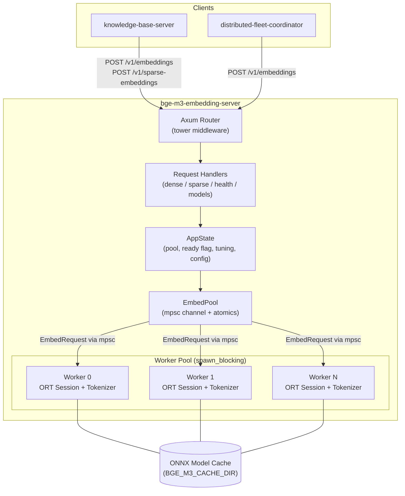
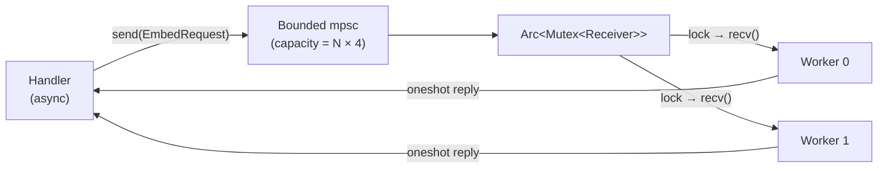
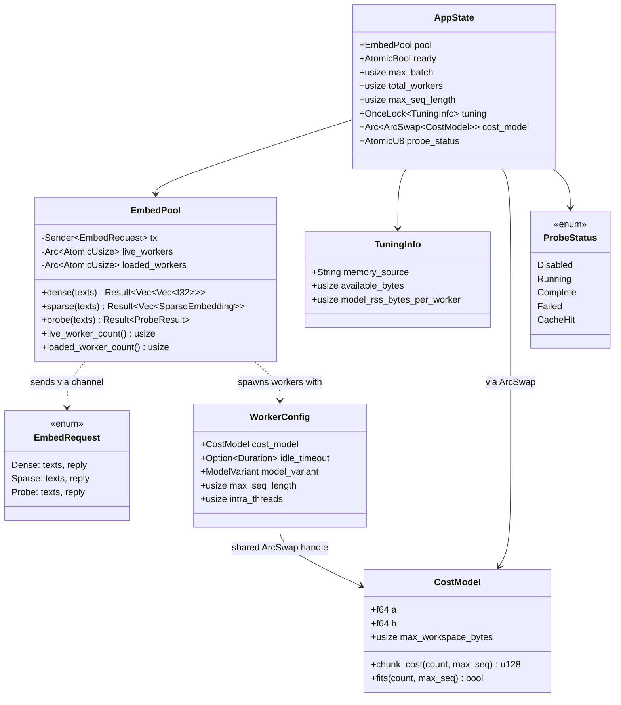
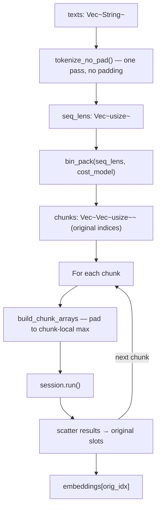

# Architecture Overview

`bge-m3-embedding-server` is an Axum HTTP server that serves **BGE-M3
dense and sparse embeddings** over an OpenAI-compatible REST API via direct
[ONNX Runtime](https://onnxruntime.ai/) integration. It is designed for
low-latency, concurrent inference in Docker-based and native deployments,
with optional CoreML EP acceleration on Apple Silicon.

## High-Level Component Diagram



## Module Layout

| Module | File | Responsibility |
|--------|------|----------------|
| `main` | `src/main.rs` | Bootstrap, router construction, memory detection, probe, readiness |
| `config` | `src/config.rs` | Env-var configuration (`Config::from_env`), cost-model override resolution |
| `state` | `src/state.rs` | Shared `AppState` struct, `TuningInfo` for `/health` |
| `handler` | `src/handler.rs` | HTTP handlers and input validation |
| `embedder` | `src/embedder.rs` | Worker pool, ORT session + tokenizer loading, tokenize-once + bin-pack inference |
| `binpack` | `src/binpack.rs` | `CostModel` + quadratic-aware bin-packer |
| `sysinfo` | `src/sysinfo.rs` | Memory detection (cgroup v2/v1 → host RAM) and RSS reads |
| `probe` | `src/probe.rs` | Startup workspace probe, least-squares coefficient fitting |
| `weights` | `src/weights/mod.rs` | Bundled sparse-linear projection weights (`sparse_linear.safetensors`) |
| `models` | `src/models.rs` | Request/response serde types |
| `error` | `src/error.rs` | `AppError` → HTTP status code mapping |

## Worker Pool Design

The core concurrency primitive is a **shared-receiver worker pool**.
Workers run on Tokio `spawn_blocking` threads (each loads its own model
instances), and all share a single bounded `mpsc` channel through an
`Arc<Mutex<Receiver>>`.



### Why shared-receiver?

The `Mutex` serializes **which worker waits for the next message**, not the
inference work itself. As soon as `recv()` returns a message, the worker
releases the lock and begins ONNX inference (~10–100 ms). Meanwhile the next
idle worker immediately acquires the lock and begins its own `recv()`. Under
normal load, at most one request is queued behind the lock at any time.

Each `EmbedRequest` carries a `oneshot::Sender` so the handler can `await`
its specific result without blocking other in-flight requests.

### Key Data Structures



`AppState.cost_model` is held in an `Arc<ArcSwap<CostModel>>`. Workers `load()`
the current handle on every bin-pack call, and the background probe `store()`s
the fitted model once the OLS fit completes — a wait-free hand-off so workers
never block on coefficient updates. `probe_status` (an `AtomicU8`) lets
`/health` distinguish "still probing" from "probe done" from "fit failed"
without any locks.

## Tokenize-Once + Bin-Pack Inference Pipeline

Instead of splitting texts into static-size chunks before tokenization, the server:

1. **Tokenizes all texts in one pass** (`tokenize_no_pad`) — no padding applied yet.
2. **Bin-packs by length** — `bin_pack()` sorts texts by sequence length and greedily groups them so `a × (count × max_seq) + b × (count × max_seq²) ≤ max_workspace_bytes`.
3. **Pads per chunk** — each chunk is padded only to its own longest sequence, not the global maximum.
4. **Runs inference per chunk** and **scatters results** back to the original input indices.

This eliminates the "one long text forces the entire batch to pay `N × max_seq²` attention cost" problem. Short-text batches pack densely; long-text chunks shrink automatically.



## Middleware Stack

The Axum router applies four `tower` layers in order (outermost first):

| Layer | Purpose |
|-------|---------|
| `SetRequestIdLayer` | Generates a UUID `x-request-id` for each request |
| `TraceLayer` | Logs request/response spans with timing via `tracing` |
| `PropagateRequestIdLayer` | Copies `x-request-id` from the request into the response |
| `DefaultBodyLimit` | Caps request bodies at 2 MiB |

## Model Lifecycle

Each worker independently manages a single `Option<(ort::session::Session, tokenizers::Tokenizer)>`.
A single ORT session produces both `sentence_embedding` (dense) and `token_embeddings`
(sparse) outputs in one forward pass. The sparse-linear projection (weight `[1024]` +
bias scalar from bundled `sparse_linear.safetensors`) is applied as a post-processing
step on the per-token hidden states.

Models transition through three states during a worker's lifetime:

1. **Loading** — ORT session and tokenizer initialized from ONNX files at startup (or reload).
2. **Loaded** — Session and tokenizer in memory, processing requests.
3. **Unloaded** — Session and tokenizer dropped after `BGE_M3_IDLE_TIMEOUT_SECS` of
   inactivity; reloaded from cache on next request.

Workers themselves never exit during idle — only their session/tokenizer pair is
dropped. The `live_workers` atomic tracks thread liveness while
`loaded_workers` tracks model presence. This distinction drives the health
endpoint's ability to differentiate `"ok"` from `"idle"` states.

## Startup Sequence (Linux)

The startup sequence has three phases: model load (leader-first), cost-model
resolution (override / cache hit / background probe), and readiness probes.

The cost model is held in `Arc<ArcSwap<CostModel>>` so workers can begin serving
requests with conservative defaults while the probe runs asynchronously in the
background; the probe task `store()`s the fitted model when finished and all
workers see it on their next bin-pack call. See
[startup-probe.md](startup-probe.md) for the math behind the probe and the
lock-free handoff details.

```mermaid
sequenceDiagram
    participant Main
    participant Sysinfo as sysinfo
    participant Leader as Worker 0 (leader)
    participant Followers as Workers 1..N
    participant Probe as probe (background task)
    participant Cache as EFS probe cache

    Main->>Leader: spawn_blocking(run_worker, conservative CostModel)
    Leader->>Leader: load_models()
    Leader-->>Main: leader ready
    Main->>Followers: spawn_blocking with shared ArcSwap<CostModel>
    Followers-->>Main: ready signals
    Main->>Sysinfo: detect_available_memory() + read_process_rss_bytes()
    Sysinfo-->>Main: MemoryReading { bytes, source }, model_rss_per_worker

    alt cost-model override env vars set
        Main->>Main: cost_model.store(override); probe_status = Disabled
    else cache fingerprint matches
        Main->>Cache: try_load_probe_cache(model, max_seq, arch)
        Cache-->>Main: (a, b)
        Main->>Main: cost_model.store(cached); probe_status = CacheHit
    else cache miss
        Main->>Main: probe_status = Running
        Main->>Probe: tokio::spawn run_probe(pool, max_seq, rss_ceiling)
        Note over Probe: 7 shapes, ~120 s — runs while<br/>workers serve requests with<br/>conservative defaults
        Probe->>Leader: EmbedRequest::Probe (per shape)
        Leader-->>Probe: ProbeResult { rss_before, rss_after }
        Probe->>Probe: fit_cost_model (normalized OLS)
        Probe->>Cache: save_probe_cache(a, b)
        Probe-->>Main: cost_model.store(fitted); probe_status = Complete
    end

    Main->>Main: dense + sparse readiness probes
    Main->>Main: state.ready = true
```

## Configuration

All configuration is read once at startup from environment variables via
`Config::from_env`. The server does not support runtime reconfiguration.

### Core variables

| Variable | Default | Description |
|----------|---------|-------------|
| `BGE_M3_CACHE_DIR` | `/cache` | ONNX model cache directory |
| `BGE_M3_BIND` | `0.0.0.0:8081` | TCP bind address |
| `BGE_M3_WORKERS` | `2` | Worker thread count (min 1) |
| `BGE_M3_MAX_BATCH` | `256` | Max texts per request (min 1) |
| `BGE_M3_MAX_SEQ_LENGTH` | `8192` | Max tokenized sequence length `[1, 8192]` |
| `BGE_M3_IDLE_TIMEOUT_SECS` | `300` | Idle unload timeout; `0` disables |
| `BGE_M3_MODEL` | `fp16` | Model variant: `fp32` = BAAI/bge-m3; `fp16` = Xenova/bge-m3; `int8` = Xenova/bge-m3 quantized |

### Auto-budget variables (Linux)

| Variable | Default | Description |
|----------|---------|-------------|
| `BGE_M3_DISABLE_AUTO_BUDGET` | unset | Skip probe, use conservative defaults |
| `BGE_M3_DISABLE_PROBE_CACHE` | unset | Force a fresh probe even when a fingerprint-matching cache file exists |
| `BGE_M3_AVAILABLE_MEMORY_BYTES` | detected | Override sysinfo memory detection |
| `BGE_M3_MEMORY_SAFETY_FACTOR` | `0.7` | Workspace headroom fraction `[0.1, 1.0]` |
| `BGE_M3_TOKEN_BUDGET` | unset | Legacy workspace ceiling (replaces `BGE_M3_ONNX_BATCH_SIZE`) |
| `BGE_M3_COST_MODEL_A` / `BGE_M3_COST_MODEL_B` | probe-derived | Override cost coefficients (see [startup-probe.md §14.4](startup-probe.md#144-pinning-explicit-coefficients)) |

See [startup-probe.md](startup-probe.md) for the full theory and operator reference.

> **Apple Silicon:** A `.cargo/config.toml` with `rustflags = ["-C", "target-cpu=native"]`
> for `aarch64-apple-darwin` is committed in the repo. This enables M2+ instruction set
> extensions (i8mm, bf16) beyond the M1 baseline. CI and Docker builds are unaffected.
