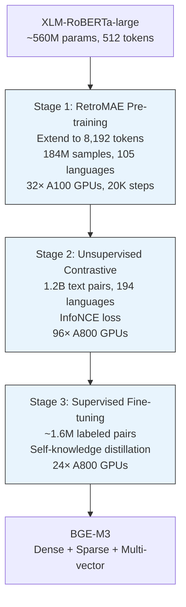
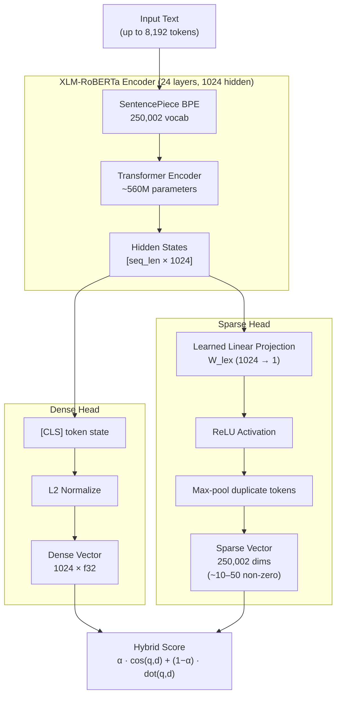

# The BGE-M3 Embedding Model

## Overview

**BGE-M3** (BAAI General Embedding — Multi-linguality, Multi-functionality,
Multi-granularity) is a text embedding model that produces both **dense** and
**sparse** vector representations from a single forward pass. It is
developed by the [FlagEmbedding](https://github.com/FlagOpen/FlagEmbedding)
team at the **Beijing Academy of Artificial Intelligence (BAAI)**.

This server exposes BGE-M3's dense and sparse capabilities over an HTTP API
via direct [ONNX Runtime](https://onnxruntime.ai/) integration. Consumers can use both
representations independently or combine them into a **hybrid scoring
model** that blends semantic understanding with lexical precision — an
approach that consistently outperforms either method alone.

### Key Resources

| Resource | Link |
|----------|------|
| Paper | [M3-Embedding: Multi-Linguality, Multi-Functionality, Multi-Granularity Text Embeddings Through Self-Knowledge Distillation](https://arxiv.org/abs/2402.03216) (ACL 2024) |
| Model weights | [BAAI/bge-m3](https://huggingface.co/BAAI/bge-m3) on Hugging Face Hub |
| Training data | [Shitao/bge-m3-data](https://huggingface.co/datasets/Shitao/bge-m3-data) |
| Source code | [FlagOpen/FlagEmbedding](https://github.com/FlagOpen/FlagEmbedding) |
| BAAI | [baai.ac.cn](https://www.baai.ac.cn/english.html) |
| License | MIT |

### Citation

```bibtex
@inproceedings{chen2024m3embedding,
  title     = {M3-Embedding: Multi-Linguality, Multi-Functionality,
               Multi-Granularity Text Embeddings Through Self-Knowledge
               Distillation},
  author    = {Jianlv Chen and Shitao Xiao and Peitian Zhang and Kun Luo
               and Defu Lian and Zheng Liu},
  booktitle = {Proceedings of the 62nd Annual Meeting of the Association
               for Computational Linguistics (ACL 2024)},
  year      = {2024},
  url       = {https://arxiv.org/abs/2402.03216}
}
```

---

## Provenance

BGE-M3 was released on **January 30, 2024** by the FlagEmbedding team at
BAAI. "BGE" stands for **BAAI General Embedding**; the model is part of a
broader family that includes BGE-large, BGE-base, and BGE-small for
English, as well as multilingual variants.

The model is built on
[XLM-RoBERTa-large](https://huggingface.co/FacebookAI/xlm-roberta-large)
(~560M parameters), a multilingual transformer encoder pretrained by Meta
AI on 2.5 TB of filtered CommonCrawl data spanning 100 languages. BAAI
extended its 512-token context window to **8,192 tokens** through continued
pretraining and added retrieval-specific capabilities through a three-stage
training pipeline.

The model weights are released under the **MIT license**. The paper itself
is available under CC BY 4.0.

### Model Variants

| Model | Description |
|-------|-------------|
| [`BAAI/bge-m3`](https://huggingface.co/BAAI/bge-m3) | Full supervised fine-tuned model (recommended) |
| [`BAAI/bge-m3-unsupervised`](https://huggingface.co/BAAI/bge-m3-unsupervised) | After contrastive pre-training only (Stage 2) |
| [`BAAI/bge-m3-retromae`](https://huggingface.co/BAAI/bge-m3-retromae) | After RetroMAE pre-training only (Stage 1) |

---

## The Three M's

### Multi-linguality

BGE-M3 supports **100+ languages** from a single model, inheriting
XLM-RoBERTa's multilingual vocabulary. Unsupervised training covered 194
languages; supervised fine-tuning covered 18 languages from the MIRACL
benchmark (Arabic, Bengali, Chinese, English, Farsi, Finnish, French,
German, Hindi, Indonesian, Japanese, Korean, Russian, Spanish, Swahili,
Telugu, Thai, Yoruba) and 25 additional languages from MKQA.

Cross-lingual retrieval works out of the box: a query in one language can
retrieve documents in another.

### Multi-functionality

The model simultaneously produces three types of representation from a
single encoder forward pass:

1. **Dense embedding** — a single 1024-dimensional vector (semantic search)
2. **Sparse embedding** — vocabulary-keyed term weights (lexical search)
3. **Multi-vector (ColBERT-style)** — per-token embeddings for late
   interaction scoring (maximum recall)

This server exposes the **dense** and **sparse** outputs. The ColBERT
multi-vector output is not exposed because its storage and scoring
requirements are substantially different (N vectors per document where
N = sequence length).

### Multi-granularity

The model handles inputs from short phrases to **8,192-token documents**.
The context extension from XLM-RoBERTa's original 512 tokens was achieved
through RetroMAE pretraining (see [Training Pipeline](#training-pipeline)).

---

## Vocabulary and Tokenizer

BGE-M3 uses the **XLM-RoBERTa tokenizer**, a SentencePiece BPE (Byte Pair
Encoding) model with a vocabulary of **250,002 tokens**. The vocabulary was
constructed jointly across 100 languages from CommonCrawl data, giving it
broad multilingual subword coverage.

| Property | Value |
|----------|-------|
| Tokenizer | SentencePiece BPE (`sentencepiece.bpe.model`) |
| Vocabulary size | 250,002 tokens |
| Max sequence length | 8,192 tokens |
| Special tokens | `<s>` (CLS, ID 0), `<pad>` (ID 1), `</s>` (EOS, ID 2), `<unk>` (ID 3), `<mask>` (ID 250001) |

The vocabulary size is significant because it defines the **dimensionality
of the sparse embedding space**: each sparse vector is conceptually a
250,002-dimensional vector where only the tokens present in the input text
have non-zero weights.

### Subword Tokenization

Because SentencePiece BPE operates at the subword level, uncommon words are
split into smaller pieces. For example, "embeddings" might become
`["▁embed", "dings"]` — two tokens, each receiving its own learned weight
in the sparse representation. This is coarser than whole-word tokenizers
used by systems like Lucene: the BGE-M3 paper notes that XLM-RoBERTa
produces ~1,056 unique terms per article versus Lucene's ~1,451. The
tradeoff is universal language coverage at the cost of slightly reduced
lexical granularity.

---

## Dense Embeddings

The dense output is a **1024-dimensional float32 vector** produced by
L2-normalizing the `[CLS]` token's hidden state:

```
e_dense = normalize(H[CLS])
```

Because the vectors are unit-normalized, **cosine similarity** and **inner
product** are mathematically equivalent for ranking. The recommended
similarity metric is cosine similarity.

### Properties

| Property | Value |
|----------|-------|
| Dimensions | 1,024 |
| Element type | `f32` |
| Normalization | L2-normalized (unit vectors) |
| Similarity metric | Cosine similarity (or inner product over normalized vectors) |
| Storage per vector | 4,096 bytes (4 × 1,024) |

### What Dense Embeddings Capture

Dense embeddings encode **semantic meaning** — the overall intent and topic
of the text are compressed into a fixed-size vector. Texts with similar
meaning cluster together in the embedding space regardless of the specific
words used. This makes dense retrieval excellent for:

- Paraphrase detection ("car" ↔ "automobile")
- Cross-lingual retrieval (English query → French documents)
- Conceptual similarity across different phrasings

The limitation is that dense embeddings can miss **exact lexical matches**
that a user clearly intends. A search for a specific product code like
"XR-7742" may not rank the exact match highly if semantically similar
documents score better.

---

## Sparse Embeddings

The sparse output is a **learned lexical representation** where each
dimension corresponds to a token in the 250,002-entry vocabulary. For each
token position in the input, a linear projection followed by ReLU produces
a non-negative importance weight:

```
w_t = ReLU(W_lex^T · h_t + b)
```

Where `h_t` is the contextual hidden state from the transformer, `W_lex` is
a learned 1024×1 projection matrix, and `b` is a scalar bias. When the same
token appears multiple times, the maximum weight is kept.

### Properties

| Property | Value |
|----------|-------|
| Dimensionality | 250,002 (vocabulary size) |
| Non-zero elements | Varies; typically 10–50 for short texts, up to hundreds for long documents |
| Element type | `(index: u32, value: f32)` pairs |
| Similarity metric | Dot product over co-occurring terms |
| Storage per vector | Variable: `8 × nnz` bytes approximately |

### What Sparse Embeddings Capture

Sparse embeddings encode **lexical importance** — which specific terms
matter and how much. Unlike BM25, these weights are **contextual**: the
same surface token receives different importance scores depending on its
surrounding context because the weight is derived from the full transformer
hidden state, not just token frequency.

| Property | BM25 / TF-IDF | BGE-M3 Sparse |
|----------|---------------|---------------|
| Term weights | Statistical (TF × IDF) | Learned via contrastive training |
| Context sensitivity | None (bag of words) | Full transformer context |
| Vocabulary | Corpus-dependent | Fixed: 250,002 (XLM-RoBERTa) |
| Multilingual | Requires per-language setup | 100+ languages, single model |
| Training signal | Unsupervised (frequency statistics) | Supervised + self-knowledge distillation |

The BGE-M3 paper reports that learned sparse weights significantly
outperform BM25 using the same tokenizer across all evaluated benchmarks.
On MLDR (Multi-Language Dense Retrieval), M3 sparse achieves 62.2 nDCG@10
versus BM25's 53.6.

---

## Hybrid Scoring: Combining Dense and Sparse

This is where BGE-M3 offers a **unique advantage** over models that produce
only dense or only sparse representations. Because both outputs come from
the same model and the same forward pass, consumers can combine them into a
hybrid score that captures both semantic meaning and lexical precision:

```
score = α · sim_dense(q, d) + (1 − α) · sim_sparse(q, d)
```

Where `α` is a tunable weight between 0 and 1.

### Why Hybrid Search Outperforms Either Alone

Dense and sparse retrieval have complementary failure modes:

| Scenario | Dense | Sparse | Hybrid |
|----------|-------|--------|--------|
| Synonym matching ("car" → "automobile") | Strong | Weak | Strong |
| Exact term matching ("XR-7742") | Weak | Strong | Strong |
| Cross-lingual retrieval | Strong | Moderate | Strong |
| Rare technical terms | Moderate | Strong | Strong |
| Conceptual similarity | Strong | Weak | Strong |

The BGE-M3 paper demonstrates consistent improvements when combining
retrieval modes, with published starting weights of `[0.4, 0.2, 0.4]`
for `[dense, sparse, multi-vector]`. For a dense + sparse combination
without multi-vector, a starting point of **α = 0.7** (dense-heavy) works
well for general-purpose retrieval.

### Building a Domain-Appropriate Scoring Model

Because this server exposes dense and sparse endpoints independently,
consumers can:

1. **Retrieve candidates** using dense similarity (fast ANN search)
2. **Re-rank** using sparse similarity (precise lexical matching)
3. **Blend scores** with domain-tuned weights

Or alternatively:

1. **Retrieve from both** dense and sparse indexes independently
2. **Fuse ranked lists** using Reciprocal Rank Fusion (RRF) or weighted
   score combination
3. **Tune fusion weights** per domain using a small labeled evaluation set

The optimal blend depends on the domain. Legal and medical corpora where
exact terminology matters benefit from higher sparse weight. Conversational
or multilingual corpora benefit from higher dense weight. A small
evaluation set (50–100 labeled query-document pairs) is typically sufficient
to tune α for a given domain.

---

## Training Pipeline

BGE-M3 is trained in three stages, each building on the previous
checkpoint:



### Stage 1 — RetroMAE Pre-training

The context window is extended from 512 to 8,192 tokens. The model is
pretrained using
[RetroMAE](https://arxiv.org/abs/2205.12035) (EMNLP 2022), a
retrieval-oriented masked autoencoder. An asymmetric encoder–decoder
architecture forces the encoder to produce information-dense
representations: the full transformer processes moderately masked input
(15–30%), while a lightweight single-layer decoder reconstructs the
original text from aggressively masked input (50–70%).

Training data: Pile, Wudao, and mC4 covering 105 languages.

### Stage 2 — Unsupervised Contrastive Pre-training

The model is trained with InfoNCE contrastive loss on **1.2 billion**
weakly supervised text pairs spanning 194 languages. Sources include
Wikipedia, S2ORC, xP3, mC4, CC-News, NLLB, and CCMatrix.

### Stage 3 — Supervised Fine-tuning with Self-Knowledge Distillation

The final stage uses ~1.6M labeled pairs with the paper's key innovation:
**self-knowledge distillation**. Rather than training each retrieval head
(dense, sparse, multi-vector) independently, the combined hybrid score
acts as a teacher signal for each individual head:

```
s_teacher = w1 · s_dense + w2 · s_sparse + w3 · s_multi-vector
L = (L_hard + L_soft) / 2
```

Each head learns from the combined strength of all three. The paper reports
this improved sparse retrieval nDCG@10 on MIRACL from 36.7 to 53.9 — a
47% relative improvement.

| Data source | Size | Languages |
|-------------|------|-----------|
| MS MARCO, HotpotQA, NQ, TriviaQA, etc. | ~1.1M pairs | English |
| DuReader, mMARCO-ZH, T2-Ranking, etc. | ~387K pairs | Chinese |
| MIRACL, Mr. TyDi | ~89K pairs | Multilingual |
| MultiLongDoc (synthetic) | ~41K pairs | Long-document |

---

## Benchmark Performance

| Benchmark | Languages | Metric | BGE-M3 (hybrid) | Best baseline |
|-----------|-----------|--------|------------------|---------------|
| MIRACL | 18 | nDCG@10 | **71.5** | mE5-large: 66.6 |
| MKQA | 25 | Recall@100 | **75.1** | mE5-large: 70.9 |
| MLDR (long-doc) | — | nDCG@10 | **65.0** | E5-mistral-7b: 42.6 |

---

## Vector Storage Compatibility

BGE-M3's 1024-dimensional dense output and vocabulary-keyed sparse output
are compatible with the major vector storage systems. The 1024 dimension
sits in a "sweet spot" — large enough for strong recall, small enough to
fit within all common index limits.

### pgvector (PostgreSQL)

[pgvector](https://github.com/pgvector/pgvector) (v0.8+) supports both
dense and sparse vectors natively:

**Dense vectors** (`vector` type):

| Property | Value |
|----------|-------|
| Max dimensions (storage) | 16,000 |
| Max dimensions (HNSW index) | 2,000 |
| Max dimensions (IVFFlat index) | 2,000 |
| 1024-dim BGE-M3 | Fits all index types |
| Recommended operator | `<=>` (cosine distance) |

```sql
-- Dense storage and indexing
CREATE TABLE documents (
    id    serial PRIMARY KEY,
    dense vector(1024)
);

CREATE INDEX ON documents
    USING hnsw (dense vector_cosine_ops);

-- Query: nearest neighbors by cosine similarity
SELECT id FROM documents
    ORDER BY dense <=> $1::vector
    LIMIT 10;
```

**Half-precision** (`halfvec` type) halves storage from 4 KB to 2 KB per
vector at the same index limits (4,000 dims for HNSW). This is viable
because the ranking-relevant signal in embedding dimensions is preserved
at float16 precision.

**Sparse vectors** (`sparsevec` type):

| Property | Value |
|----------|-------|
| Max non-zero elements (storage) | 16,000 |
| Max non-zero elements (HNSW index) | 1,000 |
| IVFFlat support | Not available for `sparsevec` |
| Recommended operator | `<#>` (negative inner product) |

```sql
-- Sparse storage and indexing
CREATE TABLE documents (
    id     serial PRIMARY KEY,
    sparse sparsevec(250002)
);

CREATE INDEX ON documents
    USING hnsw (sparse sparsevec_ip_ops);

-- Query: nearest neighbors by inner product
SELECT id FROM documents
    ORDER BY sparse <#> $1::sparsevec
    LIMIT 10;
```

> **Note:** pgvector `sparsevec` uses 1-based indices (SQL convention).
> This server's output uses 0-based vocabulary IDs. A +1 offset transform
> is needed when writing to pgvector.

> **Note:** The HNSW index limit of 1,000 non-zero elements is sufficient
> for most inputs. Short queries typically produce 10–50 non-zero terms.
> Long documents may approach or exceed 1,000; in that case, truncate to
> the top-K terms by weight (top-256 or top-512 is standard in SPLADE
> deployments).

**Hybrid search in PostgreSQL** can be implemented by querying both indexes
and fusing the results:

```sql
-- Reciprocal Rank Fusion (RRF) example
WITH dense_results AS (
    SELECT id, ROW_NUMBER() OVER (ORDER BY dense <=> $1::vector) AS rank_d
    FROM documents ORDER BY dense <=> $1::vector LIMIT 100
),
sparse_results AS (
    SELECT id, ROW_NUMBER() OVER (ORDER BY sparse <#> $2::sparsevec) AS rank_s
    FROM documents ORDER BY sparse <#> $2::sparsevec LIMIT 100
)
SELECT COALESCE(d.id, s.id) AS id,
       COALESCE(1.0 / (60 + d.rank_d), 0) +
       COALESCE(1.0 / (60 + s.rank_s), 0) AS rrf_score
FROM dense_results d FULL OUTER JOIN sparse_results s ON d.id = s.id
ORDER BY rrf_score DESC
LIMIT 10;
```

### AWS S3 Vectors

[S3 Vectors](https://docs.aws.amazon.com/AmazonS3/latest/userguide/s3-vectors-limitations.html)
supports dense vectors up to **4,096 dimensions** — BGE-M3's 1024
dimensions fit comfortably.

| Property | Value |
|----------|-------|
| Max dimensions | 4,096 |
| Data type | `float32` only |
| Distance metrics | `cosine`, `euclidean` |
| Sparse support | **Not available** |
| Max vectors per index | 2 billion |

S3 Vectors is optimized for large-scale, cost-efficient storage (up to 90%
lower cost than purpose-built vector databases). It is best suited for
dense-only workloads where the index is large and query volume is moderate.
Sparse embeddings from this server cannot be stored in S3 Vectors.

### Compatibility Summary

| System | Dense (1024-dim) | Sparse (250K-dim) | Hybrid scoring | Notes |
|--------|:---:|:---:|:---:|-------|
| **pgvector** | Yes (HNSW + IVFFlat) | Yes (HNSW, `sparsevec`) | SQL-level fusion | Both types in one database |
| **pgvector halfvec** | Yes (2 KB/vec) | N/A | With `vector` sparse column | Half storage cost |
| **AWS S3 Vectors** | Yes | No | No | Dense only; cost-optimized |
| **Qdrant** | Yes | Yes (native, v1.7+) | Built-in | Best hybrid support |
| **Pinecone** | Yes | Yes (separate index) | API-level fusion | 1,000 nnz limit |
| **Weaviate** | Yes | BM25 module only | Built-in BM25 hybrid | No raw SPLADE support |

---

## Architecture Summary



---

## Further Reading

- [M3-Embedding paper (arXiv:2402.03216)](https://arxiv.org/abs/2402.03216)
  — Full technical details including ablation studies and benchmark results
- [RetroMAE paper (arXiv:2205.12035)](https://arxiv.org/abs/2205.12035) —
  The retrieval-oriented pretraining method used in Stage 1
- [FlagEmbedding repository](https://github.com/FlagOpen/FlagEmbedding) —
  Reference implementation and training code
- [BAAI/bge-m3 model card](https://huggingface.co/BAAI/bge-m3) — Model
  weights, configuration, and usage examples
- [pgvector documentation](https://github.com/pgvector/pgvector) — Dense
  and sparse vector indexing in PostgreSQL
- [S3 Vectors documentation](https://docs.aws.amazon.com/AmazonS3/latest/userguide/s3-vectors-limitations.html)
  — AWS dense vector storage limits and capabilities
