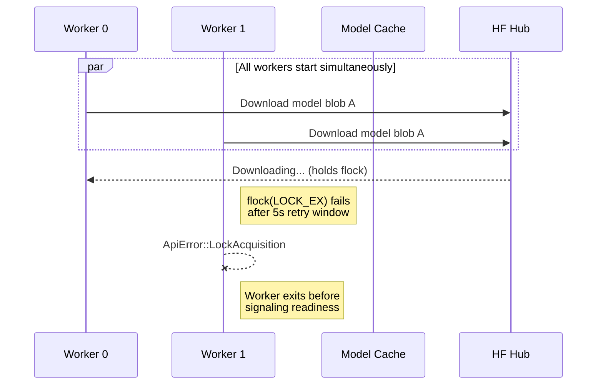
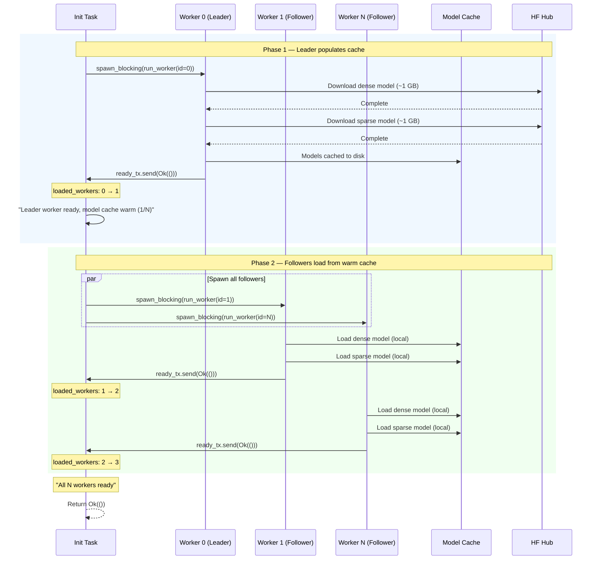
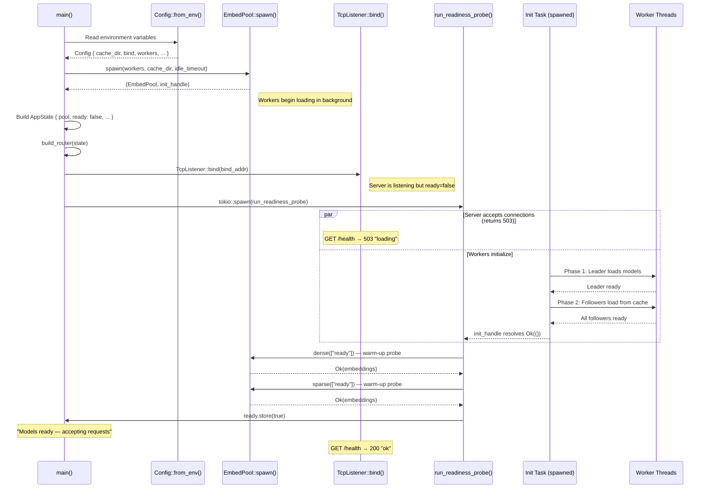
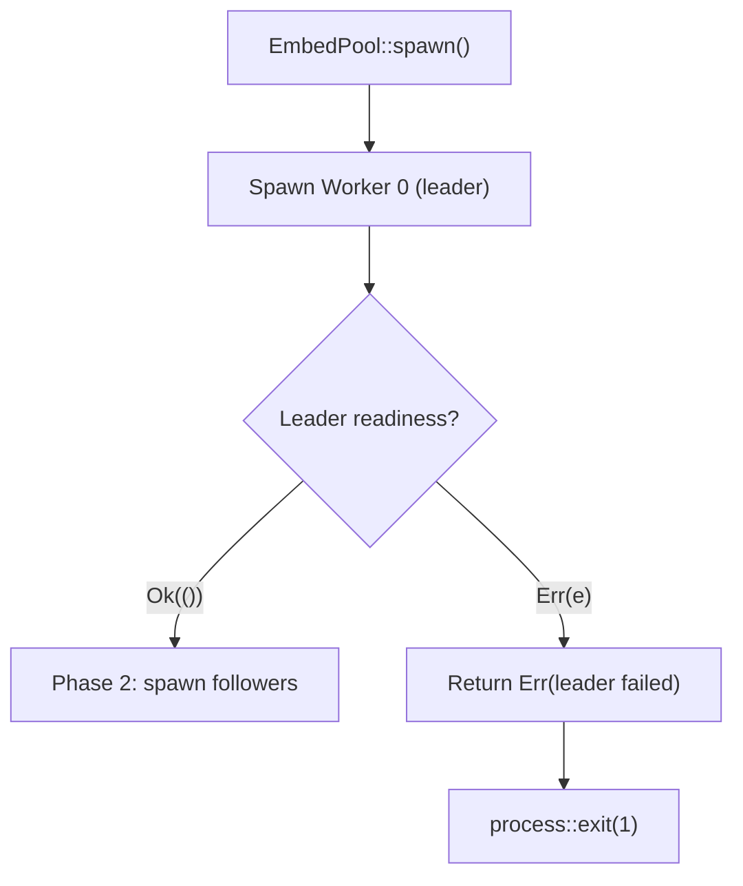

# Cold-Start Sequence

When the server starts with an empty or stale model cache, it must download
~2 GB of BGE-M3 ONNX model files from Hugging Face Hub before it can serve
requests. This document explains the leader–follower startup pattern that
ensures reliable initialization even with multiple workers.

## The Problem

`hf-hub` (the Hugging Face file downloader) acquires **per-blob exclusive
file locks** (`flock(LOCK_EX)`) during download with a hardcoded 5-second
retry window. BGE-M3 models are large enough that a fresh download takes
minutes, far exceeding that window.

If all `N` workers start concurrently on an empty cache:

The result: followers fail with `ApiError::LockAcquisition` and the init
task reports "Worker exited before signaling readiness."

## The Solution: Leader–Follower Ordering

Worker 0 (the "leader") is spawned and fully awaited before any followers
start. The leader's readiness signal acts as a **barrier**: once it fires,
the model cache is guaranteed warm and followers load from local disk.

## Full Startup Sequence

The complete startup includes configuration, pool spawn, HTTP listener
bind, and the readiness probe — all coordinated by `main()`.

## Failure Modes

### Leader fails to load

If the leader worker fails (e.g., corrupt cache, disk full), the init
task returns an error immediately and the process exits. No followers are
spawned.

### Follower fails to load

If any follower fails, the init task returns an error and the process
exits. Partial readiness is not supported — all configured workers must
load successfully.

### Readiness probe fails

Even if all workers signal readiness, the readiness probe runs a trial
dense and sparse embedding. If either fails, the process exits. This
catches edge cases like a corrupted ONNX model that loads without error
but produces invalid output.

## Idle-Timeout Reloads vs Cold Start

The leader–follower ordering is **only relevant at initial startup** when
the cache may be empty. Idle-timeout reloads follow a different path:

| Scenario | Cache state | Download required | Lock contention risk | Ordering |
|----------|-------------|-------------------|----------------------|----------|
| Cold start | Empty | Yes (~2 GB) | High | Leader first, then followers |
| Idle reload | Warm (files on disk) | No | None | Each worker reloads independently |

After an idle timeout, workers reload from disk in ~10–30 seconds. Since
model files are already cached, `hf-hub` skips the download path entirely
and no file locks are contended. Workers reload independently as requests
arrive — there is no barrier.

## Single-Worker Mode

When `BGE_M3_WORKERS=1`, the leader–follower distinction is a no-op:

- Phase 1 spawns Worker 0 (the only worker)
- Phase 2's follower loop (`1..1`) is empty
- The readiness signal collection loop (`1..1`) is also empty
- The init task returns immediately after the leader is ready

This means single-worker mode has zero overhead from the cold-start
ordering logic.
