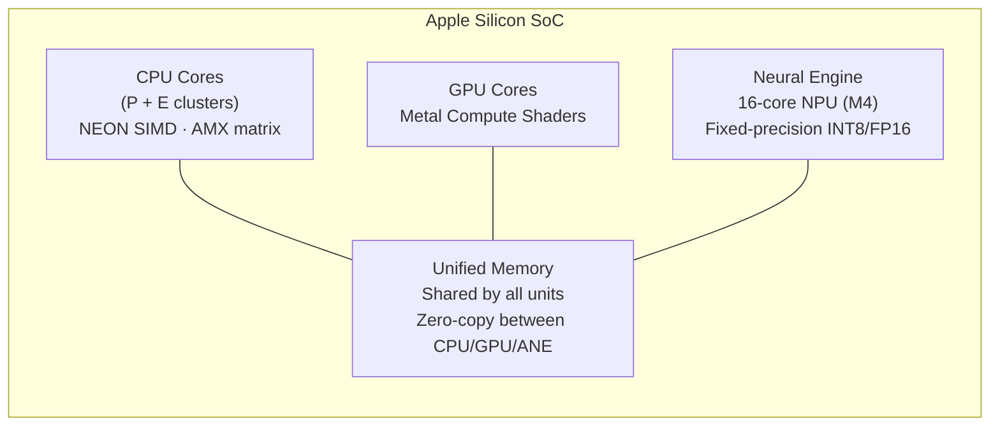
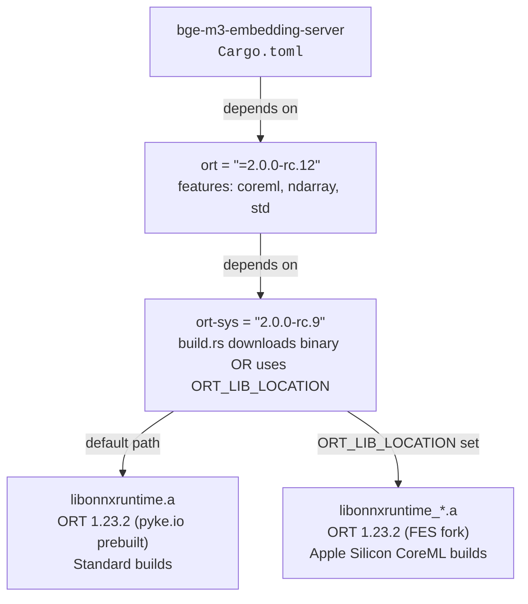

# CoreML Execution Provider

`bge-m3-embedding-server` runs CoreML EP in production on Apple Silicon. The
`coreml` feature on the `ort` crate activates the execution provider by default
on macOS; no additional runtime configuration is required. A custom ORT build
from the Fulton Engineering Services fork is required because upstream ORT
≤ v1.23.2 contains an ENOTDIR bug that prevents CoreML EP from loading BGE-M3's
external-data model format. In production, 99.5% of compute ops dispatch to the
GPU (Metal) via CoreML; 9 ops fall back to the CPU EP.

## Apple Silicon Compute Units

Apple Silicon SoCs contain four independent compute units relevant to ML
inference.



### CPU — NEON SIMD (active)

Every ARM64 core (performance and efficiency) has 32 × 128-bit SIMD vector
registers (V0–V31) implementing the NEON (Advanced SIMD) instruction set.
ONNX Runtime's MLAS library contains hand-tuned NEON assembly kernels for GEMM,
convolution, softmax, pooling, and rotary embeddings. The CPU EP handles the 9
ops that CoreML cannot dispatch.

### CPU — AMX (M1–M3) / SME (M4+) (not used)

The Apple Matrix coprocessor (AMX) is a proprietary extension tightly coupled
to each CPU cluster. It performs outer-product matrix multiplication
(`Z += X ⊗ Y`) at peak throughput of ~1.6 TFLOPS FP32 on M1.

| Aspect | Detail |
|--------|--------|
| Access path | Apple Accelerate framework only (M1–M3); no public intrinsics |
| M4+ | Uses ARM SME (Scalable Matrix Extension), an industry-standard ISA |
| MLAS | **Explicitly disabled** — `platform.cpp` guards AMX init with `#ifndef __APPLE__` |
| Status | **Not used** — MLAS disables AMX on macOS; CoreML `CPUOnly` routes through Accelerate |

### GPU — Metal Compute Shaders (active via CoreML)

Apple Silicon uses unified memory, eliminating PCIe copy overhead between CPU
and GPU. CoreML dispatches to the GPU via Metal Performance Shaders (MPS).
This is the active dispatch path for BGE-M3: 99.5% of compute ops run on the
GPU through CoreML.

### Neural Engine (ANE) — partial dispatch with FP16 MLProgram

The ANE is a discrete NPU on the SoC targeting fixed-precision inference
(INT8, FP16). The M4 ANE delivers 38 TOPS across 16 cores — roughly 3× faster
than the GPU for compatible models.

BGE-M3 has two dynamic input dimensions: both `batch_size` and `sequence_length`
are variable. Shape-dependent compute ops (MatMul, attention) require static
tensor shapes for ANE compilation and route to the GPU instead. However,
shape-independent ops such as dtype casts remain eligible for ANE dispatch
regardless of dynamic inputs. With the FP16 model compiled to `MLProgram` format,
`ProfileComputePlan` confirms an `ios18.cast` op dispatches to
`MLNeuralEngineComputeDevice`. The bulk transformer compute (MatMul, attention,
FFN) remains on the GPU, consistent with Activity Monitor GPU utilization during
inference. The `ios18.cast` op name is specific to the macOS 15 / iOS 18
`MLProgram` runtime; it represents a dtype conversion at compute-unit handoff
boundaries.

**Quantitative verification (Mac15,14, M3 Ultra Mac Studio):** `powermetrics
--samplers cpu_power,gpu_power` at 1-second intervals over 40 samples confirms
the operational picture: ANE power was 0 mW in 39 of 40 samples (2 mW in one
sample — background noise), while GPU power ranged 1,506–4,000 mW throughout
inference. The `ios18.cast` converts the attention mask from int32→fp32 — a
tensor of 10–50 values (~40–200 bytes). This is sub-microsecond work, well below
the ~1 mW measurement floor of `powermetrics` at 1-second sampling. ANE is
operationally idle for this model despite the `MLNeuralEngineComputeDevice`
dispatch classification.

Inspection of the compiled CoreML MIL confirms the same picture from the source
direction: across all 77 compiled subgraph partitions, `cast` appears exactly
**once** (partition 0, attention mask int32→fp32), while `matmul` appears 192
times — all GPU-dispatched. See [Compiled CoreML Model Evidence](#compiled-coreml-model-evidence)
for the full MIL analysis.

## Dependency Chain



The `download-binaries` feature on `ort` covers standard builds (CI, Docker,
Linux): `ort-sys` downloads the prebuilt `libonnxruntime.a` from `cdn.pyke.io`
at build time. Setting `ORT_LIB_LOCATION` at build time overrides this path,
pointing `ort-sys` at the component archives from the FES fork build. The
resulting binary is fully self-contained — `ORT_LIB_LOCATION` is a build-time
variable only.

## The ORT ENOTDIR Bug and FES Fork

### Root Cause

The upstream ORT function `TensorProtoWithExternalDataToTensorProto` receives
`ModelPath()` — a file path such as `.../onnx/model.onnx` — and passes it
directly to `ReadExternalDataForTensor`, which expects a directory path.
`GetExternalDataInfo` then constructs `model.onnx/model.onnx_data` — a path
through a file — triggering an OS-level ENOTDIR error:

```
open file ".../onnx/model.onnx/model.onnx_data" failed: Not a directory
```

BGE-M3's FP32 ONNX export uses the external data format (`.onnx` +
`.onnx_data`), which hits this path whenever CoreML EP attempts to load the
model.

### Fix

One logical line change in `tensorprotoutils.cc`:

```cpp
// Derive the directory from model_path if it points to a file.
const auto tensor_proto_dir =
    model_path.has_filename() ? model_path.parent_path() : model_path;
ORT_RETURN_IF_ERROR(ReadExternalDataForTensor(ten_proto, tensor_proto_dir, unpacked_data));
```

This mirrors the pattern used by every other external-data path in the same
file (`UnpackTensor`, `GetExtDataFromTensorProto`). The bug is present in
upstream ORT through v1.23.2 and in the `main` branch at the time of patching.
An upstream PR is planned.

### FES Fork Coordinates

| | |
|---|---|
| Fork | `https://github.com/Fulton-Engineering-Services/onnxruntime` |
| Branch | `fix/coreml-tensorproto-external-data-path` |
| Commit | `1e37c3583d05992bc1419269f87d941e8642248c` |
| Base tag | `v1.23.2` |

## Building the Custom ORT

### Prerequisites

| Prerequisite | Notes |
|---|---|
| Xcode Command Line Tools | `xcode-select --install` — provides `clang`, `clang++`, Apple SDK frameworks |
| Python 3 | Used by ORT's `build.py` orchestrator |
| CMake **3.31.x** | CMake 4.x has breaking changes with ORT's dependency `CMakeLists.txt` files. Install in a venv: `python3 -m venv .venv && .venv/bin/pip install "cmake>=3.31,<4"` |
| Rust toolchain | `rustup` — for the subsequent `cargo build --release` step |

### Fork Setup

```bash
git clone --depth 1 --branch fix/coreml-tensorproto-external-data-path \
    https://github.com/Fulton-Engineering-Services/onnxruntime.git \
    ~/.local/share/ort-build/onnxruntime

# Verify commit hash
git -C ~/.local/share/ort-build/onnxruntime rev-parse HEAD
# Expected: 1e37c3583d05992bc1419269f87d941e8642248c
```

### Build Command

The authoritative build invocation (from `scripts/install-bge-m3-apple.sh`):

```bash
# Run from the ORT source directory, inside a subshell that
# unsets CMAKE_PREFIX_PATH and PKG_CONFIG_PATH.
ORT_CMAKE=~/.local/share/ort-build/.venv/bin/cmake
ORT_OUTPUT_DIR=~/.local/share/ort-build/output
HOMEBREW_PREFIX="$(brew --prefix 2>/dev/null || echo /opt/homebrew)"

(
    unset CMAKE_PREFIX_PATH PKG_CONFIG_PATH
    cd ~/.local/share/ort-build/onnxruntime
    python3 tools/ci_build/build.py \
        --cmake_path "$ORT_CMAKE" \
        --build_dir "$ORT_OUTPUT_DIR" \
        --config Release \
        --parallel \
        --compile_no_warning_as_error \
        --skip_tests \
        --osx_arch arm64 \
        --apple_deploy_target 13.0 \
        --use_coreml \
        --cmake_extra_defines \
            CMAKE_OSX_ARCHITECTURES=arm64 \
            onnxruntime_BUILD_UNIT_TESTS=OFF \
            onnxruntime_BUILD_SHARED_LIB=OFF \
            CMAKE_SYSTEM_PREFIX_PATH= \
            "CMAKE_IGNORE_PREFIX_PATH=$HOMEBREW_PREFIX"
)
```

Build time: 15–30 minutes on first run.

### CMake Workarounds

ORT v1.23.2 with CoreML EP conflicts with system Homebrew packages during the
CMake configure step. Several protections are applied:

| Problem | Cause | Fix |
|---------|-------|-----|
| `cmake_minimum_required(VERSION 2.x)` error | CMake 4.x removed compatibility with policies < CMP0048 | Install CMake 3.31.x in a pip venv; pass `--cmake_path` |
| Homebrew `protoc` version mismatch | ORT builds its own protobuf v21.12 from source; `FindProtobuf` picks up Homebrew's v33/v4 headers, causing `PROTOBUF_NAMESPACE_OPEN` compile errors | Strip directories containing `protoc` from PATH during build |
| `find_package(Protobuf)` finds Homebrew via `CMAKE_PREFIX_PATH` | Homebrew injects `CMAKE_PREFIX_PATH` into shell environments | `unset CMAKE_PREFIX_PATH` in the build subshell |
| CMake auto-populates `CMAKE_SYSTEM_PREFIX_PATH=/opt/homebrew` on Apple Silicon | Platform-level search path ignores empty `CMAKE_PREFIX_PATH` | `--cmake_extra_defines CMAKE_SYSTEM_PREFIX_PATH=` |
| Remaining Homebrew protobuf discovery via config files or package registry | CMake config-mode find still resolves Homebrew paths | `--cmake_extra_defines "CMAKE_IGNORE_PREFIX_PATH=$HOMEBREW_PREFIX"` (CMake 3.23+) |
| `coreml_proto` not in install EXPORT set | ORT CMake bug: static CoreML build omits `coreml_proto` from the install export | Patch: comment out the `install(EXPORT)` block (the build tree `.a` files are all that is needed) |

### Build Output

The static build produces per-component archives in
`~/.local/share/ort-build/output/Release/`:

```
~/.local/share/ort-build/output/Release/
├── libonnxruntime_common.a
├── libonnxruntime_flatbuffers.a
├── libonnxruntime_framework.a        ← contains ENOTDIR fix
├── libonnxruntime_graph.a
├── libonnxruntime_lora.a
├── libonnxruntime_mlas.a             ← NEON/MLAS kernels
├── libonnxruntime_optimizer.a
├── libonnxruntime_providers.a        ← CPU EP operators
├── libonnxruntime_providers_coreml.a ← CoreML EP
├── libonnxruntime_session.a
├── libonnxruntime_util.a
├── libcoreml_proto.a                 ← CoreML protobuf definitions
└── _deps/                            ← abseil, protobuf, re2, onnx, etc.
```

`ort-sys` auto-discovers all component archives via its Layout 2 search when
`ORT_LIB_LOCATION` points at this directory.

## Rust Build Against Custom ORT

```bash
export ORT_LIB_LOCATION=~/.local/share/ort-build/output
export ORT_LIB_PROFILE=Release
cargo build --release --target aarch64-apple-darwin
```

`.cargo/config.toml` in the repository root applies `rustflags = ["-C",
"target-cpu=native"]` for the `aarch64-apple-darwin` target automatically,
enabling i8mm, bf16, and bti instruction extensions on M2+.

### Cargo Cache Gotcha

With `-C lto=thin`, Rust embeds all C++ object files from linked static
libraries into `libort_sys-*.rlib` (typically 69–72 MB). This rlib is cached
independently from the `.a` files. If the custom ORT is rebuilt (for example,
after patching), the stale rlib causes link failures and must be removed
explicitly before rebuilding:

```bash
rm target/release/deps/libort_sys-*.rlib
ORT_LIB_LOCATION=~/.local/share/ort-build/output \
  ORT_LIB_PROFILE=Release \
  cargo build --release --target aarch64-apple-darwin
```

Running `cargo clean -p ort-sys` does not remove the rlib; it must be deleted
directly from `target/release/deps/`.

## BGE-M3 Op Coverage

### Model Inputs and Outputs

```
Inputs:
  input_ids:       INT64 [batch_size, sequence_length]    ← both dynamic
  attention_mask:  INT64 [batch_size, sequence_length]    ← both dynamic

Outputs:
  token_embeddings:    FLOAT [batch_size, sequence_length, 1024]
  sentence_embedding:  FLOAT [batch_size, 1024]

IR version:  6
Opset:       ai.onnx v11
Producer:    PyTorch 2.1.2
```

Both input dimensions are dynamic. Shape-dependent ops (MatMul, attention)
require fully static shapes for ANE compilation and route to the GPU. The ANE
handles boundary cast ops (`ios18.cast`) regardless of dynamic inputs.

### Op Census (2,495 total, 28 unique types)

| Op | Count | CoreML EP Support |
|----|-------|-------------------|
| Constant | 571 | N/A (weight tensors, absorbed into CoreML model) |
| Add | 341 | Yes |
| Gather | 198 | Yes |
| Unsqueeze | 197 | Yes |
| Shape | 196 | Yes |
| MatMul | 192 | Yes |
| Mul | 100 | Yes |
| Concat | 98 | Yes |
| ReduceMean | 98 | Yes |
| Div | 98 | Yes |
| Reshape | 97 | Yes |
| Transpose | 96 | Yes |
| Pow | 51 | Yes |
| Sub | 50 | Yes |
| Sqrt | 49 | Yes |
| Softmax | 24 | Yes |
| Erf | 24 | Yes |
| Cast | 3 | Yes |
| Equal | 2 | **No** |
| Expand | 2 | **No** |
| Slice | 1 | Yes |
| ConstantOfShape | 1 | **No** |
| Where | 1 | **No** |
| Not | 1 | **No** |
| CumSum | 1 | **No** |
| Abs | 1 | **No** |
| ReduceSum | 1 | Yes |
| Clip | 1 | Yes |

### Coverage Summary

| Metric | Count | Percentage |
|--------|-------|------------|
| Total ops | 2,495 | |
| Constant (weight) ops | 571 | (excluded from coverage calc) |
| Compute ops | 1,924 | 100% |
| CoreML-dispatchable | 1,915 | **99.5%** |
| CPU EP fallback | 9 | 0.5% |

The 9 unsupported compute ops (`Equal` ×2, `Expand` ×2, `ConstantOfShape`,
`Where`, `Not`, `CumSum`, `Abs`) are in attention mask processing and sparse
embedding logic — not in the critical compute path.

### CoreML EP Supported Ops (from `op_builder_factory.cc`, ORT v1.23.2)

```
Add, ArgMax, AveragePool, BatchNormalization, Cast, Clip, Concat, Conv,
ConvTranspose, DepthToSpace, Div, Erf, Flatten, Gather, Gelu, Gemm,
GlobalAveragePool, GlobalMaxPool, GridSample, GroupNormalization,
InstanceNormalization, LayerNormalization, LeakyRelu, LRN, MatMul, Max,
MaxPool, Mul, Pad, Pow, PRelu, Reciprocal, ReduceMax, ReduceMean,
ReduceMin, ReduceProd, ReduceSum, Relu, Reshape, Resize, Round, Shape,
Sigmoid, Slice, Softmax, Split, Sqrt, Squeeze, Sub, Tanh, Transpose,
Unsqueeze
```

## Compiled CoreML Model Evidence

### Partition Structure

ORT's CoreML EP partitions the 2,495-op ONNX graph into dynamically-shaped
`MLProgram` subgraphs. The compiled cache lives at
`{BGE_M3_CACHE_DIR}/coreml/{hash}/` and contains 77
`N_dynamic_mlprogram` directories, one per partition:

```
{hash}/
├── 0_dynamic_mlprogram/      # attention mask preprocessing
│   └── model/compiled_model.mlmodelc/model.mil
├── 1_dynamic_mlprogram/      # embedding stack + layer 0 QKV
│   └── model/compiled_model.mlmodelc/model.mil
├── ...
└── 76_dynamic_mlprogram/     # final pooling / output
    └── model/compiled_model.mlmodelc/model.mil
```

All 77 partitions use `func main<ios18>` — the macOS 15 / iOS 18 `MLProgram`
function format. Manifest files are authored by `com.microsoft.OnnxRuntime`.

### MIL Op Distribution

Tallied from all 77 `model.mil` files:

| Op | Count | Notes |
|----|-------|-------|
| `add` | 340 | Residual connections, bias additions |
| `matmul` | 192 | **Primary compute** — QKV projections, attention, FFN |
| `reduce_mean` | 98 | LayerNorm mean |
| `real_div` | 98 | LayerNorm normalization |
| `mul` | 98 | LayerNorm scaling |
| `transpose` | 96 | Attention head reshaping |
| `pow` | 51 | LayerNorm variance |
| `sub` | 50 | LayerNorm centering |
| `sqrt` | 49 | LayerNorm denominator |
| `erf` | 24 | GELU activation (FFN) |
| `gather` | 3 | Token / position embedding lookups |
| `shape` | 2 | Input shape queries |
| `reduce_sum` | 1 | Output pooling |
| `identity` | 1 | Partition boundary no-op |
| `clip` | 1 | Output clamping |
| **`cast`** | **1** | **Attention mask int32→fp32 — the `ios18.cast → ANE` op** |

`cast` appears exactly once across all 77 partitions. This single op is the
`ios18.cast → MLNeuralEngineComputeDevice` entry reported by `ProfileComputePlan`.
The 192 `matmul` ops are the dominant compute, all GPU-dispatched.

### FP32 Compute Types in Compiled MLProgram

All intermediate tensor declarations in the compiled MIL are typed
`tensor<fp32, ...>`, even when loading the FP16 ONNX model
(`BGE_M3_MODEL=fp16`). CoreML's compiled graph operates in FP32 regardless of
the source model precision. The memory saving from `BGE_M3_MODEL=fp16` (~1.08 GB
vs ~2.16 GB per ORT session) reflects the smaller ONNX file loaded by ORT;
the CoreML compiled representation and GPU runtime operate in FP32.

## Dynamic Shape Impact and Compute Unit Strategy

### Dynamic Shape Impact on Compute Unit Eligibility

| Compute Unit | Requires Static Shapes? | Accessible for BGE-M3? |
|-------------|------------------------|----------------------|
| Neural Engine (ANE) | For shape-dependent ops | **Partial** — boundary cast ops (`ios18.cast`) confirmed by `ProfileComputePlan`; bulk compute (MatMul, attention) stays on GPU |
| GPU (Metal) | No | Yes — primary dispatch path for transformer compute |
| CPU (Accelerate → AMX) | No | Yes — via CoreML `CPUOnly` mode |
| CPU (MLAS NEON) | No | Yes — CPU EP fallback for 9 unsupported ops |

### ComputeUnits Strategy

| Setting | Dispatch Path | Performance Verdict |
|---------|--------------|---------------------|
| `All` (default) | CoreML decides GPU vs CPU per-subgraph | **Recommended** — routes to GPU via Metal |
| `CPUOnly` | All CoreML ops → Accelerate → AMX | **Slower than MLAS** — CoreML `CPUOnly` adds EP overhead without GPU benefit; see `docs/performance.md` for benchmarks |
| `CPUAndGPU` | GPU + CPU (ANE excluded) | Effectively equivalent to `All` for BGE-M3 — the ANE only handles zero-cost cast boundary ops |
| `CPUAndNeuralEngine` | ANE + CPU (GPU excluded) | Not recommended — without GPU, all MatMul/attention ops fall to CPU; throughput regresses despite ANE cast dispatch |

The recommended setting is `All` (the default). `CPUOnly` through CoreML is
measurably slower than the CPU EP using MLAS NEON kernels directly — the
Accelerate/AMX pathway does not compensate for CoreML dispatch overhead on
this model.

## CoreML EP Configuration

### `ort::ep::CoreML` Builder API (v2.0.0-rc.12)

| Method | Type | Default | Notes |
|--------|------|---------|-------|
| `with_compute_units()` | `ComputeUnits` | `All` | Controls hardware dispatch targets |
| `with_model_format()` | `ModelFormat` | `NeuralNetwork` | `MLProgram` requires macOS 12+; provides broader op coverage |
| `with_model_cache_dir()` | `impl ToString` | None | Caches compiled CoreML model to disk; eliminates 5–15 s recompilation on session reload |
| `with_specialization_strategy()` | `SpecializationStrategy` | `Default` | `FastPrediction` trades higher load time and memory for lower per-request latency |
| `with_profile_compute_plan()` | `bool` | `false` | Logs per-op hardware dispatch decisions to stderr; gated behind `coreml-profile` feature |
| `with_low_precision_accumulation_on_gpu()` | `bool` | `false` | FP16 accumulation on GPU |
| `with_subgraphs()` | `bool` | `false` | Handle ops inside control flow subgraphs |
| `with_static_input_shapes()` | `bool` | `false` | Reject dynamic shapes entirely |

### Rust Implementation

The `execution_providers()` function in `src/embedder/session.rs`:

```rust
fn execution_providers(cache_dir: &Path) -> Vec<ort::ep::ExecutionProviderDispatch> {
    #[cfg(target_os = "macos")]
    {
        let coreml_cache = cache_dir.join("coreml");
        // ARC-6: Allow overriding the CoreML specialization strategy via env var.
        // FastPrediction pre-allocates the full intermediate-tensor workspace, which
        // can exceed available RAM on low-memory Macs. Set to "default" to fall back
        // to the CoreML default strategy.
        let strategy = match std::env::var("BGE_M3_COREML_STRATEGY").ok().as_deref() {
            Some("default") => ort::ep::coreml::SpecializationStrategy::Default,
            _ => ort::ep::coreml::SpecializationStrategy::FastPrediction,
        };
        let builder = ort::ep::CoreML::default()
            .with_model_format(ort::ep::coreml::ModelFormat::MLProgram)
            .with_specialization_strategy(strategy)
            .with_model_cache_dir(coreml_cache.display().to_string());
        #[cfg(feature = "coreml-profile")]
        let builder = builder.with_profile_compute_plan(true);
        vec![builder.build()]
    }
    #[cfg(not(target_os = "macos"))]
    {
        let _ = cache_dir;
        vec![]
    }
}
```

Configuration rationale:

- **`MLProgram`** — newer CoreML format with broader op coverage and better
  optimisation passes; requires macOS 12+ (production targets macOS 13+).
- **`FastPrediction`** — trades higher model-specialization time and memory for
  lower per-request latency. Can be overridden to `Default` via the
  `BGE_M3_COREML_STRATEGY=default` environment variable on low-memory machines
  where `FastPrediction`'s pre-allocated workspace would cause OOM.
- **Model cache** — caches the compiled CoreML model to `{cache_dir}/coreml`,
  eliminating 5–15 s recompilation per session load. Critical for the
  idle-unload-reload cycle.
- **`coreml-profile` feature** — when compiled with `--features coreml-profile`,
  enables `with_profile_compute_plan(true)`, which emits per-op hardware
  dispatch decisions (GPU vs CPU vs ANE) to stderr at model load time.
  Diagnostic only; excluded from default builds.

On non-macOS targets (Linux, CI, Docker), the function returns an empty vec,
leaving ORT to use the CPU EP with MLAS NEON kernels.

## References

- [ONNX Runtime CoreML EP documentation](https://onnxruntime.ai/docs/execution-providers/CoreML-ExecutionProvider.html)
- [Apple MLComputeUnits](https://developer.apple.com/documentation/coreml/mlcomputeunits)
- [ort crate CoreML EP source](https://github.com/pykeio/ort) (`src/ep/coreml.rs`)
- [AMX reverse engineering (corsix/amx)](https://github.com/corsix/amx)
- [ONNX Runtime MLAS](https://github.com/microsoft/onnxruntime/tree/main/onnxruntime/core/mlas/lib)
- [Rust `native` CPU misdetection fix (rust-lang/rust#93889)](https://github.com/rust-lang/rust/issues/93889)
- [FES onnxruntime fork — ENOTDIR fix](https://github.com/Fulton-Engineering-Services/onnxruntime)
