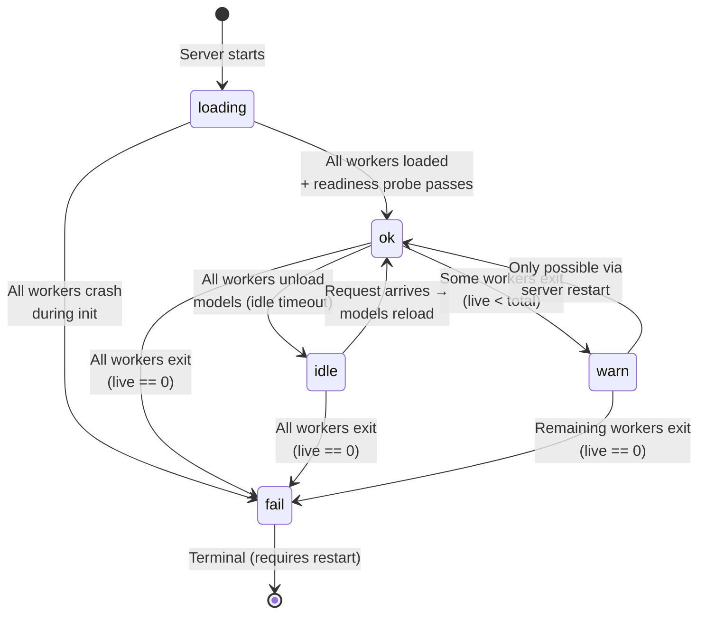
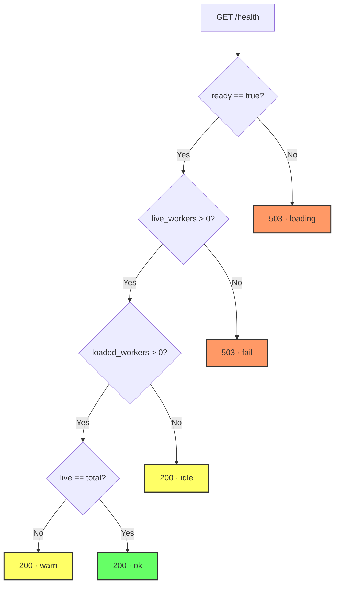

# Health State Machine

The `/health` endpoint reports the server's operational state based on three
independent atomic values. It is designed for use as a Kubernetes readiness
probe or Docker `HEALTHCHECK`.

## State Diagram



## State Definitions

| State | HTTP Status | `status` field | Condition |
|-------|-------------|---------------|-----------|
| **loading** | 503 | `"loading"` | `ready == false` (models still initializing) |
| **fail** | 503 | `"fail"` | `ready == true` AND `live_workers == 0` |
| **idle** | 200 | `"idle"` | `ready == true` AND `live_workers > 0` AND `loaded_workers == 0` |
| **warn** | 200 | `"warn"` | `ready == true` AND `0 < live_workers < total_workers` AND `loaded_workers > 0` |
| **ok** | 200 | `"ok"` | `ready == true` AND `live_workers == total_workers` AND `loaded_workers > 0` |

## Decision Logic

The health handler evaluates conditions in priority order. The first
matching branch wins.



## Input Signals

The health state is derived from three atomic values, each updated by a
different part of the system:

| Signal | Type | Updated by | Meaning |
|--------|------|-----------|---------|
| `ready` | `AtomicBool` | `run_readiness_probe()` | Set once after all workers load and warm-up succeeds; never cleared |
| `live_workers` | `AtomicUsize` | `WorkerGuard::drop()` | Decremented when a worker thread exits (clean or panic) |
| `loaded_workers` | `AtomicUsize` | Worker loop | Incremented after model load, decremented after idle unload |

### Why three signals?

A single status enum would require coordinated updates from multiple
threads. Instead, each thread independently maintains its own counter via
atomic operations. The health handler reads all three on every request and
derives the state — there is no cached status that can go stale.

## Response Examples

### ok — Fully operational

When ready, the response includes `max_seq_length` and the `tuning` object.
The `tuning` block is **always present** once the server is ready — it is written
to `AppState` immediately after memory detection completes, before the background
probe starts. The cost-model fields (`a_bytes_per_token`, `b_bytes_per_token_sq`,
`max_workspace_bytes`) reflect live values from the `ArcSwap<CostModel>` and
update atomically when the probe finishes.

```json
{
  "status": "ok",
  "workers": { "live": 2, "total": 2 },
  "max_seq_length": 8192,
  "tuning": {
    "a_bytes_per_token": 18432.0,
    "b_bytes_per_token_sq": 6.2,
    "max_workspace_bytes": 2044000000,
    "probe_status": "complete",
    "memory_source": "cgroup_v2",
    "available_bytes": 28991029248,
    "model_rss_bytes_per_worker": 1100000000,
    "worst_case_peak_bytes": 21533073408,
    "utilization_pct": 74.3
  }
}
```

| `tuning` field | Meaning |
|----------------|---------|
| `a_bytes_per_token` | Fitted linear coefficient (FFN term); updates after probe completes. |
| `b_bytes_per_token_sq` | Fitted quadratic coefficient (attention term); updates after probe completes. |
| `max_workspace_bytes` | Per-worker bin-packing budget. |
| `probe_status` | `running` while probe is in progress, then `complete`, `cache_hit`, `failed`, or `disabled`. |
| `memory_source` | How available memory was detected (`cgroup_v2`, `cgroup_v1`, `proc_meminfo`, `host_ram`). |
| `available_bytes` | Total container memory visible to the server. |
| `model_rss_bytes_per_worker` | Peak RSS delta measured by each worker during model load; used in the budget formula. |
| `worst_case_peak_bytes` | `N×workspace + N×model_rss + OS_HEADROOM`; must be below `available_bytes`. |
| `utilization_pct` | `worst_case_peak / available × 100`; a startup `WARN` fires if > 90%. |

While `probe_status` is `running`, `a_bytes_per_token` / `b_bytes_per_token_sq` reflect conservative defaults until the probe finishes. The bin-packer operates safely but may pack fewer texts per chunk than the fitted model would allow.

### idle — Models unloaded after timeout

```json
{
  "status": "idle",
  "workers": { "live": 2, "total": 2 }
}
```

The next embedding request will trigger a model reload (~10–30 s from
cache). The `/health` endpoint returns 200 because the workers are alive
and capable of reloading — no operator intervention is needed.

### warn — Degraded but functional

```json
{
  "status": "warn",
  "workers": { "live": 1, "total": 2 }
}
```

At least one worker has exited, but some remain to serve requests.
Throughput is reduced. Investigate logs to determine why the worker exited.

### loading — Startup in progress

```json
{
  "status": "loading"
}
```

No `workers` field is included during loading because the count is not yet
meaningful (workers may still be initializing).

### fail — All workers dead

```json
{
  "status": "fail",
  "workers": { "live": 0, "total": 2 }
}
```

Terminal state. The server can no longer process embedding requests. A
restart is required.

## Docker HEALTHCHECK Integration

The Dockerfile configures:

```dockerfile
HEALTHCHECK --interval=10s --timeout=5s --start-period=120s --retries=3 \
    CMD curl -sf http://localhost:8081/health || exit 1
```

| Parameter | Value | Rationale |
|-----------|-------|-----------|
| `start-period` | 120 s | Allows time for ~2 GB model download on first run |
| `interval` | 10 s | Frequent enough to detect worker failures quickly |
| `retries` | 3 | Tolerates brief transient failures (e.g., during model reload) |

During the `start-period`, Docker ignores health check failures. After that
window, three consecutive 503 responses mark the container as `unhealthy`.
