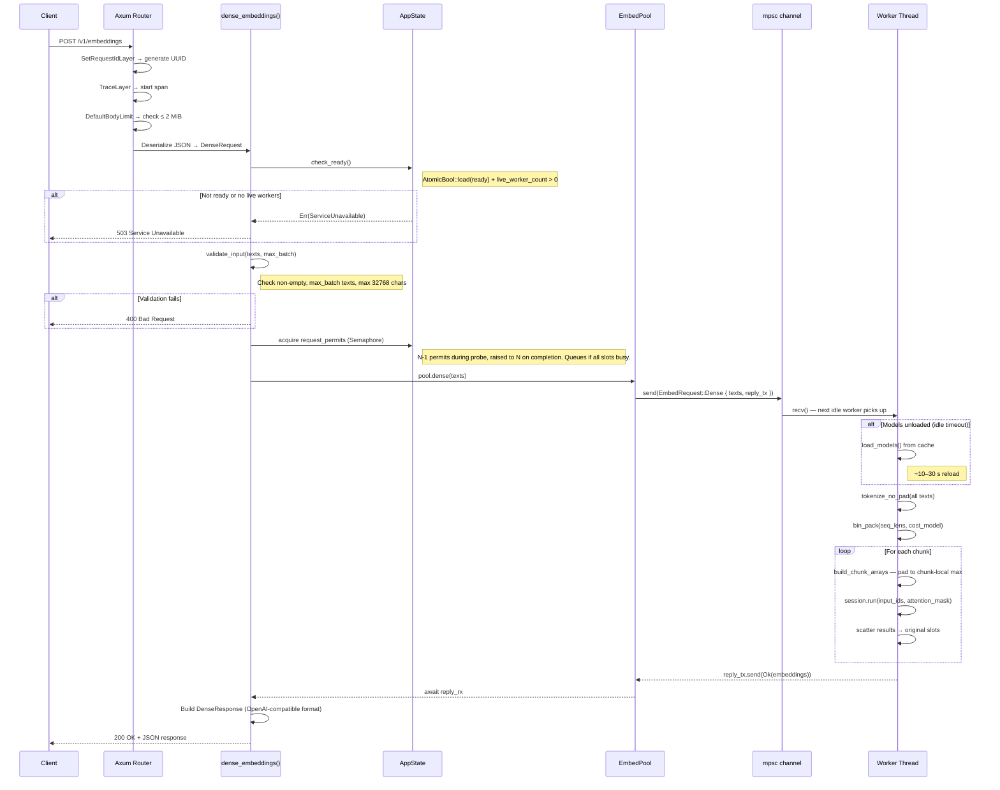
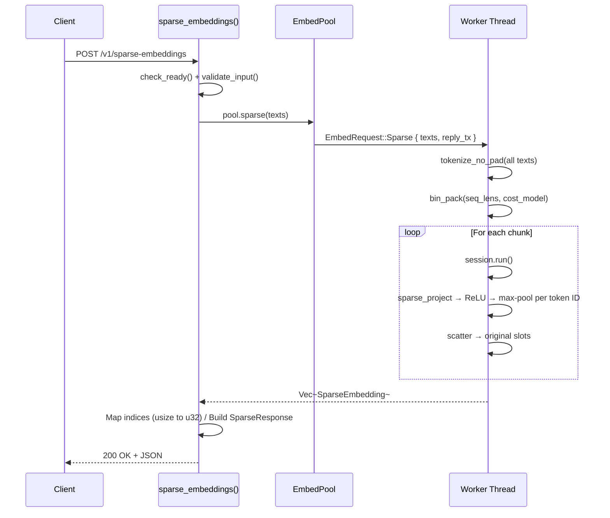
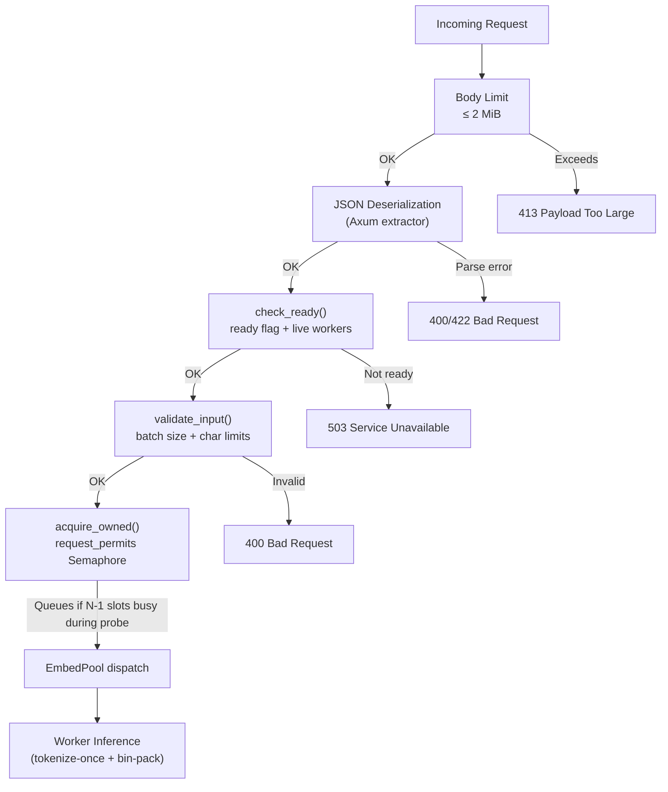
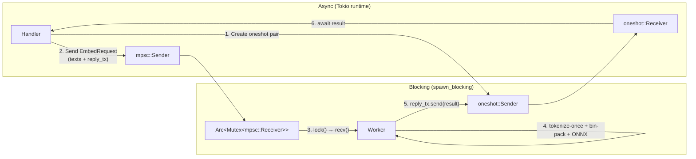

# Request Flow

This document traces the lifecycle of embedding requests from client to
response. Both the **dense** (`/v1/embeddings`) and **sparse**
(`/v1/sparse-embeddings`) endpoints follow the same pipeline; only the
model invocation and response shape differ.

## Dense Embedding Request



## Sparse Embedding Request

The sparse path is structurally identical. The differences are:

- Sends `EmbedRequest::Sparse` through the channel.
- Worker invokes `embed_sparse()` instead of `embed_dense()` — both use
  the same single ORT session; only the output tensor and post-processing differ.
- Sparse post-processing: per-token hidden states → sparse-linear projection → ReLU → max-pool by token ID.
- Response body uses `SparseResponse` with `indices` + `values` per
  embedding instead of a flat `f32` vector.



## Request Validation Pipeline

Every embedding request passes through a multi-layer validation pipeline
before reaching the worker pool. Each layer catches a distinct class of
invalid input at the earliest possible point.



### Validation constraints

| Check | Scope | Limit | Error |
|-------|-------|-------|-------|
| Body size | HTTP layer | 2 MiB | 413 Payload Too Large |
| JSON parse | Axum extractor | Valid JSON + expected shape | 400/422 |
| Readiness | `check_ready()` | `ready == true` AND `live_workers > 0` | 503 |
| Batch size | `validate_input()` | `1..=BGE_M3_MAX_BATCH` | 400 |
| String length | `validate_input()` | `≤ 32768` chars per text | 400 |
| Concurrency | `request_permits` Semaphore | `max(N-1, 1)` in-flight during probe; `N` after probe completes | queued (not rejected) |

Note: `BGE_M3_MAX_SEQ_LENGTH` (default 8192 tokens) caps how many tokens
are actually embedded — the tokenizer silently truncates any text that
tokenizes to more than that many tokens.

## Bin-Pack Chunk Dispatch

Within a worker, texts are not chunked into a static `batch_size`. Instead,
the `bin_pack()` function partitions them into workspace-safe groups using
the quadratic cost model:

```
workspace_per_chunk ≈ a × (count × max_seq) + b × (count × max_seq²)
```

A chunk closes when adding the next text would exceed `max_workspace_bytes`.
Each chunk is then padded only to its own longest sequence and passed to
`session.run()`. Results are scattered back to the original input positions.

This means:
- A batch of 256 short texts (e.g., 60 tokens each) may fit in a single `session.run()`.
- A batch of 256 long texts (e.g., 8192 tokens each) becomes 256 single-text calls.
- Mixed batches pack short texts together while long texts get their own chunks.

## Channel Dispatch Detail

The dispatch between the handler and worker pool uses a bounded `mpsc`
channel paired with `oneshot` reply channels. This design decouples the
async HTTP handler from the blocking ONNX inference.



The bounded channel (capacity `N × 4` where `N` is the worker count) provides
natural backpressure. If all workers are busy and the channel fills, callers
block on `send()` until a worker drains a message — preventing unbounded
memory growth under load.

## Error Response Format

All error responses follow a consistent JSON structure:

```json
{
  "error": {
    "message": "descriptive error message",
    "type": "invalid_request_error"
  }
}
```

| HTTP Status | `type` | Triggered by |
|-------------|--------|-------------|
| 400 | `invalid_request_error` | Empty input, oversized batch, string too long |
| 500 | `internal_error` | Worker crash, ONNX inference failure |
| 503 | `service_unavailable` | Models loading or all workers dead |
