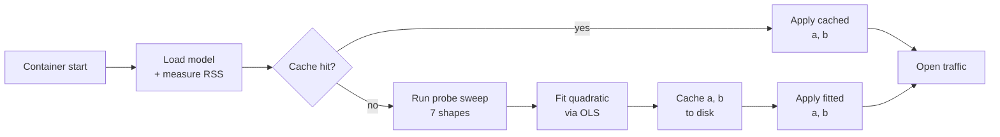

# Startup Workspace Probe — Documentation

The probe measures actual ONNX workspace cost on each container at startup, fits a quadratic cost model, and uses it to bin-pack inference requests safely. This documentation series walks through every layer.

## Visual overview


The bge-m3 transformer's workspace cost has a linear (FFN/projection) component and a quadratic (attention) component. At `S = 8192`, the quadratic term dominates by roughly 16× — a static batch ceiling under-budgets by exactly that factor. The probe replaces the static ceiling with a measured, two-coefficient model `W = a·B·S + b·B·S²`, fit on real RSS measurements taken inside the container.

## The pipeline at a glance



Every box in this pipeline has a dedicated page in the series below.

## The series

| # | Page | Topic | Has figure |
|---|------|-------|------------|
| 01 | [Overview](startup-probe/01-overview.md) | Why a probe? What problem it solves | yes |
| 02 | [Cost decomposition](startup-probe/02-cost-decomposition.md) | Where the quadratic comes from | yes (incl. animated) |
| 03 | [Bin-packing](startup-probe/03-bin-packing.md) | Using the cost model at request time | no |
| 04 | [OLS fitting](startup-probe/04-ols-fitting.md) | Least squares without intercept | yes (incl. animated) |
| 05 | [Conditioning](startup-probe/05-conditioning.md) | The Jacobi preconditioner | **yes (incl. animated)** ← key |
| 06 | [Probe shapes](startup-probe/06-probe-shapes.md) | Information geometry for two coefficients | yes (incl. animated) |
| 07 | [Measurement](startup-probe/07-measurement.md) | Synthesizing texts and reading RSS | yes |
| 08 | [Clamps & fallback](startup-probe/08-clamps-fallback.md) | Safety bounds and graceful degradation | yes |
| 09 | [Cache](startup-probe/09-cache.md) | Persistent fingerprint and atomic writes | no |
| 10 | [Execution](startup-probe/10-execution.md) | Background tasks and lock-free handoff | no |
| 11 | [End-to-end](startup-probe/11-end-to-end.md) | Worked cold-start trace | no |
| 12 | [Operator guide](startup-probe/12-operator-guide.md) | Quick reference and troubleshooting | no |
| 13 | [References](startup-probe/13-references.md) | Bibliography | no |

## Recommended reading paths

- **Operator wanting to understand `/health` output**: [Overview](startup-probe/01-overview.md) → [Operator guide](startup-probe/12-operator-guide.md)
- **Engineer reviewing the probe code**: [Cost decomposition](startup-probe/02-cost-decomposition.md) → [OLS fitting](startup-probe/04-ols-fitting.md) → [Conditioning](startup-probe/05-conditioning.md) → [Probe shapes](startup-probe/06-probe-shapes.md)
- **Anyone curious about the math**: read top to bottom

## Visual companions

The figures embedded in these pages are generated by the `tools/visuals/` package. To regenerate or modify them:

```bash
cd tools/visuals
uv sync
uv run python scripts/render_all.py             # static PNGs
uv run python scripts/render_all.py --animated  # also produce GIFs
```

Three interactive Jupyter notebooks supplement the static figures with sliders to explore the math hands-on:

| Notebook | What it explores |
|----------|------------------|
| `01_cost_decomposition_explorer.ipynb` | Sliders for `a` and `b` — live crossover point, preset buttons for fitted vs conservative defaults |
| `02_workspace_budget_calculator.ipynb` | Deployment sizing tool — workers, model RSS, available memory, safety factor → utilization traffic light |
| `03_conditioning_visualiser.ipynb` | Column scale ratio slider — morphs OLS loss landscape from circular to elongated, shows condition number |

See [`tools/visuals/README.md`](../tools/visuals/README.md) for full details.

## Audience

This documentation series is for:

- **Operators** tuning deployments — start with [Overview](startup-probe/01-overview.md) and [Operator guide](startup-probe/12-operator-guide.md).
- **Contributors** editing `src/probe.rs` or `src/binpack.rs` — read the math chain (pages 02 through 06).
- **Reviewers** auditing the auto-budget logic — every page is a self-contained examination of one piece, with explicit code references back to the implementation.

If you only want to run the server, the [README](../README.md) and [architecture overview](architecture.md) are enough. This series explains *why* the probe exists and *how* it makes its decisions.

---

[Architecture overview](architecture.md) · [Request flow](request-flow.md) · [Health state machine](health-state-machine.md) · [Cold start](cold-start.md) · [The BGE-M3 model](bge-m3-model.md) · [Performance](performance.md)
