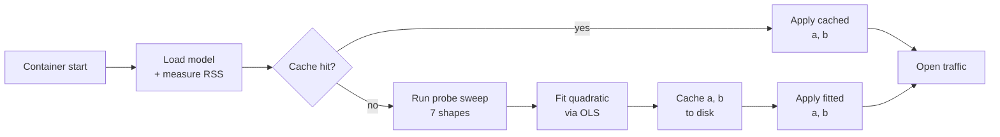

# Startup Workspace Probe — Documentation

The startup probe measures the actual ONNX workspace cost of a BGE-M3 inference call on each container at boot, fits a two-coefficient quadratic model to the measurements, and supplies that model to the bin-packer that plans every subsequent inference request. This documentation series develops the probe layer by layer: the cost decomposition that motivates the model, the ordinary least-squares solver that fits it, the conditioning fix that makes the solver work at production sequence lengths, the experimental design that makes the fit robust, and the runtime machinery that hides the measurement window from incoming traffic.

## Visual overview


The bge-m3 transformer's per-call workspace decomposes into a linear (FFN and projection) component and a quadratic (attention) component. At $S = 8192$ the quadratic term dominates by roughly $16\times$, so a static batch ceiling under-budgets long-context calls by exactly that factor. The probe replaces the static ceiling with a measured two-coefficient model $W = a \cdot B \cdot S + b \cdot B \cdot S^2$ fit on real RSS measurements taken inside the container.

## The pipeline at a glance



Each box in this pipeline corresponds to a dedicated page in the series below.

## The series

| # | Page | Topic | Has figure |
|---|------|-------|------------|
| 01 | [Overview](startup-probe/01-overview.md) | The workspace problem the probe was built to solve | yes |
| 02 | [Cost decomposition](startup-probe/02-cost-decomposition.md) | Where the quadratic term comes from | yes (incl. animated) |
| 03 | [Bin-packing](startup-probe/03-bin-packing.md) | Using the cost model at request time | no |
| 04 | [OLS fitting](startup-probe/04-ols-fitting.md) | Least squares without an intercept | yes (incl. animated) |
| 05 | [Conditioning](startup-probe/05-conditioning.md) | The Jacobi preconditioner | **yes (incl. animated)** |
| 06 | [Probe shapes](startup-probe/06-probe-shapes.md) | Information geometry for two coefficients | yes (incl. animated) |
| 07 | [Measurement](startup-probe/07-measurement.md) | Synthesising texts and reading RSS | yes |
| 08 | [Clamps & fallback](startup-probe/08-clamps-fallback.md) | Safety bounds and graceful degradation | yes |
| 09 | [Cache](startup-probe/09-cache.md) | Persistent fingerprint and atomic writes | no |
| 10 | [Execution](startup-probe/10-execution.md) | Background tasks and lock-free handoff | no |
| 11 | [End-to-end](startup-probe/11-end-to-end.md) | Worked cold-start trace | no |
| 12 | [Operator guide](startup-probe/12-operator-guide.md) | Quick reference and troubleshooting | no |
| 13 | [References](startup-probe/13-references.md) | Bibliography | no |

## Recommended reading paths

- **Operator wanting to understand `/health` output:** [Overview](startup-probe/01-overview.md) → [Operator guide](startup-probe/12-operator-guide.md).
- **Engineer reviewing the probe code:** [Cost decomposition](startup-probe/02-cost-decomposition.md) → [OLS fitting](startup-probe/04-ols-fitting.md) → [Conditioning](startup-probe/05-conditioning.md) → [Probe shapes](startup-probe/06-probe-shapes.md).
- **Reader interested in the underlying mathematics:** read top to bottom.

## Visual companions

The figures embedded in these pages are generated by the `tools/visuals/` package. To regenerate or modify them:

```bash
cd tools/visuals
uv sync
uv run python scripts/render_all.py             # static PNGs
uv run python scripts/render_all.py --animated  # also produce GIFs
```

Three interactive Jupyter notebooks at [`tools/visuals/notebooks/`](../tools/visuals/notebooks/) supplement specific pages with slider-driven exploration: cost decomposition (§2), workspace budget sizing (§3), and conditioning (§5). See [`tools/visuals/README.md`](../tools/visuals/README.md) for setup.

## Audience

This series is intended for three audiences. Operators tuning deployments will find the most directly applicable material in the [Overview](startup-probe/01-overview.md) and the [Operator guide](startup-probe/12-operator-guide.md). Contributors editing `src/probe.rs` or `src/binpack.rs` should follow the mathematical chain from page 02 through page 06. Reviewers auditing the auto-budget logic will find each page is a self-contained examination of one piece, with explicit references back to the implementation.

The [README](../README.md) and the [architecture overview](architecture.md) suffice for running the server. This series explains why the probe exists and how it makes its decisions.

---

[Architecture overview](architecture.md) · [Request flow](request-flow.md) · [Health state machine](health-state-machine.md) · [Cold start](cold-start.md) · [The BGE-M3 model](bge-m3-model.md) · [Performance](performance.md)
