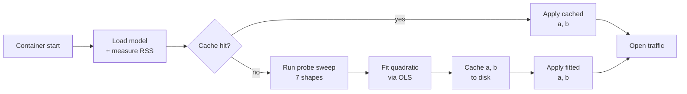

# 1. Overview

The startup probe is the mechanism by which the bge-m3 embedding server determines, at boot time, the per-call ONNX workspace cost on the container it is running in. The mechanism exists because the workspace cost depends on inputs that are chosen at request time and on hardware that is chosen at deployment time, and because the consequences of getting the cost wrong are asymmetric: under-budgeting causes OOM kills, while over-budgeting only sacrifices throughput. The probe replaces a static configuration knob with a measurement.

A transformer such as BGE-M3 allocates two distinct categories of memory. The model weights are loaded once at session creation and persist for the session's lifetime. Each `session.run()` call additionally allocates *workspace* — scratch tensors for attention scores, feed-forward projections, and the like — which is freed when the call returns but whose peak size determines whether the worker survives. The size of that workspace depends on the batch size $B$ and the maximum padded sequence length $S$ of the call: at small $S$ it grows linearly with $B \cdot S$, while at large $S$ an attention-score tensor of shape $[B, H, S, S]$ dominates and the cost grows like $B \cdot S^2$. The crossover sits inside the supported range of $S$, so a single integer ceiling like "at most 16 texts per batch" is either pessimistic at short lengths or fatal at long ones.

The probe addresses this by measuring the actual workspace cost on the active container at boot time, fitting the two-coefficient model $W = a \cdot B \cdot S + b \cdot B \cdot S^2$ to those measurements, and supplying the fitted model to a bin-packer that plans every subsequent inference call. The full sweep takes about two minutes on a fresh container. Its result is cached so that warm starts skip the sweep entirely.

## The cost decomposition at a glance


Figure 1 plots the two cost components against sequence length $S$ at fixed $B = 1$. The orange curve is the linear term $a \cdot S$ — feed-forward and projection workspace, which grows in proportion to $S$. The teal curve is the quadratic term $b \cdot S^2$ — attention-score workspace, which grows in proportion to $S^2$. The dashed black curve is their sum, the actual workspace $W(1, S)$. The vertical gold line marks the crossover sequence length $S^* = a / b \approx 2{,}973$ at which the two terms are equal.

Below the crossover, the linear term is taller and a static batch ceiling roughly suffices. Above the crossover, the quadratic term takes over and grows much faster than $S$. By $S = 8192$, the quadratic term is roughly $16\times$ larger than at $S = 2048$. Every production decision the bin-packer makes — how many texts to batch together, when to split them apart, when to reject — depends on knowing where on this curve the next call will land.

## The problem in concrete terms

Per `session.run()` call, three categories of memory exist:

| Category | When allocated | Lifetime | Scales with |
|----------|----------------|----------|-------------|
| **Model weights** | Once at session creation | Session lifetime | Model size only |
| **Activations / workspace** | Per `run()` call | Single call | Batch × sequence × layer count |
| **OS / runtime overhead** | Process boot | Process lifetime | Roughly constant |

The first and third are essentially fixed once the process is up. The middle category — the transient workspace allocated and freed by every `session.run()` call — is the one that can blow up unpredictably. This is what the probe measures.

The bin-packer's role is to ensure that this transient workspace never exceeds a per-worker budget. Doing so requires a *prediction function*: given a hypothetical chunk of `count` texts padded to `max_seq` tokens, how much workspace will the next `session.run()` use? The probe builds that function from data taken on the actual container.

### Why static knobs fail at long context

The previous design (`BGE_M3_ONNX_BATCH_SIZE`) used a single integer ceiling: never call `run()` with more than this many texts. The approximation works when the sequence length is fixed and small (the `max_length=512` era), because workspace is approximately linear in batch size in that regime.

At `MAX_SEQ_LENGTH = 8192`, the approximation breaks. The dominant cost is the attention-score tensor, whose size is $O(B \cdot S^2)$. Holding $B = 8$ constant, increasing $S$ from $512$ to $8192$ scales the attention workspace by $(8192/512)^2 = 256\times$. A static batch ceiling cannot see that scaling: it is either pessimistic at short lengths (wasting throughput) or fatal at long lengths (OOM kill). The fix is to model both regimes explicitly and pick a *workspace ceiling* that the bin-packer enforces dynamically.

### Why measure rather than compute

The workspace could in principle be derived from the ONNX graph and the ORT execution plan: count attention layers, multiply by $[B, H, S, S] \times \text{dtype size}$, add FFN intermediates. The probe instead measures, for three reasons:

1. **The arena allocator and graph optimisations alter the numbers.** Constant folding, layer fusion, in-place ops, and EP-specific subgraph rewrites all shift peak workspace away from what the static graph would suggest. The arena's reuse policy further breaks the equality "peak = sum of tensors".
2. **Model variant matters.** Fp32, fp16-with-Cast nodes, and int8-with-DequantizeLinear all carry different intermediate footprints at the same $(B, S)$ shape. A model-aware static analysis would require re-deriving constants every time the variant set changes.
3. **Hardware matters.** Page granularity, NUMA placement, and kernel version all influence RSS accounting. The probe measures the actual RSS delta on the actual host running the actual model, subsuming all of the above.

A measured cost model is also self-documenting: the fitted $(a, b)$ pair and the measurement source appear in `/health`, so operators can see exactly which budget the server is using.

## The pipeline at a glance



Five conceptual stages, plus a fast path for warm starts:

1. **Load.** Start workers, materialise ONNX sessions, and measure each worker's RSS to establish what the model itself costs.
2. **Measure.** Run a sweep of seven $(B, S)$ shapes, recording the RSS delta for each `session.run()` call. This is the heart of the probe.
3. **Fit.** Solve a $2 \times 2$ normal-equations system — after a Jacobi preconditioner (§5) — to obtain the linear coefficient $a$ and the quadratic coefficient $b$.
4. **Cache.** Atomically write $(a, b)$ plus a fingerprint to `{BGE_M3_CACHE_DIR}/probe-coefficients.json` so the next start can skip the sweep.
5. **Apply.** Hand the fitted `CostModel` to every worker via a wait-free `ArcSwap` pointer swap, then open the traffic semaphore.

Each box in this diagram has a dedicated page in the series.

## Roadmap

| # | Page | Topic |
|---|------|-------|
| 01 | **Overview** *(current)* | The workspace problem, the pipeline at a glance |
| 02 | [Cost decomposition](02-cost-decomposition.md) | Where the $a \cdot B \cdot S + b \cdot B \cdot S^2$ form comes from inside the transformer |
| 03 | [Bin-packing](03-bin-packing.md) | How the cost model is used at request time to plan ONNX calls |
| 04 | [OLS fitting](04-ols-fitting.md) | The least-squares solver, why no intercept, why two parameters |
| 05 | [Conditioning](05-conditioning.md) | Why the naïve solve fails at `MAX_SEQ = 8192` and how Jacobi normalisation fixes it |
| 06 | [Probe shapes](06-probe-shapes.md) | Information geometry: which seven shapes carry independent information |
| 07 | [Measurement](07-measurement.md) | Synthesising realistic texts, reading `/proc/self/statm`, two-layer RSS attribution |
| 08 | [Clamps & fallback](08-clamps-fallback.md) | Coefficient sanity bounds, asymmetric handling of negative $a$ vs negative $b$ |
| 09 | [Cache](09-cache.md) | Persistent fingerprint, atomic writes, what invalidates and what does not |
| 10 | [Execution](10-execution.md) | Background tasks, the `OwnedSemaphorePermit` idiom, lock-free `ArcSwap` handoff |
| 11 | [End-to-end](11-end-to-end.md) | An annotated cold-start log walkthrough |
| 12 | [Operator guide](12-operator-guide.md) | Diagnosing `/health`, forcing re-probes, pinning coefficients |
| 13 | [References](13-references.md) | Bibliography and further reading |

## Recommended reading paths

- **Operator wanting to understand `/health` output:** [Overview](01-overview.md) → [Operator guide](12-operator-guide.md).
- **Engineer reviewing the probe code:** [Cost decomposition](02-cost-decomposition.md) → [OLS fitting](04-ols-fitting.md) → [Conditioning](05-conditioning.md) → [Probe shapes](06-probe-shapes.md).
- **Reader interested in the underlying mathematics:** read top to bottom.

## Code reference

The probe is implemented in `src/probe.rs` and `src/probe/`. The cost model and bin-packer live in `src/binpack.rs`:

```26:44:src/binpack.rs
/// where `a` (bytes/token-position) captures the FFN / projection contribution
/// and `b` (bytes/token-position^2) captures the attention contribution.
///
/// At sequence length 512 attention is small relative to FFN, so a linear
/// approximation works. At 8192, `b * N^2` dominates by ~16×, so using only
/// `a` would under-budget by that same factor.
///
/// Coefficients are derived at startup by [`crate::probe`] or set
/// conservatively from compile-time defaults when measurement is unavailable.
#[derive(Clone, Copy, Debug)]
#[cfg_attr(test, derive(PartialEq))]
pub struct CostModel {
    /// Bytes per token-position (linear term: FFN intermediates, projections).
    pub a: f64,
    /// Bytes per token-position-squared (quadratic term: attention scores).
    pub b: f64,
```

---

[↑ Series overview](../startup-probe.md) | [Next: Cost decomposition →](02-cost-decomposition.md)
