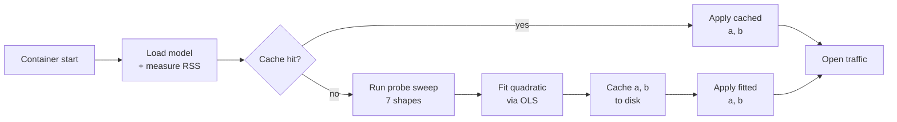

# 1. Overview — Why a Probe at All?

> A short tour of the workspace-cost problem the startup probe was built to solve, and a roadmap to the rest of the documentation series.

## Intuition

A transformer like BGE-M3 doesn't just need memory for its weights. Every time it processes a batch of texts, ONNX Runtime has to allocate **scratch memory** — sometimes called *workspace* or *activations* — to hold intermediate tensors like attention scores and feed-forward projections. That scratch memory is freed when the call returns, but its peak size is what decides whether the process gets OOM-killed.

The size of that workspace depends on two things you choose at request time: how many texts are in the batch (`B`) and how long the longest one is (`S`, in tokens). At small `S` the cost grows linearly with `B·S`; at large `S` an attention-score tensor of shape `[B, H, S, S]` shows up and the cost grows like `B·S²`. The crossover happens somewhere in the middle of the supported range. A static knob like "max 16 texts per batch" can either be wastefully conservative at short lengths or fatally optimistic at long ones.

The startup probe solves this by **measuring the actual workspace cost on this exact container** — at boot time, before any real traffic — fitting a two-coefficient quadratic model `W = a·B·S + b·B·S²` to the measurements, and handing that model to a bin-packer that uses it to plan every subsequent inference call. The whole thing takes about two minutes on a fresh container and is cached so warm starts skip it entirely.

## The figure


**What you're looking at:** two curves plotted against sequence length `S` on the x-axis (tokens). The orange curve is the **linear term** `a·S` — feed-forward and projection workspace, which grows in proportion to `S`. The teal curve is the **quadratic term** `b·S²` — attention-score workspace, which grows in proportion to `S²`. The dashed black curve is their sum, the actual workspace `W(1, S)` for `B=1`. The vertical gold line marks the **crossover point** `S* = a/b ≈ 2,973`, where the two terms are equal.

Below the crossover, the orange curve is taller — workspace is FFN-dominated and a static batch ceiling roughly suffices. Above the crossover, the teal curve takes over and grows much faster than `S`. By `S = 8192`, the quadratic term is roughly **16× larger** than at `S = 2048` — a planner that ignores it under-budgets by exactly that factor.

**Why it matters:** every production decision the bin-packer makes — how many texts to batch together, when to split them apart, when to reject — depends on knowing where on this curve the next call will land. Without the probe, the server would have to either pessimistically assume "always quadratic" (slow) or optimistically pretend "always linear" (OOM-killed). The probe replaces that guess with a measurement.

## The problem in concrete terms

For one ONNX `session.run()` call, three categories of memory exist:

| Category | When allocated | Lifetime | Scales with |
|----------|----------------|----------|-------------|
| **Model weights** | Once at session creation | Session lifetime | Model size only |
| **Activations / workspace** | Per `run()` call | Single call | Batch × sequence × layer count |
| **OS / runtime overhead** | Process boot | Process lifetime | Roughly constant |

The first and third are essentially fixed once the process is up. The middle one — the *transient* workspace allocated and freed by every `session.run()` call — is the one that can blow up unpredictably. **This is what the probe measures.**

The bin-packer's job is to make sure this transient workspace never exceeds a per-worker budget. To do that, the bin-packer needs a *prediction function*: given a hypothetical chunk of `count` texts padded to `max_seq` tokens, how much workspace will the next `session.run()` use? The probe builds that function from data taken on the actual container.

### Why static knobs don't work at long context

The previous design (`BGE_M3_ONNX_BATCH_SIZE`) used a single integer: "never call `run()` with more than this many texts." That works when the sequence length is fixed and small (the `max_length=512` era), because workspace is approximately linear in batch size.

At `MAX_SEQ_LENGTH=8192`, this approximation breaks. The dominant cost is the attention score tensor, whose size is `O(batch · seq²)`. Holding `batch=8` constant, going from `seq=512` to `seq=8192` increases the attention workspace by `(8192/512)² = 256×`. A static batch ceiling can't see that — it would either be pessimistic at short lengths (wasting throughput) or fatal at long lengths (OOM kill). The fix is to model both regimes explicitly and pick a *workspace ceiling* that the bin-packer enforces dynamically.

### Why measure instead of compute

We could in principle compute the workspace from the ONNX graph plus the ORT execution plan: count attention layers, multiply by `[B, H, S, S] × dtype_size`, add FFN intermediates, etc. We don't, for three reasons:

1. **ORT's arena allocator and graph optimizations change the numbers.** Constant folding, layer fusion, in-place ops, and EP-specific subgraph rewrites all change peak workspace from what the static graph would suggest. The arena's reuse policy further means peak ≠ sum-of-tensors.
2. **The model variant matters.** Fp32, fp16-with-Cast-nodes, and int8-with-DequantizeLinear all have different intermediate footprints even at the same `(batch, seq)` shape. A model-aware static analysis would mean re-deriving constants every time the variant set changes.
3. **The hardware matters.** Page granularity, NUMA placement, and even kernel version affect RSS accounting. The probe measures the *actual* RSS delta on *this* host running *this* model, which subsumes all the above.

A measured cost model is also self-documenting: the fitted `(a, b)` pair and the measurement source appear in `/health`, so operators see exactly what budget the server is using.

## The pipeline at a glance



Five conceptual stages, plus a fast path for warm starts:

1. **Load** — start workers, materialize ONNX sessions, and measure each worker's RSS to know what the model itself costs.
2. **Measure** — run a sweep of seven carefully chosen `(batch, seq)` shapes, recording the RSS delta from each `session.run()` call. This is the heart of the probe.
3. **Fit** — solve a 2×2 normal-equations system (after a Jacobi preconditioner — see [Conditioning](05-conditioning.md)) to get the linear coefficient `a` and the quadratic coefficient `b`.
4. **Cache** — atomically write `(a, b)` plus a fingerprint to `{BGE_M3_CACHE_DIR}/probe-coefficients.json` so the next start can skip the sweep.
5. **Apply** — hand the fitted `CostModel` to every worker via a wait-free `ArcSwap` pointer swap, then open the traffic semaphore.

Each box in this diagram has its own page in the series. Skip ahead to whichever interests you, or read top to bottom for the full story.

## Roadmap

| # | Page | What you'll learn |
|---|------|-------------------|
| 01 | **Overview** *(you are here)* | Why probing matters, the workspace problem, the pipeline at a glance |
| 02 | [Cost decomposition](02-cost-decomposition.md) | Where the `a·B·S + b·B·S²` formula comes from inside the transformer |
| 03 | [Bin-packing](03-bin-packing.md) | How the cost model is used at request time to plan ONNX calls |
| 04 | [OLS fitting](04-ols-fitting.md) | The least-squares solver, why no intercept, why two parameters |
| 05 | [Conditioning](05-conditioning.md) | Why the naive solve fails at `MAX_SEQ=8192` and how Jacobi normalization fixes it (the keystone page) |
| 06 | [Probe shapes](06-probe-shapes.md) | Why these seven shapes and not others — information geometry for two coefficients |
| 07 | [Measurement](07-measurement.md) | Synthesizing realistic texts, reading `/proc/self/statm`, two-layer RSS attribution |
| 08 | [Clamps & fallback](08-clamps-fallback.md) | Coefficient sanity bounds, asymmetric handling of negative `a` vs negative `b`, capability checks |
| 09 | [Cache](09-cache.md) | Persistent fingerprint, atomic writes, what invalidates and what doesn't |
| 10 | [Execution](10-execution.md) | Background tasks, the `OwnedSemaphorePermit` trick, lock-free `ArcSwap` handoff |
| 11 | [End-to-end](11-end-to-end.md) | A real cold-start log walkthrough |
| 12 | [Operator guide](12-operator-guide.md) | Diagnosing `/health`, forcing re-probes, pinning coefficients |
| 13 | [References](13-references.md) | Bibliography and further reading |

## Recommended reading paths

- **Operator wanting to understand `/health` output**: [Overview](01-overview.md) → [Operator guide](12-operator-guide.md)
- **Engineer reviewing the probe code**: [Cost decomposition](02-cost-decomposition.md) → [OLS fitting](04-ols-fitting.md) → [Conditioning](05-conditioning.md) → [Probe shapes](06-probe-shapes.md)
- **Anyone curious about the math**: read top to bottom

## Code reference

The probe is implemented in `src/probe.rs` and `src/probe/`. The cost model and bin-packer live in `src/binpack.rs`:

```26:44:src/binpack.rs
/// where `a` (bytes/token-position) captures the FFN / projection contribution
/// and `b` (bytes/token-position^2) captures the attention contribution.
///
/// At sequence length 512 attention is small relative to FFN, so a linear
/// approximation works. At 8192, `b * N^2` dominates by ~16×, so using only
/// `a` would under-budget by that same factor.
///
/// Coefficients are derived at startup by [`crate::probe`] or set
/// conservatively from compile-time defaults when measurement is unavailable.
#[derive(Clone, Copy, Debug)]
#[cfg_attr(test, derive(PartialEq))]
pub struct CostModel {
    /// Bytes per token-position (linear term: FFN intermediates, projections).
    pub a: f64,
    /// Bytes per token-position-squared (quadratic term: attention scores).
    pub b: f64,
```

---

[↑ Series overview](../startup-probe.md) | [Next: Cost decomposition →](02-cost-decomposition.md)
