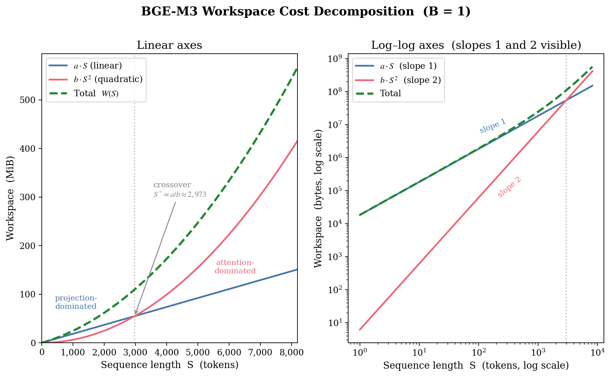
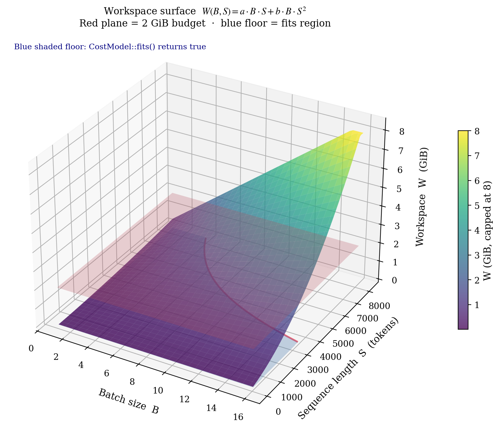
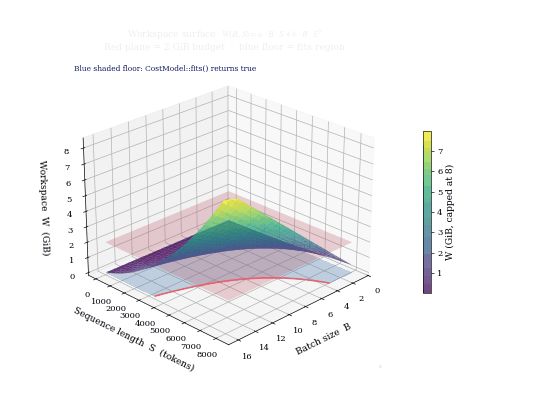

# 2. Cost Decomposition — Where the Quadratic Comes From

> The `W = a·B·S + b·B·S²` cost model is not a guess. It falls directly out of the per-layer tensor sizes inside a transformer like BGE-M3.

## Intuition

A transformer is a stack of identical layers. Each layer takes a `[B, S, D]` tensor of token embeddings (batch `B`, sequence length `S`, hidden dim `D`) and produces another `[B, S, D]` tensor for the next layer. To do that, it has to allocate a handful of intermediate tensors. Most of them are shaped `[B, S, something]` — they grow linearly with the total number of tokens `B·S`. But one of them — the **attention score matrix** — is shaped `[B, H, S, S]`. It is *every-token-against-every-other-token*, so it has a factor of `S²` baked in.

You can think of it like booking a room for a conference. Most costs scale with the number of attendees: chairs, lunches, badge printing — these are linear in `S`. But if every attendee has to shake hands with every other attendee (a bizarre but mathematically convenient social contract), then the handshake cost grows like `S²`. At small conferences this is fine — handshakes are dominated by lunch costs. At a big conference with a thousand attendees, the half-million handshakes overwhelm everything else.

The two coefficients `a` and `b` are exactly "how expensive a chair is" and "how expensive a handshake is" on **this hardware running this model**. The probe measures both. The bin-packer respects both.

## The figure



**What you're looking at:** sequence length `S` runs along the x-axis (tokens, log scale on the right panel). The orange curve is `a · S` (linear) and the teal curve is `b · S²` (quadratic), with `B=1` for clarity. The dashed black curve is their sum. The vertical gold line is the **crossover** `S* = a/b ≈ 2,973`, where the two terms are equal.

Below `S*`, the orange curve is taller — most workspace is feed-forward, and a static "max batch size" knob is roughly the right tool. Above `S*`, the teal curve takes over and grows quadratically. By the time you reach `S=8192`, the quadratic term dominates the total by 2.7× — the linear term is a rounding error.

**Why it matters:** it's not enough to know that workspace grows. You have to know *how* it grows, because the bin-packer's whole job is to plan calls right up to the budget edge. A planner that assumes linear growth packs too many texts at long `S` and gets OOM-killed. A planner that assumes quadratic growth refuses to batch short texts and wastes throughput. The two-coefficient model captures both regimes with the minimum number of parameters.

## The 3-D view



**What you're looking at:** the same cost function, now plotted as a surface over the `(B, S)` plane. Workspace `W` is the height. The colored surface is `W(B, S) = a·B·S + b·B·S²`. The translucent horizontal plane is the per-worker budget `max_workspace_bytes`. Where the surface punches through the plane, you have a chunk that doesn't fit. The floor projection traces the `fits()` boundary as a contour.

The shape of the surface tells the bin-packer's story at a glance: at small `S` the surface is nearly a flat ramp (linear); as `S` grows the surface curls up into a parabolic bowl (quadratic). The budget plane is most easily crossed by sliding **outward** along the `S` axis — exactly why the bin-packer sorts texts by length and packs similar-length texts together.

### Animated version



**What changes per frame:** the camera azimuth rotates around the vertical (workspace) axis. Watch the budget plane as it slices the cost surface — the intersection contour stays the same shape regardless of viewing angle, but the geometry of the over-budget region (the part of the surface above the plane) becomes much easier to see when the camera is roughly perpendicular to the long axis of the bowl.

## The math

BGE-M3 is a 24-layer XLM-RoBERTa-style transformer with 16 attention heads, hidden dim `D = 1024`, and FFN intermediate dim `D_ff = 4096`. For every `session.run()` call with batch `B` and padded sequence length `S`, ORT has to materialize, per layer:

| Tensor | Shape | Size (fp32 bytes) |
|--------|-------|-------------------|
| Q / K / V projections | `[B, S, D]` × 3 | `3 · B · S · D · 4` |
| Attention scores | `[B, H, S, S]` | `B · H · S² · 4` |
| Attention output | `[B, S, D]` | `B · S · D · 4` |
| FFN intermediate | `[B, S, D_ff]` | `B · S · D_ff · 4` |
| FFN output | `[B, S, D]` | `B · S · D · 4` |

Stripping the constants and grouping by how the size grows with `(B, S)`:

```text
linear-in-S terms:    B · S · (3D + D + D_ff + D) · 4 = B · S · k₁
quadratic-in-S term:  B · S² · (H · 4)               = B · S² · k₂
```

Summed across 24 layers and ignoring sub-leading constants:

$$
W(B, S) \;\approx\; a \cdot (B \cdot S) \;+\; b \cdot (B \cdot S^2)
$$

This is the cost model in [`src/binpack.rs`](../../src/binpack.rs):

```26:44:src/binpack.rs
/// where `a` (bytes/token-position) captures the FFN / projection contribution
/// and `b` (bytes/token-position^2) captures the attention contribution.
///
/// At sequence length 512 attention is small relative to FFN, so a linear
/// approximation works. At 8192, `b * N^2` dominates by ~16×, so using only
/// `a` would under-budget by that same factor.
///
/// Coefficients are derived at startup by [`crate::probe`] or set
/// conservatively from compile-time defaults when measurement is unavailable.
#[derive(Clone, Copy, Debug)]
#[cfg_attr(test, derive(PartialEq))]
pub struct CostModel {
    /// Bytes per token-position (linear term: FFN intermediates, projections).
    pub a: f64,
    /// Bytes per token-position-squared (quadratic term: attention scores).
    pub b: f64,
```

## The crossover point

The two terms are equal when `S = a / b`. With typical fitted values `a ≈ 18 KiB/token` and `b ≈ 6 B/token²`, the crossover sits around `S ≈ 3000`. Below that the FFN/projection term dominates; above it the attention term takes over. This is exactly the regime where a single linear knob fails.

| `S` | linear term `a · B · S` | quadratic term `b · B · S²` | ratio |
|-----|-------------------------|------------------------------|-------|
| 512  | 9.4 MB · B  | 1.5 MB · B  | 0.16× |
| 2048 | 38 MB · B   | 25 MB · B   | 0.66× |
| 4096 | 75 MB · B   | 100 MB · B  | 1.3×  |
| 8192 | 150 MB · B  | 400 MB · B  | 2.7×  |

At `S = 8192`, the quadratic term is roughly **16× larger** than at `S = 2048`. Any planner that ignores it under-budgets by exactly that factor.

### Worked example: the cliff at S = 8192

Imagine you're sizing a chunk of `B = 4` texts, all padded to `S = 8192` tokens. With the fitted `a = 18432`, `b = 6.2`:

```
linear  = 18432 × 4 × 8192      ≈ 604 MB
quad    =   6.2 × 4 × 8192²     ≈ 1665 MB
total   ≈ 2.27 GB
```

That single chunk consumes **~2.3 GiB** of workspace. If your per-worker budget is 2 GiB, this chunk doesn't fit — even though it's only four texts. With a static `BGE_M3_ONNX_BATCH_SIZE = 16` budget calibrated for `S = 512` (where 16 texts at 512 tokens uses ~140 MB), this chunk would have been admitted with a 16× overshoot. **That's the OOM.**

Now imagine the same `B = 4` at `S = 1024`:

```
linear  = 18432 × 4 × 1024      ≈ 75 MB
quad    =   6.2 × 4 × 1024²     ≈ 26 MB
total   ≈ 101 MB
```

Same number of texts, eight times shorter, **23× cheaper**. The bin-packer can safely pack 20× more texts at `S = 1024` than at `S = 8192` — but only if it knows the quadratic term is there.

## What we are *not* modeling

The two-coefficient model deliberately omits:

- **Constant per-call overhead** (ORT setup, arena initialization). This is a fixed offset; we absorb it into the linear term by not adding an intercept. (See [OLS fitting](04-ols-fitting.md) for why.)
- **Sub-leading polynomial terms** (e.g., `S³` from any cubic fusion patterns). At BGE-M3's scale these are negligible; including them would require more probe shapes for marginal gain.
- **Concurrency effects.** The cost model is per-`session.run()`; per-worker concurrency is already serialized inside one ORT session. Multi-worker effects come from the global memory budget, not the cost model itself.
- **Page-level RSS jitter.** The probe measures process RSS at 4 KiB granularity on Linux. A 4 KiB measurement floor on a 2 GiB chunk is a 0.0002% noise floor — comfortably below what the OLS fit cares about.

The model is "wrong but useful" in the George Box sense: it captures the two regimes that actually drive OOMs, with one parameter per regime.

## Why two parameters and no more

A 2-parameter fit needs at least 2 data points. With more, OLS minimizes the sum-of-squares — extra points serve as noise rejection rather than as additional degrees of freedom. The 7 probe shapes give us 5 degrees of freedom for residual estimation, which is sufficient to detect when a fit is suspect (large residuals → fall back to defaults, see [Clamps & fallback](08-clamps-fallback.md)).

Going to three parameters (e.g., adding `c · S³`) would force more shapes, more probe time, and would mostly fit measurement noise. The two-regime decomposition above already captures the dominant terms — and **two terms is exactly the minimum number you need** to model both the FFN-dominated low-`S` regime and the attention-dominated high-`S` regime separately.

## What's next

The next page shows how this cost model is *used* — how the bin-packer takes a stream of arbitrary-length texts and turns them into a sequence of safe `session.run()` calls.

---

← [Previous: Overview](01-overview.md) | [↑ Series overview](../startup-probe.md) | [Next: Bin-packing →](03-bin-packing.md)
