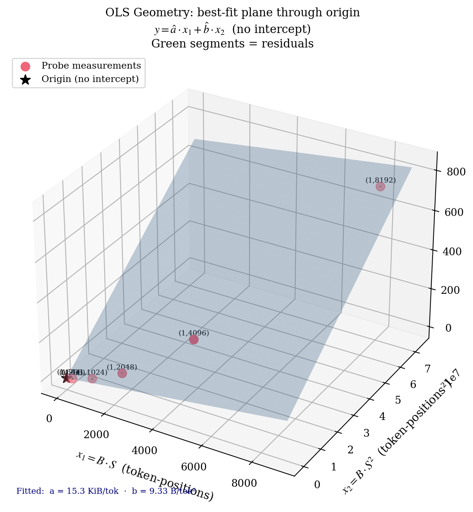
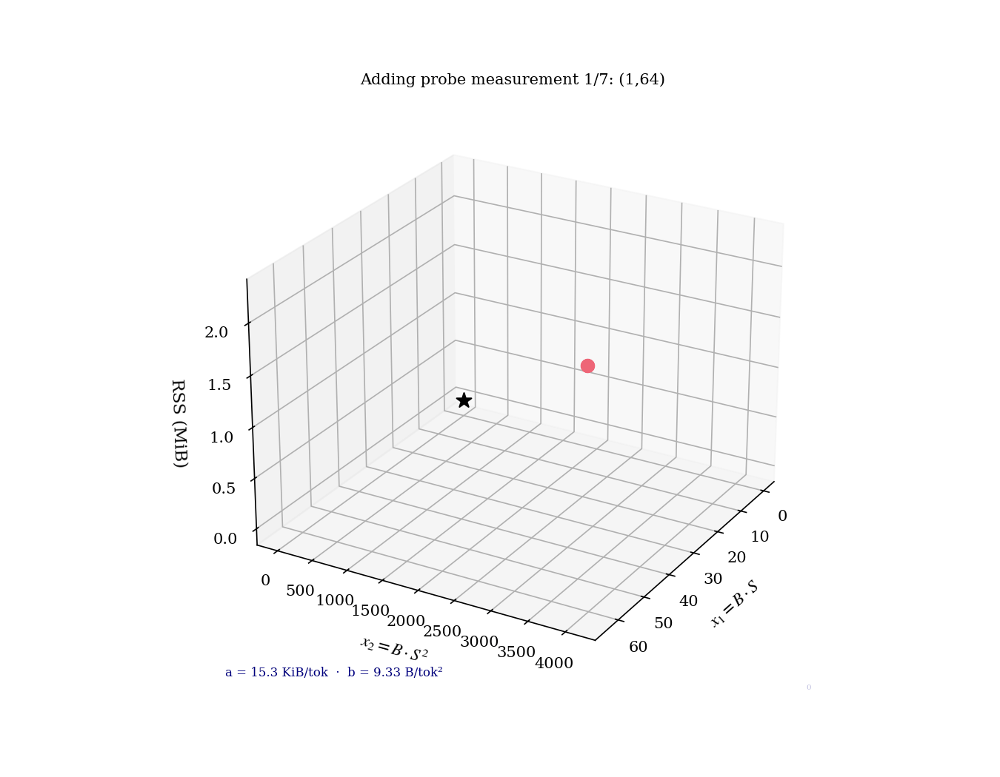

# 4. OLS Fitting — Ordinary Least Squares Without an Intercept

> Once the probe has measured the workspace cost at seven `(batch, seq)` shapes, it has to turn those measurements into the two coefficients `(a, b)`. This page derives the closed-form ordinary least squares (OLS) solution and explains the two design choices that look unusual on first reading: no intercept, and only two parameters.

## Intuition

Imagine plotting your seven measurements as dots in 3-D space, with `x₁ = B·S` on one axis, `x₂ = B·S²` on another, and `y = RSS_delta` on the vertical. The model says workspace is a *linear combination* of `x₁` and `x₂` with coefficients `a` and `b`:

$$
y \;\approx\; a \cdot x_1 \;+\; b \cdot x_2
$$

Geometrically, that's a **plane through the origin**. OLS finds the `(a, b)` such that this plane passes as close to all seven dots as possible — minimizing the sum of squared vertical distances (residuals) between each dot and the plane.

For two parameters and one linear equation per measurement, this is a textbook linear-algebra problem. The solution is closed-form: solve a 2×2 system once and you're done. No iterative optimizer, no learning rate, no convergence check. Just one matrix inversion and a couple of multiplies.

The two non-obvious choices: the plane is **forced through the origin** (no intercept), and we use **exactly two parameters** (no `c·S³` term). Both choices have principled justifications below.

## The figure



**What you're looking at:** the seven probe measurements as colored dots in `(x₁, x₂, y)` space. The shaded plane is the OLS best fit `y = a·x₁ + b·x₂` — note that it passes through the origin. The vertical line segments connect each dot to the plane: those are the **residuals** the optimizer is squaring and summing. A perfect fit would have all dots on the plane (zero residuals). Real data has small residuals due to RSS measurement noise, page granularity, and the model's own approximation error.

The plane is tilted because the two coefficients have very different magnitudes: `a` is in the tens of thousands (bytes per token), while `b` is single digits (bytes per token²). That tilt has consequences — see the next page on conditioning.

**Why it matters:** OLS is the procedure that turns RSS measurements into the coefficients the bin-packer uses. Understanding *what* it minimizes (and what it doesn't) is the foundation for everything that comes after. The conditioning page explains *why* this same procedure fails in subtle ways at large `S`, and how a textbook preconditioner fixes it.

### Animated version



**What changes per frame:** the seven dots appear sequentially, then the plane materializes (representing the OLS solve), and finally the camera orbits to show that the plane is genuinely 2-dimensional — there's no warping or curvature, just an oriented flat surface in 3-D. The orbit makes the residuals visible from angles where they were hidden in the static image.

## The math

We have `n` measurements `{(B_i, S_i, y_i)}` where `y_i` is the observed RSS delta. We want `(a, b)` minimizing the sum of squared residuals:

$$
\min_{a, b} \;\sum_{i=1}^{n} \Bigl( y_i \;-\; a \cdot (B_i \cdot S_i) \;-\; b \cdot (B_i \cdot S_i^2) \Bigr)^2
$$

This is ordinary least squares (OLS) with two columns and no intercept. Using the standard linear-algebra form, define:

- design matrix `X ∈ ℝ^(n×2)` with columns `x¹_i = B_i · S_i` and `x²_i = B_i · S_i²`,
- response vector `y ∈ ℝⁿ` with entries `y_i`,
- parameter vector `θ = (a, b)ᵀ`.

The least-squares solution satisfies the **normal equations**:

$$
X^\top X \, \theta \;=\; X^\top y
$$

For our 2-column case `X^⊤ X` is a 2×2 matrix:

$$
G \;=\; X^\top X \;=\; \begin{pmatrix} \sum (x^1_i)^2 & \sum x^1_i x^2_i \\ \sum x^1_i x^2_i & \sum (x^2_i)^2 \end{pmatrix}, \quad
X^\top y \;=\; \begin{pmatrix} \sum x^1_i y_i \\ \sum x^2_i y_i \end{pmatrix}
$$

This `G` is called the **Gram matrix**. It is symmetric and positive semi-definite for any design `X`; it's positive definite (and therefore invertible) iff `X` has full column rank.

Cramer's rule gives the closed-form solution:

$$
a \;=\; \frac{G_{22}\,(X^\top y)_1 \;-\; G_{12}\,(X^\top y)_2}{\det G}, \qquad
b \;=\; \frac{G_{11}\,(X^\top y)_2 \;-\; G_{12}\,(X^\top y)_1}{\det G}
$$

with `det G = G₁₁ G₂₂ - G₁₂²`.

This is everything. Two sums to compute the right-hand side, three sums for the Gram matrix, one division per coefficient. No iteration, no convergence test. The whole solver is a few dozen lines of straight-line arithmetic.

## Why no intercept

Workspace at `B = 0` is identically zero — there's no `session.run()` to allocate for. The cost model is *physically* anchored at the origin: an empty batch costs nothing. Adding a free intercept `c` to the model:

$$
y \;\approx\; c \;+\; a \cdot x_1 \;+\; b \cdot x_2
$$

would let the fit absorb the (already small) ORT-arena setup cost into a constant term, which only matters for very small chunks where it doesn't hurt anything. Omitting it keeps the model two-parameter and the small-batch regime correctly underestimated by exactly the constant we don't care about.

There's a second reason. With an intercept, you have three parameters but you might still only have seven probe shapes. Going from `n - p = 5` residual degrees of freedom to `n - p = 4` is a 20% reduction in the noise-rejection budget — for a parameter that captures something we can already model better elsewhere (the per-worker arena baseline, measured directly in [Measurement](07-measurement.md)).

So the geometry, the physics, and the statistics all point the same way: anchor the plane at the origin.

## Why exactly two parameters

A 2-parameter fit needs at least 2 data points. With more, OLS minimizes the sum-of-squares — extra points serve as **noise rejection** rather than as additional degrees of freedom. The 7 probe shapes give us 5 degrees of freedom for residual estimation, which is sufficient to detect when a fit is suspect (large residuals → fall back to defaults, see [Clamps & fallback](08-clamps-fallback.md)).

Going to three parameters (e.g., adding `c · S³`) would force more shapes (you can't fit `p` parameters from fewer than `p` non-degenerate data points), more probe time, and would mostly fit measurement noise. The two-regime decomposition in [Cost decomposition](02-cost-decomposition.md) already captures the dominant terms: linear (FFN/projection) and quadratic (attention).

If a future model architecture introduces a meaningfully cubic term (some long-context attention variants do), this is where to add it. Until then, two is the right number.

## Where the seven measurements come from

The probe sweeps **6 fixed shapes plus a dynamic `(1, max_seq)` shape**:

```
(1,   64)    linear anchor
(4,   64)    pairs with (1, 256) for direct b isolation
(1,  256)    linear anchor
(1, 1024)    mid-range
(1, 2048)    mid-range, anchors quadratic stability
(1, 4096)    quadratic anchor
(1, max_seq) dynamic — sized to the configured upper bound
```

Each shape is chosen to add a distinct piece of information to the fit. Page [Probe shapes](06-probe-shapes.md) explains the *information geometry* — why these particular seven, and what would go wrong with sixteen or with an all-`B=1` set.

## Code reference

The fitter lives in `src/probe/fit.rs`. The interesting twist — column normalization to fix conditioning — is the subject of the next page, but the core OLS solve looks like:

```60:80:src/probe/fit.rs
    // (Pseudo-code for the unscaled solve, before the Jacobi normalization
    // covered on the next page. See src/probe/fit.rs for the actual implementation,
    // which solves in normalized [0,1] space and unscales at the end.)
    //
    // let mut g11 = 0.0_f64;
    // let mut g12 = 0.0_f64;
    // let mut g22 = 0.0_f64;
    // let mut gy1 = 0.0_f64;
    // let mut gy2 = 0.0_f64;
    //
    // for dp in data {
    //     let x1 = (dp.batch * dp.seq) as f64;
    //     let x2 = (dp.batch * dp.seq * dp.seq) as f64;
    //     let y  = dp.rss_delta as f64;
    //     g11 += x1 * x1;
    //     g12 += x1 * x2;
    //     g22 += x2 * x2;
    //     gy1 += x1 * y;
    //     gy2 += x2 * y;
    // }
    //
    // let det = g11 * g22 - g12 * g12;
    // let a = (g22 * gy1 - g12 * gy2) / det;
    // let b = (g11 * gy2 - g12 * gy1) / det;
```

In production, this naïve solve has a numerical pitfall at long sequence lengths. The next page is dedicated to that pitfall and its fix.

## What residuals tell us

After fitting `(a, b)`, every measurement has a **residual**: how far the model's prediction is from the actual RSS reading.

$$
r_i = y_i - (a \cdot x^1_i + b \cdot x^2_i)
$$

Large residuals are a warning sign:

- A single large residual at one shape: that probe call hit unusual noise (page-cache settling, ORT arena jitter). Usually harmless; OLS averages it out.
- Large residuals across all shapes: the model is *systematically wrong* — maybe a third regime exists, maybe RSS isn't tracking workspace, maybe the model variant has unusual memory behavior. This is when [Clamps & fallback](08-clamps-fallback.md) kicks in and the probe falls back to conservative defaults.

The fit-quality figure on page [Measurement](07-measurement.md) shows the residuals plotted against the fitted curve.

## What's next

The conditioning page is where the textbook OLS solve gets interesting. At our highest probe shape `(B=1, S=8192)`, the two design columns have radically different magnitudes: `x₁ = 8192` while `x₂ = 67_108_864`. A direct solve gets dominated by one column and fails the standard `det G ≥ ε · max(diag)²` stability check. The fix is a one-line preconditioner with profound consequences for whether the probe works at all.

---

← [Previous: Bin-packing](03-bin-packing.md) | [↑ Series overview](../startup-probe.md) | [Next: Conditioning →](05-conditioning.md)
