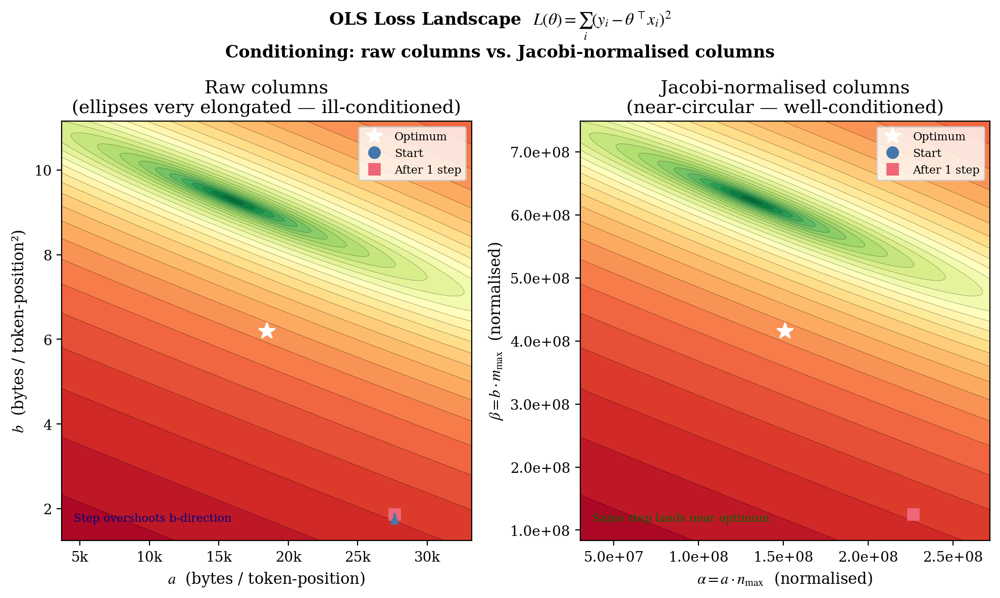
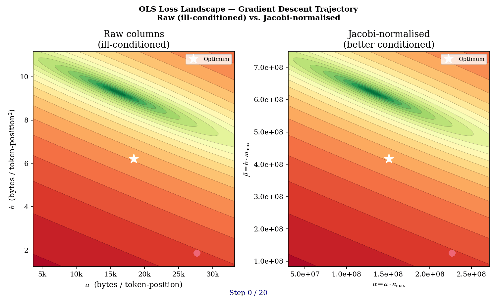

# 5. Conditioning — Why the Probe Almost Didn't Work

> **This is the most important page in the series.** The naïve OLS solve from the previous page silently fails on real production data. The fix is a one-line preconditioner with profound consequences. If you only read one page about the math behind the probe, read this one.

## Intuition

OLS — the closed-form normal-equations solver from the previous page — is a textbook procedure. It works. But "works" comes with an unspoken assumption: the columns of the design matrix should be of *similar magnitude*. When they aren't, the procedure can quietly produce garbage even though every step is mathematically correct.

In our case, the two columns are `x₁ = B·S` and `x₂ = B·S²`. At the highest probe shape `(1, 8192)`:

- column 1: `B · S = 8 192`
- column 2: `B · S² = 67 108 864`

The columns differ by **roughly 8 000×** in scale at the upper end. This is not a math problem in any rigorous sense — the data has full rank, the solve has a unique solution, `f64` has plenty of precision. But it's a **conditioning** problem: the standard defensive checks that a numerical library uses to *detect* near-singularity stop working when the columns are this far apart in magnitude. Perfectly-good fits get silently rejected.

The real-world symptom: before the fix, the probe would sweep its 7 shapes, gather perfect data, attempt the OLS solve, and then *silently fall back to conservative defaults*. The container would boot, accept traffic, run slower than necessary, and operators would see `probe_status: "failed"` with no obvious reason in the logs. The data was great. The solver was correct. The defensive check was reading scale-distorted numbers and refusing to trust them.

The fix is a **Jacobi preconditioner** — a one-line trick that rescales each column to live in `[0, 1]` before the solve, then unscales the result. Mathematically equivalent to the unscaled solve. Numerically, the difference between "it works" and "it silently doesn't."

This trick is what lets the probe operate at `MAX_SEQ_LENGTH = 8192` at all.

## The figure



**What you're looking at:** the *same OLS objective function*, plotted twice. Each panel shows the loss `L(a, b)` as a 2-D contour plot — concentric ellipses where each ellipse is a level set (constant residual sum-of-squares). The optimum (minimum loss) is at the center.

- **Left panel** is the raw, unconditioned loss landscape. The contours are extremely elongated ellipses — almost cigar-shaped. The condition number of this Hessian is on the order of `10⁸`. A gradient-descent trajectory (overlaid in red) takes 10+ zigzag steps to inch toward the minimum, bouncing back and forth across the narrow valley.
- **Right panel** is the same loss after column normalization (Jacobi preconditioner). The contours are now near-circular. The condition number is `O(1)`. The gradient trajectory shoots straight to the minimum in a few steps.

We don't actually use gradient descent — we use the closed-form normal equations. But the **conditioning** problem visualized by the elongated ellipses on the left is exactly what makes the unscaled normal equations' singularity check unreliable: a bad-condition Hessian has a tiny determinant *relative to* its largest eigenvalue, and the standard `det G ≥ ε · max_diag²` test is built on that comparison.

**Why it matters:** the right-panel landscape is **why the probe works**. Without the preconditioner, every probe sweep at `MAX_SEQ = 8192` would silently fail and the server would limp along on conservative defaults — at half the throughput it could otherwise achieve. The fix is one matrix substitution; the impact is "the feature exists at all."

### Animated version



**What changes per frame:** the optimization trajectory advances one step at a time. On the left (raw), each step is small and the direction oscillates — the gradient points roughly across the long axis of the valley but the step keeps overshooting. On the right (normalized), each step makes large, nearly-direct progress to the minimum. By the end, the right panel has converged; the left is still inching forward.

This is the strongest visual argument for why the preconditioner matters. The same problem, the same data, the same algorithm — only the coordinate system is different — and the convergence behavior is qualitatively transformed.

## The column-magnitude problem

![Bar chart: left side shows raw column magnitudes for B·S and B·S² across the seven probe shapes, with up to 8000× ratio at S=8192; right side shows the normalized columns, all bounded in [0, 1]](../figures/startup-probe/fig05_column_magnitudes.png)

**What you're looking at:** seven pairs of bars, one pair per probe shape. Each pair shows the magnitude of `x₁ = B·S` (linear column) and `x₂ = B·S²` (quadratic column). The left half of the figure shows the **raw** values on a log scale — the quadratic column dwarfs the linear column at every shape, by a factor that grows with `S`. At `(1, 8192)`, the gap is roughly 8000:1.

The right half of the figure shows the **normalized** columns — each divided by its column-wide maximum. Both columns now live in `[0, 1]`. No more scale gap. The geometry of the fit is unchanged, but the solver's view of the data is now balanced.

**Why it matters:** the normal equations build the Gram matrix `G = X^⊤ X`. Each diagonal entry `G_kk = Σ (x^k_i)²` is the **squared sum** of one column. With one column 8000× larger than the other, the corresponding `G_kk` is `64_000_000×` larger — and the determinant test compares against `max(G_kk)²`, which is now the dominant entry squared. The fit is fine; the test is broken.

## What goes wrong: two specific failures

### Failure 1: the Gram matrix is dominated by one entry

The diagonal entries scale like `Σ(x^k_i)²`. With `x²_i ≈ 8000 · x¹_i`, we get `G_22 ≈ 64 000 000 · G_11`. The determinant `det G = G_11 G_22 - G_12²` is then small *relative to* `G_22²`, which is what numerical-stability checks compare it against.

In other words, the *absolute* determinant is fine — the matrix isn't even close to singular in any rigorous sense. But the **relative** determinant (compared to the largest entry squared) looks tiny, because `G_22²` is enormous. Standard libraries (and our hand-rolled solver) use this relative test to detect ill-conditioning and refuse to trust the fit.

### Failure 2: singularity threshold becomes scale-dependent

A common defensive check is `|det G| ≥ ε · max(diag)²`. With unscaled columns, `max(diag)² = G_22²` is enormous and the threshold rejects perfectly-good full-rank fits. Lowering `ε` masks the scale problem but also masks actual ill-conditioning when probe shapes happen to align (e.g., all data at the same `B/S` ratio).

The condition number of the unnormalized Gram matrix grows roughly as `(S_max / S_min)⁴`. At `S_max = 8192`, `S_min = 64`, that's `128⁴ ≈ 2.7 × 10⁸`. Solving a 2×2 system at this condition number in `f64` is numerically fine (we keep ~7 significant digits), but stability *checks* that compare `det G` to `max(diag)²` see only the dominant entry.

Empirically, before the fix, the 16-shape sweep would silently fall back to conservative defaults despite valid data — a test in `probe.rs` (`fit_cost_model_production_scale_16_shapes_with_max_seq_8192`) reproduces this and then verifies the normalized version succeeds.

## The fix: a Jacobi preconditioner

The fix is a textbook diagonal preconditioner. Define `n_max = max_i x¹_i` and `m_max = max_i x²_i`. Substitute scaled columns:

$$
\xi^1_i \;=\; \frac{x^1_i}{n_{\max}}, \qquad \xi^2_i \;=\; \frac{x^2_i}{m_{\max}}, \qquad \xi^k_i \in [0, 1]
$$

This is just the substitution `x = D ξ` where `D = diag(n_max, m_max)`. The new model is:

$$
y_i \;\approx\; \alpha \cdot \xi^1_i \;+\; \beta \cdot \xi^2_i \quad\text{with}\quad \alpha = a \cdot n_{\max},\;\; \beta = b \cdot m_{\max}
$$

Solve OLS in `(α, β)` space — both columns are now in `[0, 1]`, so the Gram-matrix entries are all `O(n)`-scale and the determinant test compares like-to-like. The full code is short:

```75:104:src/probe/fit.rs
    // Build normalized Gram matrix: n1 = x1/x1_max, n2 = x2/x2_max ∈ [0,1].
    // Variable names use single-letter prefixes to avoid clippy::similar_names
    // on the longer accumulator names (g11, g12, g22, gy1, gy2).
    let mut g11 = 0.0_f64; // sum(n1²)
    let mut g12 = 0.0_f64; // sum(n1*n2)
    let mut g22 = 0.0_f64; // sum(n2²)
    let mut gy1 = 0.0_f64; // sum(n1*y)
    let mut gy2 = 0.0_f64; // sum(n2*y)

    for dp in data {
        let n1 = (dp.batch * dp.seq) as f64 / x1_max;
        let n2 = (dp.batch * dp.seq * dp.seq) as f64 / x2_max;
        let y = dp.rss_delta as f64;

        g11 += n1 * n1;
        g12 += n1 * n2;
        g22 += n2 * n2;
        gy1 += n1 * y;
        gy2 += n2 * y;
    }

    // 2×2 determinant in normalized space.
    // With n1, n2 ∈ [0,1], max_diag ≤ N and det is directly comparable.
    let det = g11 * g22 - g12 * g12;
    let max_diag_sq = g11.max(g22).powi(2);
    if det.abs() < 1e-6 * max_diag_sq {
        // Nearly singular — likely all data points at the same shape or
        // concentrated along one direction in design space.
        return None;
    }
```

After solving for `(α, β)`, unscale to recover `(a, b)`:

$$
a \;=\; \alpha / n_{\max}, \qquad b \;=\; \beta / m_{\max}
$$

This transformation is mathematically equivalent to the original OLS — both produce the same residual-minimizing `(a, b)` when the problem is well-posed. What changes is which inputs the *solver* sees: in `[0, 1]` space the Gram matrix's spectrum is condition-number-bounded by the geometry of the probe shape distribution, not by the absolute magnitudes.

This is exactly a Jacobi (diagonal) preconditioner — the simplest case of preconditioning where the diagonal of the design's column scales is folded out before solving. For this 2-coefficient problem it is sufficient; for larger systems one would generally use SVD-based pseudoinverse, but at `n=7, p=2` the closed-form Cramer's solution is overwhelmingly the right tool.

## Why this is a coordinate change, not a different algorithm

![Side-by-side scatter plots: left shows the seven probe shapes in raw log-log (B·S, B·S²) coordinates; right shows the same shapes after Jacobi normalization, now bounded in the [0, 1] × [0, 1] unit square; the (4, 64) off-arc shape is highlighted in both panels](../figures/startup-probe/fig06_jacobi_transformation.png)

**What you're looking at:** the probe shapes plotted in two coordinate systems. On the left, in raw `(x₁, x₂) = (B·S, B·S²)` log-log coordinates — the points span 8 decades on the y-axis. On the right, after dividing each column by its max — the points are crammed into the unit square `[0, 1]²`. The (4, 64) shape, which deliberately *breaks* the `B = 1` line to give us leverage on the quadratic coefficient, is highlighted in both panels.

**What you should notice:** the *shape* of the point cloud is preserved — the same off-arc point is off the arc in both panels, the same near-collinear cluster is near-collinear in both panels. The geometry of the fit is unchanged. Only the units have changed.

**Why it matters:** preconditioning isn't approximation. The OLS objective in `(α, β)` space has the *same minimum* as the OLS objective in `(a, b)` space — they're related by an invertible diagonal transformation. We're solving the same problem, just in a coordinate system where our defensive checks aren't reading nonsense.

## A worked example

Suppose we have just two probe measurements:

| Shape | `x₁ = B·S` | `x₂ = B·S²` | `y = RSS` |
|-------|-----------|--------------|-----------|
| (1, 64)   | 64    | 4 096       | 1 200 000 |
| (1, 8192) | 8 192 | 67 108 864  | 760 000 000 |

The **raw** Gram matrix is:

```
G_11 = 64² + 8192²       ≈ 6.71e7
G_22 = 4096² + 67108864² ≈ 4.50e15
G_12 = 64·4096 + 8192·67108864 ≈ 5.50e11

det G = G_11 · G_22 - G_12² 
      ≈ 6.71e7 · 4.50e15 − (5.50e11)²
      ≈ 3.02e23 − 3.02e23
      ≈ vanishingly small (catastrophic cancellation in f64)

max_diag² = G_22² ≈ 2.0e31
```

The standard test `det G ≥ 1e-6 · max_diag²` becomes `~0 ≥ 2e25`. **Rejected.** Even though the data is perfectly fine, the test fails because `max_diag²` is astronomical and `det G` is the difference of two large nearly-equal quantities.

Now **normalize**:

```
n_max = 8192,         m_max = 67_108_864
ξ₁ = (64/8192, 8192/8192)             = (0.0078, 1.0)
ξ₂ = (4096/67_108_864, 67_108_864/67_108_864) = (0.000061, 1.0)

G_11 = 0.0078² + 1.0² ≈ 1.0001
G_22 ≈ 1.0000  
G_12 ≈ 0.99999
det G ≈ 1.0001 · 1.0000 − 0.99999² ≈ 2e-5
max_diag² ≈ 1.0
det/max_diag² ≈ 2e-5
```

`2e-5 ≥ 1e-6` — passes. Same problem, same data, same algorithm. The only difference is that the numbers the solver is comparing are now of similar magnitude.

(In practice, the probe takes 7 measurements rather than 2, which makes the system better-determined and the preconditioned `det/max_diag²` ratio larger still — but the principle is the same.)

## What this enables

Without the preconditioner, the probe is functional only when `S_max / S_min` is small. That basically means it works at `MAX_SEQ = 512` — the legacy regime — and silently fails everywhere else. The Jacobi normalization is what enables:

- **`MAX_SEQ = 8192` deployments** — the production setting on Fargate amd64. Workspace prediction at this length is the whole reason the probe exists.
- **Probe shapes spanning `S ∈ [64, 8192]`** — necessary for clean linear and quadratic anchoring (page [Probe shapes](06-probe-shapes.md) explains why the spread matters).
- **Future multi-precision support** — fp16, int8, and any future fp8 path will all hit the same conditioning issue. The fix scales with them.

## The TL;DR

| Without preconditioner | With preconditioner |
|------------------------|---------------------|
| Columns differ by 8000× in magnitude | Columns both in `[0, 1]` |
| Gram matrix dominated by one diagonal entry | Gram matrix entries `O(n)` |
| `det G / max_diag²` test rejects valid fits | Test compares like-to-like |
| Probe silently falls back to conservative defaults at `S = 8192` | Probe succeeds and produces accurate `(a, b)` |
| Half the throughput on long-context deployments | Full throughput |

One coordinate change. One line of code per accumulator. The difference between "the feature exists" and "the feature silently doesn't."

## What's next

Now that we know *how* the fitter solves a well-conditioned system, the next page explains *which* probe shapes to feed it — and why those particular shapes carry the most information about `(a, b)`.

---

← [Previous: OLS fitting](04-ols-fitting.md) | [↑ Series overview](../startup-probe.md) | [Next: Probe shapes →](06-probe-shapes.md)
