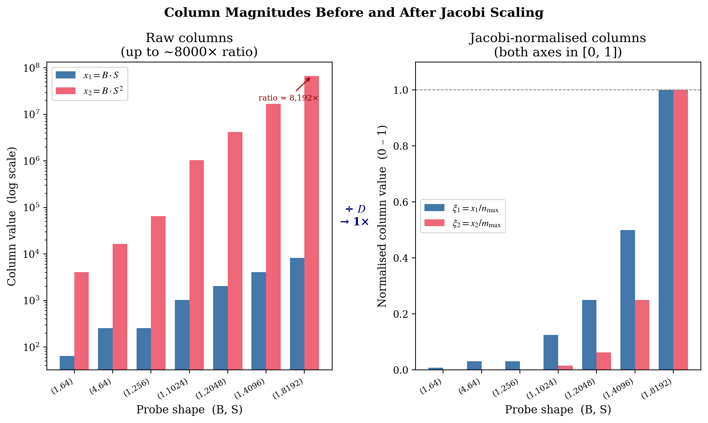
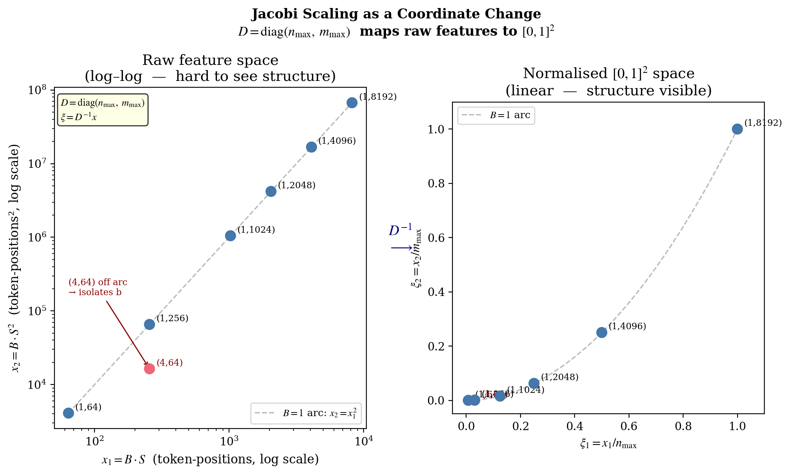

# 5. Conditioning

The closed-form OLS solver of §4 is correct in exact arithmetic and well-conditioned at the modest sequence lengths typical of a `MAX_SEQ = 512` deployment. At `MAX_SEQ = 8192` it silently produces fits that the standard defensive checks reject, even though the underlying data is full-rank and the floating-point precision is more than sufficient. This page identifies the failure mode, derives the diagonal preconditioner that resolves it, and records the consequences for the rest of the system.

## The column-magnitude problem

The two design columns of the cost-model fit are $x^1 = B \cdot S$ and $x^2 = B \cdot S^2$. At the highest probe shape $(B = 1, S = 8192)$:

- column 1: $B \cdot S = 8\,192$
- column 2: $B \cdot S^2 = 67\,108\,864$

The columns differ by a factor of roughly $8\,000$ at the upper end. The data is full rank, the system has a unique solution, and `f64` carries plenty of precision. But the standard *defensive* check used to detect near-singularity — comparing $\det G$ to $\max(\mathrm{diag}\,G)^2$ — interprets the scale-distorted Gram matrix as nearly singular and rejects the fit. The probe sweeps its seven shapes, gathers clean data, attempts the solve, and silently falls back to conservative defaults; the container boots, accepts traffic, and runs slower than necessary while operators see `probe_status: "failed"` with no obvious reason in the logs.

The remedy is a Jacobi (diagonal) preconditioner: rescale each column to live in $[0, 1]$ before the solve and unscale the result. The transformation is mathematically equivalent to the original problem; numerically, it is the difference between "the feature works at `MAX_SEQ = 8192`" and "the feature silently does not."

## The loss landscape, conditioned and unconditioned

<div align="center">


</div>

Figure 4 plots the OLS loss-level ellipse $\{\theta : (\theta - \theta^*)^\top G\,(\theta - \theta^*) = c\}$ in two parameter coordinate systems, where $G$ is the Gram matrix and $\theta^*$ is the OLS optimum recovered from the actual probe data. Each panel uses eigenvector-aligned axes — the long axis $v_{\min}$ and the short axis $v_{\max}$ — and equal aspect (`set_aspect("equal")`) with identical axis ranges on both sides. Under those drawing conventions, the visible aspect ratio of the level set equals exactly $\sqrt{\kappa(G)}$, the square root of the Gram matrix's condition number; no coordinate-system stretch hides or exaggerates the geometry.

The left panel uses the raw design columns $x^1 = B \cdot S$ and $x^2 = B \cdot S^2$. The condition number is $\kappa \approx 6.7 \times 10^8$, so the visible eccentricity is $\sqrt{\kappa} \approx 2.6 \times 10^4$. The short semi-axis is $1/\sqrt{\kappa}$ relative to the long, well below the figure's pixel resolution; the closed ellipse therefore degenerates visually to a near-line. Eccentricity of this magnitude is the visual signature of ill-conditioning: the loss is genuinely flat along one principal direction relative to the other, by the same factor that determines the relative-determinant test the solver uses to detect singularity.

The right panel applies the Jacobi rescaling $\xi^k = x^k / \max|x^k|$ before forming the Gram matrix. The condition number drops to $\kappa \approx 49$, the visible eccentricity to $\sqrt{\kappa} \approx 7$, and the level set becomes a clean $\sim 7{:}1$ ellipse with both principal axes plainly visible. The data, the optimum, and the residual minimum are all unchanged — only the parameter coordinates differ. The geometric story of the figure is exhausted by that single quantity, $\sqrt{\kappa}$: it sets the eccentricity in the drawing and it sets the conditioning of every operation the solver performs on $G$.

The probe does not use gradient descent — it uses the closed-form normal equations — but the conditioning failure visualised by the degenerate ellipse on the left is precisely what makes the unscaled normal-equations singularity check unreliable. A poorly conditioned Hessian has a determinant that is small *relative to* its largest eigenvalue, and the standard $\det G \geq \varepsilon \cdot \max(\mathrm{diag}\,G)^2$ test is built on that comparison.

### Animated version

<div align="center">


</div>

Figure 4a morphs the same level-set ellipse continuously from raw to Jacobi-normalised parameter coordinates. A column-rescaling matrix $D(t) = \mathrm{diag}(n_{\max}^t, m_{\max}^t)$ interpolates between $D(0) = I$ and $D(1) = \mathrm{diag}(n_{\max}, m_{\max})$, so the design $X(t) = X_{\text{raw}} \cdot D(t)^{-1}$ and the Hessian $H(t) = X(t)^\top X(t)$ slide smoothly between the two endpoints. A cubic smoothstep easing applied over $t \in [0, 1]$ accelerates the morph through the middle and rests at each end. The condition number $\kappa(t)$, reported in the annotation block, decreases monotonically from $\sim 6.7 \times 10^8$ at $t = 0$ to $\sim 49$ at $t = 1$; the visible eccentricity decreases as $\sqrt{\kappa(t)}$, and the ellipse deforms continuously from the degenerate near-line into the workable $\sim 7{:}1$ ellipse. The animation runs 150 frames at 15 fps with hold periods at both endpoints.

## Two specific failures of the unscaled solve

### Failure 1: the Gram matrix is dominated by one entry

The diagonal entries of $G$ scale as $\sum_i (x^k_i)^2$. With $x^2_i \approx 8000 \cdot x^1_i$ at the upper probe shape, $G_{22} \approx 6.4 \times 10^7 \cdot G_{11}$. The determinant $\det G = G_{11} G_{22} - G_{12}^2$ is then small *relative to* $G_{22}^2$, the quantity that numerical-stability checks compare it against. The absolute determinant is fine — the matrix is not even close to singular in any rigorous sense — but the relative determinant looks vanishingly small, and standard libraries (and the hand-rolled solver) use the relative test to detect ill-conditioning and refuse to trust the fit.

### Failure 2: the singularity threshold becomes scale-dependent

A common defensive check has the form $|\det G| \geq \varepsilon \cdot \max(\mathrm{diag}\,G)^2$. With unscaled columns, $\max(\mathrm{diag}\,G)^2 = G_{22}^2$ is enormous and the threshold rejects perfectly good full-rank fits. Lowering $\varepsilon$ would mask the scale problem but also mask actual ill-conditioning when probe shapes happen to align (e.g., all data at the same $B/S$ ratio).

The condition number of the unnormalised Gram matrix grows roughly as $(S_{\max} / S_{\min})^4$. At $S_{\max} = 8192$, $S_{\min} = 64$, that is $128^4 \approx 2.7 \times 10^8$. Solving a $2 \times 2$ system at this condition number in `f64` is numerically fine — it preserves about seven significant digits — but the stability *check* that compares $\det G$ to $\max(\mathrm{diag}\,G)^2$ sees only the dominant entry.

Empirically, before the fix, the 16-shape sweep silently fell back to conservative defaults despite valid data. The test `fit_cost_model_production_scale_16_shapes_with_max_seq_8192` in `probe.rs` reproduces this and verifies the normalised version succeeds.

<div align="center">



</div>

Figure 5 makes the scale gap concrete. On the left, the raw values are plotted on a log scale: the quadratic column dwarfs the linear column at every shape, by a factor that grows with $S$. At $(1, 8192)$, the gap is roughly $8000{:}1$. On the right, each column has been divided by its column-wide maximum and both lie in $[0, 1]$. The geometry of the fit is unchanged; the solver's view of the data is now balanced.

## The Jacobi preconditioner

Define $n_{\max} = \max_i x^1_i$ and $m_{\max} = \max_i x^2_i$, and substitute scaled columns:

$$
\xi^1_i \;=\; \frac{x^1_i}{n_{\max}}, \qquad \xi^2_i \;=\; \frac{x^2_i}{m_{\max}}, \qquad \xi^k_i \in [0, 1]
$$

This is the substitution $x = D \xi$ with $D = \mathrm{diag}(n_{\max}, m_{\max})$. The model in the new coordinates is

$$
y_i \;\approx\; \alpha \cdot \xi^1_i \;+\; \beta \cdot \xi^2_i \quad\text{with}\quad \alpha = a \cdot n_{\max},\;\; \beta = b \cdot m_{\max}.
$$

OLS is solved in $(\alpha, \beta)$ space. Both columns lie in $[0, 1]$, so all Gram-matrix entries are $O(n)$-scale and the determinant test compares like to like. The implementation is short:

```75:104:src/probe/fit.rs
    // Build normalized Gram matrix: n1 = x1/x1_max, n2 = x2/x2_max ∈ [0,1].
    // Variable names use single-letter prefixes to avoid clippy::similar_names
    // on the longer accumulator names (g11, g12, g22, gy1, gy2).
    let mut g11 = 0.0_f64; // sum(n1²)
    let mut g12 = 0.0_f64; // sum(n1*n2)
    let mut g22 = 0.0_f64; // sum(n2²)
    let mut gy1 = 0.0_f64; // sum(n1*y)
    let mut gy2 = 0.0_f64; // sum(n2*y)

    for dp in data {
        let n1 = (dp.batch * dp.seq) as f64 / x1_max;
        let n2 = (dp.batch * dp.seq * dp.seq) as f64 / x2_max;
        let y = dp.rss_delta as f64;

        g11 += n1 * n1;
        g12 += n1 * n2;
        g22 += n2 * n2;
        gy1 += n1 * y;
        gy2 += n2 * y;
    }

    // 2×2 determinant in normalized space.
    // With n1, n2 ∈ [0,1], max_diag ≤ N and det is directly comparable.
    let det = g11 * g22 - g12 * g12;
    let max_diag_sq = g11.max(g22).powi(2);
    if det.abs() < 1e-6 * max_diag_sq {
        // Nearly singular — likely all data points at the same shape or
        // concentrated along one direction in design space.
        return None;
    }
```

After solving for $(\alpha, \beta)$, unscale to recover $(a, b)$:

$$
a \;=\; \alpha / n_{\max}, \qquad b \;=\; \beta / m_{\max}.
$$

The transformation is mathematically equivalent to the original OLS — both produce the same residual-minimising $(a, b)$ when the problem is well-posed. What changes is the inputs the solver sees: in $[0, 1]$ space the Gram matrix's spectrum is bounded by the geometry of the probe-shape distribution rather than by the absolute magnitudes.

This is the simplest case of preconditioning: the diagonal of the design's column scales is folded out before solving. For the two-coefficient problem it suffices; larger systems would generally use SVD-based pseudoinverse, but at $n = 7$, $p = 2$ Cramer's solution in well-scaled coordinates is overwhelmingly the right tool.

## A coordinate change, not a different algorithm

<div align="center">



</div>

Figure 6 plots the probe shapes in two coordinate systems. On the left, in raw $(x^1, x^2) = (B \cdot S, B \cdot S^2)$ log-log coordinates, the points span eight decades on the $y$-axis. On the right, after dividing each column by its maximum, the points are confined to the unit square $[0, 1]^2$. The $(4, 64)$ shape that deliberately breaks the $B = 1$ line to provide leverage on the quadratic coefficient (§6) is highlighted in both panels.

The shape of the point cloud is preserved — the same off-arc point is off the arc in both panels, the same near-collinear cluster is near-collinear in both. Only the units have changed. Preconditioning is not approximation: the OLS objective in $(\alpha, \beta)$ space has the same minimum as the OLS objective in $(a, b)$ space; they are related by an invertible diagonal transformation.

## A worked example

Consider just two probe measurements:

| Shape | $x^1 = B \cdot S$ | $x^2 = B \cdot S^2$ | $y = \mathrm{RSS}$ |
|-------|-----------|--------------|-----------|
| (1, 64)   | 64    | 4 096       | 1 200 000 |
| (1, 8192) | 8 192 | 67 108 864  | 760 000 000 |

The raw Gram matrix has

```
G_11 = 64² + 8192²       ≈ 6.71e7
G_22 = 4096² + 67108864² ≈ 4.50e15
G_12 = 64·4096 + 8192·67108864 ≈ 5.50e11

det G = G_11 · G_22 - G_12²
      ≈ 6.71e7 · 4.50e15 − (5.50e11)²
      ≈ 3.02e23 − 3.02e23
      ≈ vanishingly small (catastrophic cancellation in f64)

max_diag² = G_22² ≈ 2.0e31
```

The standard test $\det G \geq 10^{-6} \cdot \max(\mathrm{diag})^2$ becomes ${\sim}0 \geq 2 \times 10^{25}$ — rejected. The data is fine; the test fails because $\max(\mathrm{diag})^2$ is astronomical and $\det G$ is the difference of two large nearly equal quantities.

After normalisation,

```
n_max = 8192,         m_max = 67_108_864
ξ₁ = (64/8192, 8192/8192)             = (0.0078, 1.0)
ξ₂ = (4096/67_108_864, 67_108_864/67_108_864) = (0.000061, 1.0)

G_11 = 0.0078² + 1.0² ≈ 1.0001
G_22 ≈ 1.0000
G_12 ≈ 0.99999
det G ≈ 1.0001 · 1.0000 − 0.99999² ≈ 2e-5
max_diag² ≈ 1.0
det/max_diag² ≈ 2e-5
```

$2 \times 10^{-5} \geq 10^{-6}$ — the test passes. Same problem, same data, same algorithm; the only difference is that the numbers the solver compares are now of similar magnitude. In practice the probe takes seven measurements rather than two, which makes the system better determined and the preconditioned $\det/\max(\mathrm{diag})^2$ ratio larger still, but the principle is the same.

## What this enables

Without the preconditioner, the probe is functional only when $S_{\max} / S_{\min}$ is small. In effect it works at `MAX_SEQ = 512` — the legacy regime — and silently fails everywhere else. The Jacobi normalisation enables:

- **`MAX_SEQ = 8192` deployments** — the production setting on Fargate amd64, the very reason the probe exists.
- **Probe shapes spanning $S \in [64, 8192]$** — necessary for clean linear and quadratic anchoring (§6).
- **Future multi-precision support** — fp16, int8, and any future fp8 path will hit the same conditioning issue, and the fix scales with them.

## Summary table

| Without preconditioner | With preconditioner |
|------------------------|---------------------|
| Columns differ by $8000\times$ in magnitude | Columns both in $[0, 1]$ |
| Gram matrix dominated by one diagonal entry | Gram matrix entries $O(n)$ |
| $\det G / \max(\mathrm{diag})^2$ test rejects valid fits | Test compares like to like |
| Probe silently falls back to conservative defaults at $S = 8192$ | Probe succeeds and produces accurate $(a, b)$ |
| Half the throughput on long-context deployments | Full throughput |

One coordinate change, one line of code per accumulator.

## Interactive exploration

The companion notebook for this section runs interactively in the browser via JupyterLite (no install required):

**[▶ Open Conditioning Visualiser](https://fulton-engineering-services.github.io/bge-m3-embedding-server/notebooks/lab/index.html?path=03_conditioning_visualiser.ipynb)**

The notebook morphs the OLS loss landscape as a function of column scale ratio. Sliding from $r = 1$ to $r = 8192$ reveals the geometric origin of the conditioning failure: the contour ellipses elongate along the $b$-axis at the same rate that the condition number $\kappa(G)$ grows. The Jacobi-normalised right panel remains near-circular regardless of $r$.

To run locally instead:

```bash
cd tools/visuals
uv sync --group notebooks
uv run jupyter notebook notebooks/03_conditioning_visualiser.ipynb
```

---

← [Previous: OLS fitting](04-ols-fitting.md) | [↑ Series overview](../startup-probe.md) | [Next: Probe shapes →](06-probe-shapes.md)
