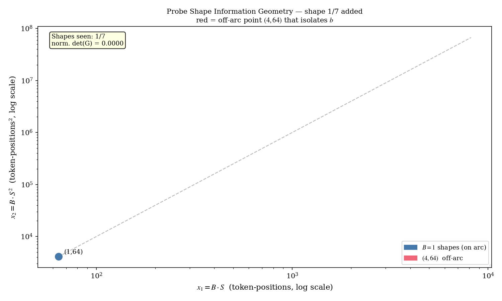

# 6. Probe Shapes — Information Geometry for Two Coefficients

> Seven probe shapes, hand-picked. Why these and not sixteen? Why an L-shape and not a flat row? Why is `(4, 64)` the most "interesting" probe shape in the set? This page is about the *information* each shape carries — and why missing the right shape is worse than running fewer of them.

## Intuition

Think of fitting `(a, b)` as triangulating a point. You're trying to pinpoint a 2-D location, and each probe measurement is a single bearing — it tells you something about where `(a, b)` is, but not *exactly* where. With one bearing you can't triangulate at all. With two bearings, you can — but only if they're in *different directions*. Two bearings pointing the same way are no better than one.

Mathematically, "different directions" means the two design columns of those measurements aren't parallel — they aren't scalar multiples of each other. For our model `y = a·x₁ + b·x₂`, two measurements at shapes `(B₁, S₁)` and `(B₂, S₂)` give parallel design columns whenever `S₁ = S₂`. That is, **all `(B, S)` shapes at a fixed sequence length lie along the same direction in design space**.

So a probe sweep made entirely of `(B, S)` pairs at varying batch and *fixed* `S` would be useless — every measurement is the same bearing. To break that degeneracy, you need at least two measurements at *different* `S`. And to anchor both `a` (which lives in the FFN-dominated low-`S` regime) and `b` (which lives in the attention-dominated high-`S` regime), you want measurements that span the full range.

This is why the chosen probe set looks the way it does: a row of `(1, S)` shapes spanning four orders of magnitude in `S`, plus **one off-arc point** `(4, 64)` whose only purpose is to give the fitter a clean handle on `b` independent of `a`.

## The figure


**What you're looking at:** the seven probe shapes plotted in design-matrix coordinates `(x₁, x₂) = (B·S, B·S²)` on a log-log scale. Six of the points lie on a single curve — the parametric curve traced out by `(1, S)` for varying `S`. The seventh, `(4, 64)`, sits **off** that curve. An annotated bracket connects `(4, 64)` to `(1, 256)` — they share the same `x₁` value (`4·64 = 1·256 = 256`) but have different `x₂` values (`4·64² = 16384` vs `1·256² = 65536`).

**What you should notice:** `(4, 64)` and `(1, 256)` are *aligned in `x₁` but separated in `x₂`*. That's the most informative pair you can construct for isolating `b`: if you subtract their model predictions, the `a · x₁` terms cancel and you're left with `b · (x₂_{1,256} - x₂_{4,64}) = b · 49152`. Whatever's left of the RSS difference goes directly into estimating `b`. **This is the L-shape geometry**: one row plus one off-row point, the minimum information needed to fit two coefficients.

**Why it matters:** if you removed `(4, 64)` from the probe set and added another `(1, S)` point, the OLS solve would still nominally work — but the fit on `b` would have no clean isolation, and small RSS noise could swing `b` substantially. The off-arc point is what makes the fit robust.

### Animated version



**What changes per frame:** each shape is added to the design matrix one at a time. After each addition, the figure shows the running determinant of the (normalized) Gram matrix `det G`. The pattern is striking:

- After two collinear `(1, S)` points: `det G` is essentially zero — the two design columns are nearly parallel, no information about `b` independent of `a`.
- After three `(1, S)` points: `det G` grows slowly — adding more parallel points doesn't add a new dimension.
- The moment `(4, 64)` is added: `det G` **jumps** by orders of magnitude. The new point breaks the collinearity and gives the fitter a clean second axis to work with.
- Subsequent `(1, S)` additions only modestly grow `det G` — they're noise rejection, not new geometry.

Watch the counter. The jump when `(4, 64)` enters the set is the moment the probe goes from "underdetermined" to "fully constrained."

## What goes wrong without an off-arc shape


**What you're looking at:** the OLS loss landscape `L(a, b)` plotted twice. On the left, the seven chosen probe shapes — the loss has a clean, isolated minimum (visible as concentric tight ellipses). On the right, the same number of probe shapes but **all at `B = 1`**. The loss is now a long valley — moving along the valley axis barely changes the loss at all. The fit on `(a, b)` is essentially undetermined: many `(a, b)` pairs all give roughly the same residual sum.

The Gram-matrix determinants are annotated: the left landscape has `det G ≈ 1e-3` (in normalized space, well above the `1e-6` threshold). The right landscape has `det G ≈ 1e-9` — below the threshold, the fit is rejected, the probe falls back to conservative defaults.

**Why it matters:** this is the failure mode the original test in `probe.rs` (`fit_cost_model_production_scale_16_shapes_with_max_seq_8192`) was added to catch. A naïve "more shapes is better" intuition leads to running 16 shapes — and if those 16 shapes are all variations of `(B, S)` along the `B = 1` line, you've added 16 points to the same direction in design space. The probe fails. The fix isn't "add more shapes" — it's "add the *right* shape."

## The chosen seven

The probe sweeps **6 fixed shapes plus a dynamic `(1, max_seq)` shape**:

```64:72:src/probe/runner.rs
const PROBE_SHAPES: &[Shape] = &[
    (1, 64),   // linear anchor
    (4, 64),   // pairs with (1,256) for direct b isolation
    (1, 256),  // linear anchor
    (1, 1024), // mid-range
    (1, 2048), // mid-range, anchors quadratic stability
    (1, 4096), // quadratic anchor
               // (1, max_seq) is added dynamically based on configured max.
];
```

Each shape is chosen for a reason:

| Shape | Role | Purpose in the fit |
|-------|------|---------------------|
| `(1, 64)` | Linear anchor | Pure low-`S` regime; quadratic term is `b · 4096` ≈ 25 KB — negligible. Nails down `a`. |
| `(1, 256)` | Linear anchor | Same regime, longer arm. Confirms `a` and starts probing `b`. |
| `(4, 64)` | **`b`-isolator** | Has the same `B·S = 256` as `(1, 256)`, but `B·S² = 16384` vs `65536`. The two shapes share the linear column but differ on the quadratic column by 4×. The difference of their RSS deltas is almost purely a measurement of `b`. |
| `(1, 1024)` | Mid-range | Bridges linear and quadratic regimes. Improves leverage on `(a, b)` jointly. |
| `(1, 2048)` | Mid-range | Improves the stability condition of the (normalized) Gram matrix — adds spread along the diagonal of the design space. |
| `(1, 4096)` | Quadratic anchor | Quadratic term ~50% of total cost. Strong leverage on `b`. |
| `(1, max_seq)` | Quadratic anchor | Dynamic — sized to the configured upper bound. Dominant `b` measurement. Doubles as a soft capability check (errors are skipped, not fatal). |

### Why (4, 64) is the magic shape

It sits at the same `B·S = 256` as `(1, 256)`. Subtract their predicted RSS:

$$
y_{(4,64)} - y_{(1,256)} \;=\; a \cdot 0 \;+\; b \cdot (16\,384 - 65\,536) \;=\; -49\,152 \cdot b
$$

The `a` term **vanishes**. What remains is a direct measurement of `b`. In OLS terms, the difference between these two shapes' design rows lies entirely along the `x₂` axis — it's a probe that touches one parameter and not the other. That's the ideal experimental design for isolating coefficients.

This is also why we don't add `(4, 256)`, `(4, 1024)`, etc. We don't need *more* off-arc points; we need *one* off-arc point in a place where the algebra cleanly separates the two coefficients. `(4, 64)` is that one point.

## Three independent OOM-protection layers

ORT's memory arena retains pages across `session.run()` calls, so cumulative process RSS grows with each successive probe shape. Without countermeasures, sweeping high-seq shapes can push the process past the container's cgroup ceiling mid-probe. Three independent layers prevent this:

1. **Arena warm-up** at the start of `run_probe` runs a `(1, 64)` `session.run()` BEFORE the sweep. ORT's lazy arena initialisation contributes ~1 GiB to `rss_after - rss_before` on the first call. By running the warm-up first and discarding the result, subsequent per-shape deltas reflect only the incremental allocation attributable to that shape, giving the OLS fitter a meaningful signal.
2. **Conservative `fits()` gate** rejects shapes whose per-call workspace estimate (under `CONSERVATIVE_A=16384, CONSERVATIVE_B=8`) exceeds `rss_ceiling` (the safety-discounted budget). Protects against pathological budget configurations.
3. **Absolute-RSS guard** rejects any shape whose projected total RSS would breach `cgroup_limit × 87.5%`:

   ```
   current_rss + 4 × chunk_cost(batch, seq) > 87.5% × cgroup_limit  →  skip
   ```

   The `4×` multiplier is empirically calibrated against observed ORT arena growth at mid-range shapes. Even after warm-up, ORT's arena can grow further at higher seq; the guard rejects shapes that risk pushing total RSS past the cgroup ceiling regardless of the conservative model's per-call estimate.

## Why earlier shapes and not others

A previous draft used 16 shapes including `(8, 64)`, `(8, 256)`, `(8, 1024)`, `(16, 64)`, `(16, 256)`, `(16, 512)`. Those were removed because:

1. **Probe time.** Each `session.run()` at large batch is expensive — especially on the slowest target architectures. Sweeping 16 shapes pushed total probe time on aarch64 MLAS into the tens of minutes.
2. **No information gain.** Once you have `(1, S)` for several `S` plus *one* `(B>1, S)` shape that breaks the pure `B=1` line, additional `(B>1, S)` shapes mostly add noise. The OLS fit weights them all equally; a single noisy 16-batch measurement can drag the coefficients more than its information contribution justifies.
3. **Conditioning.** All `(B>1, large S)` shapes lie roughly along the same direction in design-matrix space (`B·S ≈ B·S²/S` — collinear with the `(1, S)` line at fixed `S`). They don't add a new dimension, only repetition.

The chosen 5 give us:

- two clean low-`S` linear anchors at different effective `S`,
- one shape that *breaks* the `B=1` line in a controlled way (`(4, 64)` paired with `(1, 256)`),
- two `(1, S)` shapes at mid-range for quadratic leverage without high-arena-retention risk.

Geometrically: the shapes form a roughly L-shaped distribution in `(N, M) = (B·S, B·S²)` space — points along the `B=1` arc plus one off-arc point. That's the minimum-information geometry for separating linear from quadratic.

## Skipping shapes that won't fit

Each shape is checked against a *conservative* model before dispatch:

```180:195:src/probe/runner.rs
    for (batch, seq) in &shapes {
        let batch = *batch;
        let seq = *seq;

        // Skip shapes estimated to exceed the rss_ceiling by more than
        // conservative cost model says (avoids OOM mid-probe).
        if !conservative.fits(batch, seq) {
            info!(
                batch,
                seq,
                rss_ceiling_mb = rss_ceiling / (1024 * 1024),
                "Probe: skipping shape (estimated to exceed rss_ceiling)"
            );
            shapes_skipped += 1;
            continue;
        }
```

This protects the probe itself from the OOM it's trying to predict. On a small container (e.g., 4 GB available with 1 worker), the conservative model will pre-rule out shapes like `(1, 8192)` and the fit will still produce reasonable coefficients from the surviving shapes.

## Information vs. measurements: a trade-off

There's a tempting intuition that "more probe shapes always help, since they let OLS average out more noise." That intuition is half-true and half-dangerously-misleading.

It's true that adding a shape in a *new direction* in design space adds genuine information — that's why `(4, 64)` is irreplaceable. It's misleading because adding a shape in an *existing direction* mostly adds noise: OLS weights all measurements equally, so a noisy outlier in a redundant direction can drag the fit more than it would if the shape weren't there at all.

The right framing is: **what's the rank of the design subspace your shapes cover?** With two parameters, you need rank 2. Once you have rank 2, more shapes are noise rejection — useful, but with diminishing returns and bounded by probe time. The chosen seven are the smallest set that gives both rank-2 coverage and enough redundancy to detect bad measurements.

## What's next

We've now seen *which* shapes the probe runs and *why*. The next page explains *how* each measurement is actually taken — how the probe synthesizes realistic input texts, how it reads the process's RSS, and why there are two distinct RSS measurements happening on different timescales.

---

← [Previous: Conditioning](05-conditioning.md) | [↑ Series overview](../startup-probe.md) | [Next: Measurement →](07-measurement.md)
