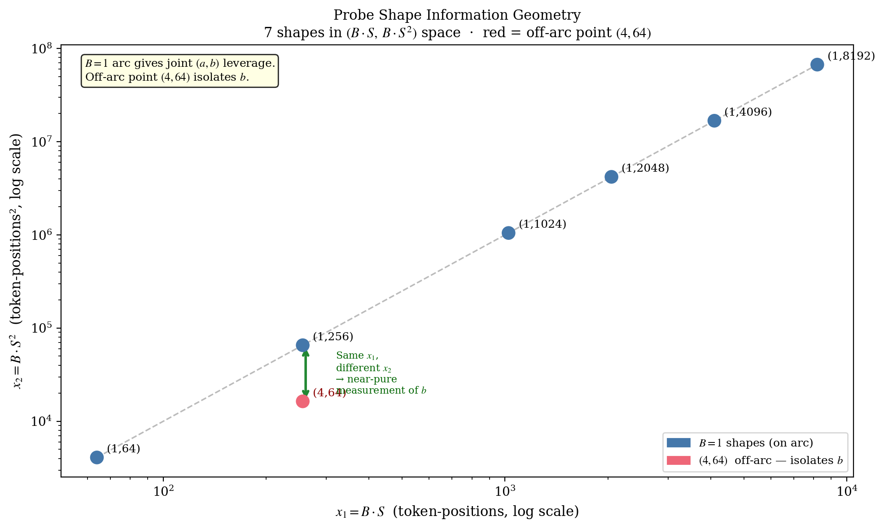

# 6. Probe Shapes

The probe runs seven hand-picked $(B, S)$ shapes. The choice of shapes determines whether the OLS fit can recover the two coefficients robustly. This page derives the information-geometry argument that motivates the chosen set, identifies the one off-arc shape that makes the fit possible, and explains the protection layers that prevent the probe sweep from OOM-killing the worker it is measuring.

## Information geometry of two coefficients

Fitting $(a, b)$ amounts to triangulating a point in a two-dimensional parameter space. Each probe measurement supplies one bearing — a constraint on where $(a, b)$ lies but not its exact location. With one bearing, no triangulation is possible. With two bearings, the location is determined, but only when the bearings point in different directions; two bearings along the same direction are no better than one.

In linear-algebra terms, "different directions" means the corresponding rows of the design matrix are not scalar multiples of each other. For the model $y = a \cdot x^1 + b \cdot x^2$, two measurements at shapes $(B_1, S_1)$ and $(B_2, S_2)$ produce parallel design rows whenever $S_1 = S_2$: every $(B, S)$ shape at fixed $S$ lies along the same direction in design space. A probe sweep made entirely of $(B, S)$ pairs at varying batch and fixed $S$ is therefore information-degenerate; every measurement carries the same bearing.

To break that degeneracy, at least two measurements at different $S$ are required. To anchor both $a$ (FFN-dominated low-$S$ regime) and $b$ (attention-dominated high-$S$ regime), measurements should span the full range. The chosen probe set therefore consists of a row of $(1, S)$ shapes spanning four orders of magnitude in $S$, plus one off-arc shape $(4, 64)$ that exists solely to give the fitter a clean handle on $b$ independent of $a$.



Figure 7 plots the seven shapes in design-matrix coordinates $(x^1, x^2) = (B \cdot S, B \cdot S^2)$ on log-log axes. Six points lie along the parametric curve traced by $(1, S)$ for varying $S$. The seventh, $(4, 64)$, sits off that curve. An annotated bracket connects $(4, 64)$ to $(1, 256)$: they share the same $x^1$ value ($4 \cdot 64 = 1 \cdot 256 = 256$) but have different $x^2$ values ($4 \cdot 64^2 = 16{,}384$ versus $1 \cdot 256^2 = 65{,}536$).

These two shapes are aligned in $x^1$ but separated in $x^2$ — the most informative pair available for isolating $b$. Subtracting their model predictions cancels the $a \cdot x^1$ term and leaves $b \cdot (x^2_{1,256} - x^2_{4,64}) = b \cdot 49{,}152$, so whatever remains of the RSS difference goes directly into estimating $b$. This is the L-shape geometry: one row plus one off-row point, the minimum information needed to fit two coefficients.

If $(4, 64)$ were removed and replaced by another $(1, S)$ point, the OLS solve would still nominally work, but the fit on $b$ would lack clean isolation and small RSS noise could swing $b$ substantially. The off-arc point is what makes the fit robust.

### Animated version


Figure 7a adds shapes to the design matrix one at a time and displays the running determinant of the (normalised) Gram matrix $\det G$. After two collinear $(1, S)$ points $\det G$ is essentially zero — the design columns are nearly parallel and there is no information about $b$ independent of $a$. After three $(1, S)$ points the determinant grows slowly: parallel additions add no new dimension. The moment $(4, 64)$ enters the set, $\det G$ jumps by orders of magnitude, marking the transition from underdetermined to fully constrained. Subsequent $(1, S)$ additions only modestly grow $\det G$ — they contribute noise rejection, not new geometry.

## What goes wrong without an off-arc shape


Figure 8 plots the OLS loss $\mathcal{L}(a, b)$ for two candidate probe sets. The left panel uses the seven chosen shapes: the loss has a clean, isolated minimum visible as concentric tight ellipses. The right panel uses the same number of probe shapes, but all at $B = 1$. The loss is now a long valley — moving along the valley axis barely changes the loss at all, and the fit on $(a, b)$ is essentially undetermined.

The Gram-matrix determinants are annotated. The left landscape has $\det G \approx 10^{-3}$ in normalised space, well above the $10^{-6}$ threshold. The right landscape has $\det G \approx 10^{-9}$ — below the threshold, the fit is rejected, the probe falls back to conservative defaults.

This is the failure mode that the test `fit_cost_model_production_scale_16_shapes_with_max_seq_8192` in `probe.rs` was added to catch. A naïve "more shapes is better" intuition leads to running 16 shapes; if those 16 shapes are all variations of $(B, S)$ along the $B = 1$ line, all 16 lie along the same direction in design space and the fit fails. The remedy is not "add more shapes" — it is "add the right shape."

## The chosen seven

The probe sweeps six fixed shapes plus a dynamic $(1, \texttt{max\_seq})$ shape:

```64:72:src/probe/runner.rs
const PROBE_SHAPES: &[Shape] = &[
    (1, 64),   // linear anchor
    (4, 64),   // pairs with (1,256) for direct b isolation
    (1, 256),  // linear anchor
    (1, 1024), // mid-range
    (1, 2048), // mid-range, anchors quadratic stability
    (1, 4096), // quadratic anchor
               // (1, max_seq) is added dynamically based on configured max.
];
```

Each shape has a specific role:

| Shape | Role | Purpose in the fit |
|-------|------|---------------------|
| $(1, 64)$ | Linear anchor | Pure low-$S$ regime; quadratic term is $b \cdot 4096 \approx 25\,\text{KB}$ — negligible. Nails down $a$. |
| $(1, 256)$ | Linear anchor | Same regime, longer arm. Confirms $a$ and starts probing $b$. |
| $(4, 64)$ | $b$-isolator | Same $B \cdot S = 256$ as $(1, 256)$, but $B \cdot S^2 = 16\,384$ versus $65\,536$. The two shapes share the linear column but differ on the quadratic column by $4\times$. The difference of their RSS deltas is almost purely a measurement of $b$. |
| $(1, 1024)$ | Mid-range | Bridges linear and quadratic regimes. Improves leverage on $(a, b)$ jointly. |
| $(1, 2048)$ | Mid-range | Improves the conditioning of the (normalised) Gram matrix — adds spread along the diagonal of design space. |
| $(1, 4096)$ | Quadratic anchor | Quadratic term is roughly $50\%$ of total cost. Strong leverage on $b$. |
| $(1, \texttt{max\_seq})$ | Quadratic anchor | Dynamic — sized to the configured upper bound. Dominant $b$ measurement. Doubles as a soft capability check (errors are skipped, not fatal). |

### Why $(4, 64)$ is the decisive shape

The shape $(4, 64)$ sits at the same $B \cdot S = 256$ as $(1, 256)$. Subtracting their predicted RSS gives

$$
y_{(4,64)} - y_{(1,256)} \;=\; a \cdot 0 \;+\; b \cdot (16\,384 - 65\,536) \;=\; -49\,152 \cdot b.
$$

The $a$ term vanishes; what remains is a direct measurement of $b$. In OLS terms, the difference between these two shapes' design rows lies entirely along the $x^2$ axis — a probe that touches one parameter and not the other. This is the ideal experimental design for isolating coefficients.

Adding more off-arc points, such as $(4, 256)$ or $(4, 1024)$, brings no comparable benefit. What is needed is *one* off-arc point in a place where the algebra cleanly separates the coefficients; $(4, 64)$ is that point.

## Three independent OOM-protection layers

ORT's memory arena retains pages across `session.run()` calls, so cumulative process RSS grows with each successive probe shape. Without countermeasures, sweeping high-seq shapes can push the process past the container's cgroup ceiling mid-probe. Three independent layers prevent this:

1. **Arena warm-up** at the start of `run_probe` runs a $(1, 64)$ `session.run()` *before* the sweep. ORT's lazy arena initialisation contributes ${\sim}1\,\text{GiB}$ to `rss_after - rss_before` on the first call. By running the warm-up first and discarding the result, subsequent per-shape deltas reflect only the incremental allocation attributable to that shape, giving the OLS fitter a meaningful signal.
2. **Conservative `fits()` gate** rejects shapes whose per-call workspace estimate (under `CONSERVATIVE_A = 16384`, `CONSERVATIVE_B = 8`) exceeds `rss_ceiling` (the safety-discounted budget). Protects against pathological budget configurations.
3. **Absolute-RSS guard** rejects any shape whose projected total RSS would breach $87.5\%$ of the cgroup limit:

   ```
   current_rss + 4 × chunk_cost(batch, seq) > 87.5% × cgroup_limit  →  skip
   ```

   The $4\times$ multiplier is empirically calibrated against observed ORT arena growth at mid-range shapes. Even after warm-up, ORT's arena can grow further at higher seq; the guard rejects shapes that risk pushing total RSS past the cgroup ceiling regardless of the conservative model's per-call estimate.

## Why earlier drafts ran sixteen shapes

A previous draft used 16 shapes including $(8, 64)$, $(8, 256)$, $(8, 1024)$, $(16, 64)$, $(16, 256)$, $(16, 512)$. They were removed for three reasons:

1. **Probe time.** Each `session.run()` at large batch is expensive — especially on the slowest target architectures. Sweeping 16 shapes pushed total probe time on aarch64 MLAS into the tens of minutes.
2. **No information gain.** Once $(1, S)$ is sampled at several values of $S$ plus *one* $(B > 1, S)$ shape that breaks the pure $B = 1$ line, additional $(B > 1, S)$ shapes mostly contribute noise. OLS weights every measurement equally, so a noisy $16$-batch reading can drag the coefficients more than its information contribution justifies.
3. **Conditioning.** All $(B > 1, \text{large } S)$ shapes lie roughly along the same direction in design-matrix space (note $B \cdot S \approx (B \cdot S^2) / S$, collinear with the $(1, S)$ line at fixed $S$). They do not add a new dimension, only repetition.

The chosen seven provide two clean low-$S$ linear anchors at different effective $S$, one shape that breaks the $B = 1$ line in a controlled way ($(4, 64)$ paired with $(1, 256)$), and three $(1, S)$ shapes at mid-to-high range for quadratic leverage without high-arena-retention risk. Geometrically, the shapes form an L-shaped distribution in $(N, M) = (B \cdot S, B \cdot S^2)$ space: points along the $B = 1$ arc plus one off-arc point — the minimum-information geometry for separating linear from quadratic.

## Skipping shapes that do not fit

Each shape is checked against a conservative model before dispatch:

```180:195:src/probe/runner.rs
    for (batch, seq) in &shapes {
        let batch = *batch;
        let seq = *seq;

        // Skip shapes estimated to exceed the rss_ceiling by more than
        // conservative cost model says (avoids OOM mid-probe).
        if !conservative.fits(batch, seq) {
            info!(
                batch,
                seq,
                rss_ceiling_mb = rss_ceiling / (1024 * 1024),
                "Probe: skipping shape (estimated to exceed rss_ceiling)"
            );
            shapes_skipped += 1;
            continue;
        }
```

This protects the probe itself from the OOM it is trying to predict. On a small container (e.g., 4 GB available with 1 worker), the conservative model rules out shapes such as $(1, 8192)$ and the fit still produces reasonable coefficients from the surviving shapes.

## The information-versus-measurement trade-off

The intuition that "more probe shapes always help, since they let OLS average out more noise" is half true and half misleading. Adding a shape in a *new direction* in design space adds genuine information — that is why $(4, 64)$ is irreplaceable. Adding a shape in an *existing direction* mostly adds noise: OLS weights all measurements equally, so a noisy outlier in a redundant direction can drag the fit more than it would if the shape were absent.

The right framing is: what is the rank of the design subspace the shapes cover? With two parameters, rank 2 is needed. Once rank 2 is achieved, more shapes are noise rejection — useful, with diminishing returns and bounded by probe time. The chosen seven are the smallest set that gives both rank-2 coverage and enough redundancy to detect bad measurements.

---

← [Previous: Conditioning](05-conditioning.md) | [↑ Series overview](../startup-probe.md) | [Next: Measurement →](07-measurement.md)
