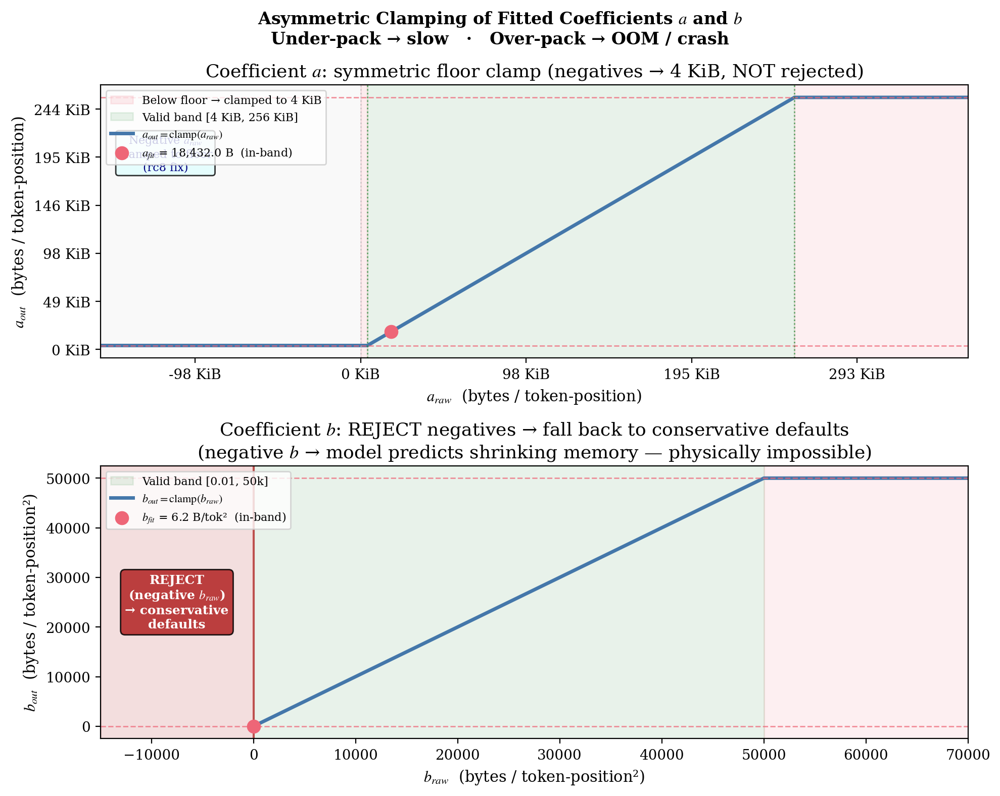

# 8. Clamps and Fallback

Every measurement system must handle the case in which the measurement disagrees with reality. RSS readings can be noisy, ORT can switch kernels between sequence regimes, and a fresh model variant can refuse to run at the configured `MAX_SEQ`. If the probe naïvely trusts whatever the fitter returns, a single anomalous reading can produce coefficients that disable batching entirely — turning the server into a one-text-at-a-time slowpoke.

The probe defends against this with two layers of safety. *Coefficient clamping* forces the fit's output into a physically reasonable range: a negative $a$ (which can legitimately arise from a noisy fit when ORT swaps kernels) is clamped to zero, while a negative $b$ (which is physically impossible because workspace cannot shrink as sequence length grows) is treated as an outright fit failure. *Capability and shape checks* validate, before any `session.run()`, that the configured `MAX_SEQ_LENGTH` can actually be allocated; during the sweep, if a single shape errors out (e.g., the model variant has shorter positional embeddings), the probe skips it and continues with the data it has.

The asymmetry — $a$ is forgiving, $b$ is strict — reflects the asymmetric production cost of each error. Under-counting $b$ is fatal (OOM kills the container). Over-counting $a$ is merely slow (the bin-packer leaves throughput on the table). When in doubt, the probe over-counts; the bin-packer is happy and the operator can investigate at leisure. This page also catalogues the broader fallback story: every failure mode the probe can encounter, what each one degrades to, and how the operator finds out.

## The clamping functions

<div align="center">



</div>

Figure 10 plots the two clamping functions side by side. The horizontal axis on each is the raw fitter output; the vertical axis is the clamped value applied to the cost model.

The left panel ($a$ clamp) is $\max(a_{\text{raw}}, 0)$ followed by $\mathrm{clamp}(4096, 262144)$. There is no rejection — every raw $a$, including negative values, maps to a usable number. The leftmost portion of the graph (where $a_{\text{raw}} < 0$) is flat at $4096$ (the lower bound), reflecting "treat negative $a$ as a noisy zero." The right panel ($b$ clamp) has a discontinuity at zero. For $b_{\text{raw}} \geq 0$, the value is clamped to $[0.01, 50\,000]$. For $b_{\text{raw}} < 0$, the function returns `None` — the entire fit is rejected and conservative defaults take over.

These functions are how the probe stays safe when the data lies. Without them, a single noisy probe reading could push $b$ to $10^9$, the bin-packer would refuse every chunk longer than a token, and the server would be effectively unavailable. The asymmetric handling reflects the asymmetric cost of error: a slightly inflated $a$ is fine; a slightly inflated $b$ would crash the server, but a *negative* $b$ is so impossible that throwing away the whole fit is preferable to trusting any of it.

## Coefficient clamping

Even with a well-conditioned fit, measurement noise can produce values outside the physically reasonable range. The clamping logic in `src/probe/fit.rs`:

```143:153:src/probe/fit.rs
    if b_raw < 0.0 {
        return None;
    }
    let a_raw = a_raw.max(0.0);

    // Clamp to sane operational ranges.
    // a: [4 KiB, 256 KiB] per token-position
    let a = a_raw.clamp(4_096.0, 262_144.0);
    // b: [0.01, 50_000] bytes per token-position^2
    let b = b_raw.clamp(0.01, 50_000.0);
```

Three rules, each with its own justification:

| Rule | Behaviour | Justification |
|------|-----------|---------------|
| $b_{\text{raw}} < 0 \Rightarrow$ `None` | Reject the whole fit | Workspace cannot decrease as sequence length grows. A negative $b$ is physically impossible — the measurements lie or the model is misspecified. Either way, conservative defaults are safer than any quantity derived from this fit. |
| $a_{\text{raw}} < 0 \Rightarrow 0$ | Clamp to zero, then apply the $[4096, 262144]$ clamp (so the final $a \geq 4096$) | ORT can switch attention kernels between sequence regimes — at low $S$ it may use a fused kernel that allocates less than the linear model predicts, which the fitter sees as needing a small negative $a$ to subtract back out the over-prediction. The signal in $b$ is still valid; the $4\,\text{KiB}$ floor on $a$ applies. |
| $b \in [0.01, 50\,000]$ and $a \in [4096, 262144]$ | Symmetric clamp on both | Sanity bounds. $a > 256\,\text{KiB/token}$ would mean an FFN intermediate is allocating more than 64 floats per token-position per layer (impossible for $D_{\text{ff}} = 4096$). $b > 50\,000\,\text{B/token}^2$ would mean attention scores using more than $12\,\text{KB}$ per $S \times S$ slot per layer (impossible for $H = 16$). |

A clamp is graceful degradation: a fit that lands outside these bounds still produces a valid cost model, just one that is less aggressive than the noise might have suggested. Without clamping, an outlier RSS reading could push $b$ to e.g. $10^9$ and effectively disable batching for any sequence longer than a few tokens.

The asymmetry can be summarised in one sentence: a negative $a$ is the universe reporting that the fitter saw an inconvenient kernel switch, so the probe clips and continues; a negative $b$ is the universe reporting that something is fundamentally wrong with the measurements, so the probe throws away the whole fit and uses defaults.

## Max-seq capability — two-stage check

The capability check is split into a cheap synchronous shape validation at startup followed by a live `session.run()` as part of the probe sweep.

### Stage 1: `validate_max_seq_shape`

A synchronous, cheap check that runs at the start of `run_probe`. It constructs `input_ids` and `attention_mask` ndarrays at shape (1, `max_seq`) and discards them. The check confirms that `max_seq` fits within `usize` bounds and that ndarray can allocate the 2-D layout. It cannot detect ONNX positional-embedding bounds — only that the OS can allocate the input tensors at all. This stage catches typos (e.g., setting `MAX_SEQ_LENGTH` to a number that overflows `usize`) before the probe wastes time on later stages.

### Stage 2: (1, `max_seq`) probe shape (dynamic, soft)

Added to the probe sweep at runtime. Runs after the warm-up and the static shapes. The error path logs and skips, *not* fail-fast:

```
Err(e) => {
    warn!(batch, seq, error = %e, "Probe shape failed; skipping");
    shapes_errored += 1;
}
```

If the ONNX model variant cannot run at `max_seq` (e.g., some Xenova FP16/INT8 exports with `max_position_embeddings = 512`), the shape errors out, the probe continues with the data points it has, and the cost-model fit excludes the failing shape. The incompatibility surfaces as an ORT error on the first real `/v1/embeddings` request rather than killing the container at startup. Arena-OOM during the probe is prevented by the three protection layers of §6.

### Operator response

Operators who see "Probe shape failed; skipping" with `seq` matching their configured `max_seq` should:

1. Check the error message in the warning log for a positional-embedding bounds violation.
2. Set `BGE_M3_MODEL=fp32` (uses `BAAI/bge-m3` with full $8192$-position embeddings) or lower `BGE_M3_MAX_SEQ_LENGTH`.

The choice between "fail at startup" and "fail at first request" is intentional: by deferring the failure, the server can still serve all requests at *shorter* sequence lengths even when the long-context capability is broken. That is strictly better than a fail-fast container that serves nothing.

## The conservative defaults

Every failure path leads to a functional server with conservative budgets. The compile-time defaults are calibrated to match the legacy `BGE_M3_ONNX_BATCH_SIZE = 16`, `MAX_SEQ_LENGTH = 512` behaviour:

```58:65:src/binpack.rs
    pub const CONSERVATIVE_A: f64 = 16_384.0; // 16 KiB per token-position
    pub const CONSERVATIVE_B: f64 = 8.0; // 8 bytes per token-position^2

    /// Default maximum workspace per worker when memory cannot be detected.
    ///
    /// 2 GiB is conservatively safe for the Fargate 28 GiB task with 7 workers
    /// (`28 GB * 0.7 safety / 7 workers ≈ 2.8 GB`); we round down for headroom.
    pub const DEFAULT_MAX_WORKSPACE: usize = 2 * 1024 * 1024 * 1024; // 2 GiB
```

The chosen values:

- **`CONSERVATIVE_A` = 16,384** is roughly the legacy assumption: $16\,\text{KiB}$ of FFN/projection workspace per token-position. Slightly higher than typical fitted values (${\sim}18\,\text{KB}$), so the bin-packer will pack a bit fewer texts than ideal but never overshoot.
- **`CONSERVATIVE_B` = 8** is intentionally pessimistic — about $1.3\times$ the typical fitted $b \approx 6.2$. At $S = 8192$, this means the conservative model predicts ${\sim}30\%$ more workspace than the fitted model would, so chunks are smaller and chunk count is higher. Slow but safe.
- **`DEFAULT_MAX_WORKSPACE` = 2 GiB** is a per-worker budget calibrated for the Fargate $28\,\text{GiB}$ / 7-worker production layout. On smaller containers, the auto-budget recalculates this from `available − N × model_rss − OS_HEADROOM`.

When the cost model is built from `CostModel::conservative(max_workspace_bytes)`, the bin-packer is fully usable — just tuned for safety over throughput.

## The full failure-mode table

Every failure path lands in one of these cells:

| Failure | What the probe does | What `probe_status` becomes | Server behaviour |
|---------|---------------------|------------------------------|-------------------|
| RSS reads return 0 (non-Linux) | All-zero delta detection; fit skipped | `failed` | Conservative defaults; server functional |
| Warm-up $(1, 64)$ errors | Log warning, proceed without warm-up | depends on sweep | First-shape delta will include arena init noise; fit may fail |
| One probe shape errors mid-sweep | Skip that data point, continue | `complete` (if others succeed) | Fit may be slightly less accurate |
| (1, `max_seq`) errors (model incompatibility) | Skip + warn (no fail-fast) | `complete` (if others succeed) | First real `/v1/embeddings` request surfaces ORT error; operator changes model or lowers `MAX_SEQ_LENGTH` |
| All shapes skipped by RSS-cap guard | Emit diagnostic with `current_rss` + `cgroup_limit` | `failed` | Conservative defaults; check cgroup detection |
| `validate_max_seq_shape` ndarray fails | Would be a Rust panic (usize overflow); unreachable in practice | — | — |
| OLS Gram is singular | `fit_cost_model` returns `None` | `failed` | Conservative defaults |
| Negative $b$ coefficient | `fit_cost_model` returns `None` (physically impossible) | `failed` | Conservative defaults |
| Negative $a$ coefficient | `a_raw` clamped to 0; fit proceeds with correct $b$ | `complete` | Fitted model with $a \geq 4\,\text{KiB/token}$ — bin-packer may over-split short batches but never accepts unsafe long ones |
| Coefficient outside clamp | Clamp; log warning if difference $> 1\%$ | `complete` | Fitted-but-clamped coefficients used |
| Cache file unreadable / truncated | Treat as miss; re-probe | normal lifecycle | Probe runs as if no cache |
| Cache write fails | Log warning, keep fitted coefficients | `complete` | Next cold start re-probes |

The asymmetry of conservatism is intentional: bin-packing under-counting is a slow service, bin-packing over-counting is no service. The probe over-counts when in doubt.

## `probe_status` in `/health`

`probe_status` is exposed in the `/health` response so operators can distinguish "we just started up" from "the probe failed and we're stuck on conservative defaults":

| Status | Meaning |
|--------|---------|
| `disabled` | A cost-model override env var bypasses the probe entirely. |
| `running` | Probe in flight; workers using conservative defaults. |
| `complete` | Fitted $(a, b)$ are active and have been written to the cache. |
| `failed` | Probe ran but the fit was invalid (singular system, capability-check failure, or all-conservative coefficients). Conservative defaults remain in effect. |
| `cache_hit` | Probe skipped because a fingerprint-matching cache file existed. |

§9 details what is in the cache file and how it gets there.

## Why the asymmetry is non-negotiable

Consider the symmetric alternative in which negative $b$ is clamped to a small positive value rather than rejecting the fit. A noisy probe could produce $(a, b) = (\text{very high}, \text{slightly negative})$. Clamped symmetrically, that becomes $(\text{very high}, 0.01)$. The bin-packer would then believe linear cost is much higher than reality (slightly slow) and quadratic cost is essentially zero (catastrophically wrong at long $S$).

The bin-packer would happily pack 100 texts at $S = 8192$ because `chunk_cost(100, 8192)` \approx 100 \cdot (\text{very high}) \cdot 8192 + 100 \cdot 0.01 \cdot 8192^2 \approx (\text{very high linear}) + (\text{tiny quad})$. The actual workspace would be ${\sim}10\times$ higher because $b$ is really ${\sim}6$, not $0.01$. The result is OOM.

By rejecting the whole fit when $b < 0$, the system never enters the state where one coefficient is mistakenly tiny while the other absorbs the model error. Either both coefficients are believable or defaults are used. There is no "partially trust the fit" state.

This is the same logic that motivates the Jacobi preconditioner in §5 (a fit whose conditioning fails the determinant test is rejected outright, not partially trusted): consistency between coefficients matters more than any individual coefficient's value.

---

← [Previous: Measurement](07-measurement.md) | [↑ Series overview](../startup-probe.md) | [Next: Cache →](09-cache.md)
