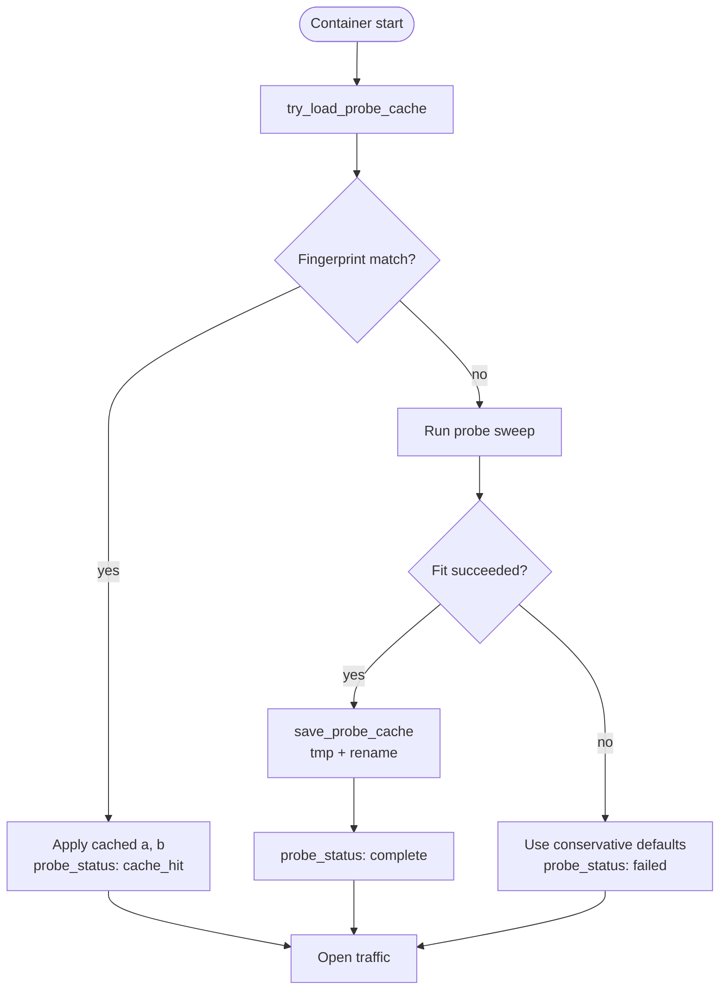

# 9. Persistent Coefficient Cache

A cold-start probe takes about two minutes on a Fargate amd64 task at default settings, longer on slower architectures. Repeating that cost on every container restart, scale-out, or rolling deployment is unnecessary: the fitted $(a, b)$ are deterministic functions of the runtime configuration, and persisting them lets warm starts skip the sweep entirely.

Caching coefficient values is dangerous in subtle ways. The fitted $(a, b)$ are tied to a particular runtime configuration: the model variant, the maximum sequence length, the host architecture. An upgrade from fp32 to fp16 changes the model weights and shifts the workspace cost. Changing `MAX_SEQ_LENGTH` from $2048$ to $8192$ moves the highest probe shape and changes the fit. Migrating from amd64 to arm64 changes which ORT kernels run and shifts the per-call workspace. Reusing yesterday's $(a, b)$ after any of those changes is worse than running a fresh probe — silently worse, because the server happily boots and accepts traffic until a long-context request OOM-kills a worker.

The cache file solves this with a *fingerprint*: a tuple of all the fields that affect $(a, b)$. On boot, the probe computes the current fingerprint, opens the cache, compares fingerprints, and only honours the cached $(a, b)$ when they match. Any mismatch — model, max-seq, architecture, server version — invalidates the cache and triggers a re-probe. Fields that do not affect $(a, b)$ (worker count, memory budget, idle timeout) are deliberately excluded from the fingerprint, so changing them never invalidates the cache.

The other half of the story is *atomicity*. The cache file lives on EFS in production, where multiple containers may read and write it concurrently. A partial write — a container that crashes after opening the file but before flushing its contents — must never be visible to a reader. The probe writes to a temp file and then `rename(2)`s atomically; readers see either the old file or the new one, never a half-baked one.

## The fingerprint

The cache file at `{BGE_M3_CACHE_DIR}/probe-coefficients.json` carries enough metadata to know when the cached $(a, b)$ are still valid:

```25:35:src/probe/cache.rs
#[derive(serde::Serialize, serde::Deserialize)]
struct ProbeCache {
    schema_version: u32,
    server_version: String,
    model: String,
    max_seq: usize,
    arch: String,
    fitted_at_unix: u64,
    a: f64,
    b: f64,
}
```

The cache key is the tuple `(schema_version, server_version, model, max_seq, arch)`. Any difference invalidates the cache entry.

| Field | Why it is in the key | Why a mismatch matters |
|-------|---------------------|------------------------|
| `schema_version` | Lets the cache format evolve | A future field addition can bump the version; old entries are silently invalidated |
| `server_version` | Conservative invalidation across releases | A patch bump that does not touch ORT/tokenizer technically does not need a re-probe, but invalidating broadly is safer than maintaining a hand-curated "compatible versions" list |
| `model` | fp32 / fp16 / int8 have different per-call workspace | Reusing fp32 coefficients on an int8 deployment would dramatically over-budget |
| `max_seq` | Cost model is fit to a *range* of sequence lengths | A fit anchored at $S_{\max} = 2048$ may extrapolate poorly to $S_{\max} = 8192$ |
| `arch` | Different ORT kernels on different ISAs | amd64 fp16 uses MLAS; arm64 fp16 uses NEON — different per-shape costs |
| `fitted_at_unix` | Audit trail, not part of the key | Operator can see how stale the cache is |

This is conservative — for example, a patch bump that does not touch ORT or the tokenizer technically does not need a re-probe, but invalidating broadly is safer than maintaining a hand-curated compatibility matrix.

### Fields excluded from the key

| Field | Why it is *not* in the key |
|-------|----------------------------|
| `BGE_M3_WORKERS` | Does not affect per-call workspace; only affects the global memory accounting (more workers means smaller per-worker budget, but each worker still has the same $(a, b)$) |
| `BGE_M3_MAX_BATCH` | Per-request limit, not per-call workspace |
| `BGE_M3_MEMORY_SAFETY_FACTOR` | Affects `max_workspace_bytes` (computed from current memory + safety factor on each start) but not $(a, b)$ |
| `BGE_M3_AVAILABLE_MEMORY_BYTES` | Same — input to the budget formula, not the cost-model coefficients |
| `BGE_M3_IDLE_TIMEOUT_SECS` | Lifecycle policy only, no effect on workspace |

Changing memory or worker settings never invalidates the cache: only the probe-relevant tuple does. This is deliberate — those settings are the ones operators most often tune, and forcing a re-probe every time would punish them for trying to right-size the deployment.

## Atomic writes

Cache writes use a temp-file-plus-rename pattern to avoid partial-write corruption:

```123:143:src/probe/cache.rs
    let final_path = cache_dir.join("probe-coefficients.json");
    let tmp_path = cache_dir.join("probe-coefficients.json.tmp");

    if let Err(e) = std::fs::write(&tmp_path, &json) {
        warn!(error = %e, path = %tmp_path.display(), "Failed to write probe cache temp file");
        return;
    }

    if let Err(e) = std::fs::rename(&tmp_path, &final_path) {
        warn!(error = %e, "Failed to atomically rename probe cache file");
        let _ = std::fs::remove_file(&tmp_path);
        return;
    }

    info!(
        path = %final_path.display(),
        a,
        b,
        "Probe coefficients cached to EFS"
    );
}
```

`rename(2)` on POSIX file systems is atomic — readers see either the old file or the new file, never a partial write. On the production EFS volume, a server reading the cache during a probe-cache update never sees a half-written file.

A cache-write failure is non-fatal: the warning is logged but startup continues. The fitted coefficients are used in this run; the next cold start will re-probe.

### Why temp-file-plus-rename and not fsync

The naïve alternative is `open()` → `write()` → `fsync()` → `close()`. That ensures the bytes hit the disk, but it does not address the *visibility* problem: readers who open the file partway through the write see a partial file. Temp-file-plus-rename solves the visibility problem at the file-system layer: the rename is atomic with respect to other readers because it is a single inode update, not a content overwrite.

The cache file is not fsynced. The probe is best-effort caching, not durability-critical state. If the file system loses the write to a power loss, the next cold start re-probes. There is no consistency invariant that the probe must maintain across reboots.

## The cache lifecycle



Five terminal states for the cache flow:

1. **No file present** → run probe, fit, save → `probe_status: complete`.
2. **File present, fingerprint matches** → load, apply → `probe_status: cache_hit`.
3. **File present, fingerprint mismatches** → re-run probe, fit, save (overwriting the old file via atomic rename) → `probe_status: complete`.
4. **File present but unreadable / corrupt** → treat as no file, re-probe → `probe_status: complete`.
5. **Probe fails despite fresh sweep** → use conservative defaults; do *not* write the cache (writing would persist bad data) → `probe_status: failed`.

Setting `BGE_M3_DISABLE_PROBE_CACHE=1` forces a fresh probe even when a valid cache exists. Use this when validating a new deployment, after manual edits to the cache file, or when debugging probe behaviour.

## Contents of `BGE_M3_CACHE_DIR`

The cache directory holds two distinct kinds of state:

| Path | Owner | Purpose |
|------|-------|---------|
| `*.onnx`, `tokenizer.json`, `*.safetensors` | The model fetcher | The downloaded model variant (${\sim}2\,\text{GB}$ for fp32, ${\sim}1\,\text{GB}$ for fp16, ${\sim}570\,\text{MB}$ for int8) |
| `probe-coefficients.json` | The probe | The fitted $(a, b)$ plus the fingerprint |
| `probe-coefficients.json.tmp` | The probe (transient) | A half-written temp file from an in-flight save; cleaned up on rename failure |

Both kinds of state are kept in the same directory so that operators can `rm -rf` the whole thing to force a clean re-fetch + re-probe. In production on Fargate this is an EFS mount shared across all tasks: the model files are fetched once and reused, and the probe cache is shared so the first task to complete a probe primes the cache for everyone.

## Concurrency: many readers, occasional writers

Multiple containers can read the cache simultaneously without coordination. Reads are stateless `open` + parse + close; the file's content is small (a few hundred bytes of JSON) so reads are fast and never block.

Writes are exclusive in effect because the probe only writes after a successful fit, and only one task at a time runs a fresh probe in a typical rolling-update scenario. If two tasks race to write the cache:

1. Both run the probe sweep independently (a deterministic measurement on identical hardware, producing nearly identical $(a, b)$).
2. Both write to their own temp files.
3. Both rename. The "winner" is whoever completes the final rename last.

Either set of $(a, b)$ is valid — both are measurements of the same underlying physical workspace, differing only by RSS noise. There is no consistency violation.

## Cache poisoning

The cache is a JSON file on a writable volume. A malicious actor could in principle edit the file to inject bad coefficients. In practice:

- The cache lives in `BGE_M3_CACHE_DIR`, which is owned by the same user as the server process and not exposed externally.
- Even if the file were tampered with, the clamps of §8 catch any out-of-range values before they reach the bin-packer.
- A negative $b$ would still be rejected; clamped $(a, b)$ would still produce a functional (if suboptimal) bin-packer.

The defence is layered: the cache assumes a trusted file system; the fitter and bin-packer assume nothing.

## What if the fingerprint logic itself is buggy?

A latent bug in fingerprint comparison — for instance, accidentally treating two different model variants as equal — would cause the probe to apply mismatched coefficients without re-probing. Three measures help operators detect this:

1. The `fitted_at_unix` field gives operators a way to see when the cache was written. Coefficients from a year-old fit applied to a new deployment is a strong signal something is wrong.
2. The `model` field is included verbatim, so operator-visible logs make any silent mismatch easy to spot.
3. After any deployment that changes the cache key, operators should run `BGE_M3_DISABLE_PROBE_CACHE=1` for the first task to validate the fresh probe before relying on the cache.

The fingerprint is conservative because the cost of an undetected mismatch is high. Adding more fields to the key would only make false-cache-hits less likely; removing them would make false-cache-hits more likely. The current set is a tuned balance between safety and re-probe frequency.

## When to invalidate manually

Operators should consider clearing the cache (`rm` the file) when:

- **A new model variant is being qualified.** Even if the fingerprint fields have not changed, a fresh fit may be desirable for confidence.
- **The hardware has changed.** A new ECS instance type or different CPU generation. The `arch` field in the fingerprint catches ISA changes (amd64 vs arm64) but not microarchitecture changes.
- **The fit is suspect.** `/health` shows `probe_status: complete` but the $(a, b)$ look wrong (e.g., $b \approx 0$), perhaps from a transient measurement glitch on the original probe.

`BGE_M3_DISABLE_PROBE_CACHE=1` is the env-var equivalent of the same operation: it forces a fresh probe without permanently deleting the file. Use it as a one-shot for the next start, then unset it for normal operation.

---

← [Previous: Clamps & fallback](08-clamps-fallback.md) | [↑ Series overview](../startup-probe.md) | [Next: Execution →](10-execution.md)
