# 11. End-to-End — A Worked Cold-Start Trace

> Everything in this series, played out in a real cold-start log from a 28 GB Fargate task. Each line is annotated with the page that explains the underlying machinery.

## Intuition

It's one thing to know each piece of the probe in isolation. It's another to see them assembled into a real boot sequence and recognize each piece by its log signature. This page walks through a representative cold start at production settings (`workers=7`, `max_seq=8192`, `model=Fp16`), pointing at every line and saying "this is where page X happens."

If you only ever read one page about *operating* the server — not about the theory — read [Operator guide](12-operator-guide.md). If you want to understand *what you're seeing in the logs*, this is the page.

## A timeline of cold start

```mermaid
gantt
    title Cold-start timeline (representative cache miss, 28 GB Fargate, 7 workers)
    dateFormat  s
    axisFormat  %S s
    section Boot
    Container start                :milestone, m1, 0, 0
    section Workers
    Leader load + prime            :a1, 1, 11
    Followers load (warm cache)    :a2, after a1, 8
    section Budget
    Budget compute                 :b1, after a2, 1
    section Probe (drained)
    Cache check                    :c1, after b1, 1
    Permit drain + spawn           :milestone, m2, after c1, 0
    Arena warm-up                  :p0, after c1, 1
    Probe sweep (7 shapes)         :p1, after p0, 100
    OLS fit + clamp                :p2, after p1, 1
    Cache write (rename)           :p3, after p2, 1
    Dense readiness                :p4, after p3, 1
    Sparse readiness               :p5, after p4, 1
    section Open traffic
    add_permits(N)                 :milestone, m3, after p5, 0
    /v1/embeddings ready           :milestone, m4, after p5, 0
```



Roughly: ~10 s to load the leader and prime its arena, ~10 s for the followers to load from warm cache, then ~120 s for the probe sweep (dominated by the `(1, 8192)` shape), then a few seconds of bookkeeping. Total: under three minutes from container start to traffic open. **The `/health` endpoint is at 200 from second ~21 onward** — the load balancer never sees an unhealthy task, even though traffic doesn't actually flow until ~140s later.

## Annotated cold-start log

A representative cold-start trace at default settings on a 28 GB ECS Managed Instance task (v0.15.0):

```
[INFO] Starting bge-m3-embedding-server bind=0.0.0.0:8081 workers=7 max_seq=8192 model=Fp16
[INFO] Phase 1/4 git: cloning model files                                  ┐
[INFO] Phase 4/4 saveAll: tokenizer + dense + sparse loaded                │ leader-first
[INFO] Leader worker ready, model cache warm rss_delta_mb=1409 (1/7)       │ §7 worker-reported
[INFO] Workers 1..7 loaded from warm cache rss_delta_mb=1409 each          ┘ sequential, §7
[INFO] Memory detected available_bytes=30064771072 source=cgroup_v2        ← path-walk §1
[INFO] Measured model RSS per worker model_rss_per_worker_mb=1409          ← median across workers
[INFO] Workspace budget computed worst_case_peak_mb=17537 available_mb=28672
        utilization_pct=61.2 per_worker_workspace_mb=1058                  ← §10 (semaphore init)
[INFO] Probe cache fingerprint mismatch; will re-probe                     ← §9
[INFO] Starting memory probe max_seq=8192 rss_ceiling_mb=1058              ┐ probe task holds all
        cgroup_limit_mb=28672                                              │ cfg_workers permits
                                                                           │ (OwnedSemaphorePermit)
                                                                           │ §10
[INFO] Probe: arena warm-up complete (delta excluded from fit)             ← arena warm-up §6
        warmup_delta_mb=994 rss_after_mb=10857 elapsed_ms=812              │
[INFO] Probe shape measured batch=1 seq=64 rss_delta_mb=2                  │ deltas now reflect
[INFO] Probe shape measured batch=4 seq=64 rss_delta_mb=8                  │ per-shape workspace
[INFO] Probe shape measured batch=1 seq=256 rss_delta_mb=6                 │ rather than arena
[INFO] Probe shape measured batch=1 seq=1024 rss_delta_mb=27               │ initialisation
[INFO] Probe shape measured batch=1 seq=2048 rss_delta_mb=68               │
[INFO] Probe shape measured batch=1 seq=4096 rss_delta_mb=210              │
[INFO] Probe shape measured batch=1 seq=8192 rss_delta_mb=720              │ §6 — 7 shapes
[INFO] Probe: fitted cost model a=18432 b=6.2 data_points=7                ┘ OLS, §4 + §5
[INFO] Probe complete — updating cost model
[INFO] Probe coefficients cached to EFS                                    ← §9 atomic write
[INFO] Probe status updated probe_status=complete
[INFO] Dense readiness probe passed                                        ┐ readiness checks
[INFO] Sparse readiness probe passed                                       ┘ inside probe task
[INFO] Models ready — accepting requests                                   ← permits released, traffic opens (§10)
```

### What each phase corresponds to in the docs

| Log line(s) | Section | Page |
|-------------|---------|------|
| `Phase N/4 ...` | Model fetch and load | (covered in [cold-start.md](../cold-start.md), out of scope here) |
| `Leader worker ready ... rss_delta_mb=1409` | Layer 2 RSS measurement (per-worker baseline) | [Measurement §7](07-measurement.md) |
| `Memory detected ... source=cgroup_v2` | cgroup detection | (covered in [architecture.md](../architecture.md)) |
| `Workspace budget computed ... per_worker_workspace_mb=1058` | `total_workspace = available − N×model_rss − OS_HEADROOM` | [Overview §1](01-overview.md) intro |
| `Probe cache fingerprint mismatch; will re-probe` | Cache miss path | [Cache §9](09-cache.md) |
| `Starting memory probe ... rss_ceiling_mb=1058` | Probe task spawned, semaphore drained | [Execution §10](10-execution.md) |
| `Probe: arena warm-up complete` | Layer 1 arena pre-priming inside the probe task | [Probe shapes §6](06-probe-shapes.md) (§7.1: arena warm-up) |
| `Probe shape measured ...` | Per-shape RSS-delta readings (Layer 1) | [Measurement §7](07-measurement.md) |
| `Probe: fitted cost model a=18432 b=6.2 data_points=7` | OLS solve in normalized space | [OLS fitting §4](04-ols-fitting.md), [Conditioning §5](05-conditioning.md) |
| `Probe coefficients cached to EFS` | Temp + atomic rename | [Cache §9](09-cache.md) |
| `Dense readiness probe passed` / `Sparse readiness probe passed` | Final correctness checks before opening traffic | [Execution §10](10-execution.md) |
| `Models ready — accepting requests` | `add_permits(cfg_workers)` releases the gate | [Execution §10](10-execution.md) |

## What `/health` looks like after this

After the cold start above, `GET /health` returns:

```json
{
  "status": "ok",
  "workers": { "live": 7, "total": 7 },
  "max_seq_length": 8192,
  "tuning": {
    "a_bytes_per_token": 18432.0,
    "b_bytes_per_token_sq": 6.2,
    "max_workspace_bytes": 2044000000,
    "probe_status": "complete",
    "memory_source": "cgroup_v2",
    "available_bytes": 28991029248,
    "model_rss_bytes_per_worker": 1100000000,
    "worst_case_peak_bytes": 21533073408,
    "utilization_pct": 74.3
  }
}
```

| Field | Source | Meaning |
|-------|--------|---------|
| `status` | `EmbedPool::worker_health()` | Aggregate live-worker health |
| `workers.live` / `workers.total` | `EmbedPool` counters | How many of the configured workers are still running |
| `max_seq_length` | Config | The configured upper bound on tokenized sequence length |
| `tuning.a_bytes_per_token` | OLS fit | The fitted linear coefficient |
| `tuning.b_bytes_per_token_sq` | OLS fit | The fitted quadratic coefficient |
| `tuning.max_workspace_bytes` | Workspace-budget formula | Per-worker workspace ceiling enforced by the bin-packer |
| `tuning.probe_status` | `state.probe_status.load()` | Lifecycle state |
| `tuning.memory_source` | `detect_available_memory()` | Where the budget formula got its `available_bytes` (cgroup_v1, cgroup_v2, sysctl, override) |
| `tuning.available_bytes` | Same | The detected (or overridden) available memory |
| `tuning.model_rss_bytes_per_worker` | Layer 2 median RSS delta | Per-worker model+arena baseline |
| `tuning.worst_case_peak_bytes` | `N×workspace + N×model_rss + OS_HEADROOM` | Absolute worst-case; must stay below `available_bytes` |
| `tuning.utilization_pct` | `worst_case_peak / available × 100` | Headroom indicator; `WARN` fires at startup if > 90% |

`worst_case_peak_bytes` is `N × per_worker_workspace + N × model_rss + OS_HEADROOM`. A value above 90% of `available_bytes` triggers a startup `WARN`. At 74% with accurate `model_rss_bytes_per_worker`, the production 7-worker fp16 config has adequate headroom.

## A warm-start trace (cache hit)

On the *next* cold start (cache hit), the probe sweep is skipped:

```
[INFO] Starting bge-m3-embedding-server bind=0.0.0.0:8081 workers=7 max_seq=8192 model=Fp16
[INFO] Phase 1/4 git: cloning model files
[INFO] Phase 4/4 saveAll: tokenizer + dense + sparse loaded
[INFO] Leader worker ready, model cache warm rss_delta_mb=1409 (1/7)
[INFO] Workers 1..7 loaded from warm cache rss_delta_mb=1409 each
[INFO] Memory detected available_bytes=30064771072 source=cgroup_v2
[INFO] Measured model RSS per worker model_rss_per_worker_mb=1409
[INFO] Workspace budget computed worst_case_peak_mb=17537 available_mb=28672
        utilization_pct=61.2 per_worker_workspace_mb=1058
[INFO] Probe cache hit — skipping startup probe a=18432 b=6.2 fitted_at_unix=1746...
[INFO] Cost model loaded from EFS cache
[INFO] Dense readiness probe passed
[INFO] Sparse readiness probe passed
[INFO] Models ready — accepting requests
```

…and `/health` reports `probe_status: "cache_hit"`. Total time from container start to traffic open: ~25 seconds (down from ~140s). This is what makes the cache worth having.

## A failed-probe trace

A cold start where the probe ran but the fit was rejected (e.g., due to RSS measurement contamination):

```
[INFO] Starting bge-m3-embedding-server bind=0.0.0.0:8081 workers=7 max_seq=8192 model=Fp16
[INFO] ... (workers load normally) ...
[INFO] Probe cache fingerprint mismatch; will re-probe
[INFO] Starting memory probe max_seq=8192 rss_ceiling_mb=1058 cgroup_limit_mb=28672
[INFO] Probe: arena warm-up complete warmup_delta_mb=994 elapsed_ms=812
[INFO] Probe shape measured batch=1 seq=64 rss_delta_mb=2
[WARN] Probe shape failed; skipping batch=1 seq=8192 error="positional embeddings exceeded"
[INFO] Probe shape measured batch=4 seq=64 rss_delta_mb=8
... (5 shapes succeed, 1 fails) ...
[WARN] Probe: fit_cost_model returned None — singular system
[INFO] Probe status updated probe_status=failed
[INFO] Cost model: using conservative defaults a=16384 b=8 max_workspace_bytes=2147483648
[INFO] Dense readiness probe passed
[INFO] Sparse readiness probe passed
[INFO] Models ready — accepting requests
```

Note that **the server still becomes ready and accepts traffic** — it's just running on the conservative defaults rather than the fitted values. Traffic flows. Throughput is lower than optimal. `/health` returns `probe_status: "failed"` so operators know to investigate.

The asymmetry from [Clamps & fallback](08-clamps-fallback.md) is visible here: a partial probe is treated as no probe, conservative defaults take over, the server keeps serving. There's no fail-fast crash even when the fitting machinery declares the data unworkable.

## A deliberately-disabled trace

When `BGE_M3_DISABLE_AUTO_BUDGET=1` is set:

```
[INFO] Starting bge-m3-embedding-server bind=0.0.0.0:8081 workers=7 max_seq=8192 model=Fp16
[INFO] ... (workers load normally) ...
[INFO] BGE_M3_DISABLE_AUTO_BUDGET=1 — skipping memory probe
[INFO] Cost model: using conservative defaults a=16384 b=8 max_workspace_bytes=2147483648
[INFO] Probe status updated probe_status=disabled
[INFO] Dense readiness probe passed
[INFO] Sparse readiness probe passed
[INFO] Models ready — accepting requests
```

The probe machinery is bypassed entirely. `probe_status: "disabled"` distinguishes this from `failed`: the operator made an explicit decision, not a measurement anomaly. Used heavily in macOS dev loops (where the probe wouldn't work anyway) and for fast smoke tests where probe time matters more than packing optimality.

## What to look for as an operator

Three things to verify after every cold start:

1. **`probe_status`** — should be `complete` or `cache_hit`. Anything else (`failed`, `disabled`) merits investigation.
2. **`utilization_pct`** — should be below 90%. Above that, `BGE_M3_WORKERS` is too high or `BGE_M3_MEMORY_SAFETY_FACTOR` is too lax.
3. **`a` and `b`** — should look like `~18 000` and `~6` for fp16 on amd64. Order-of-magnitude differences signal either a fit failure or a model-variant change.

Page [Operator guide](12-operator-guide.md) covers all of this in checklist form.

## What's next

The next page is the operator's quick-reference for diagnosing probe state in production: what to check, what to tweak, what each tuning env var does.

---

← [Previous: Execution](10-execution.md) | [↑ Series overview](../startup-probe.md) | [Next: Operator guide →](12-operator-guide.md)
